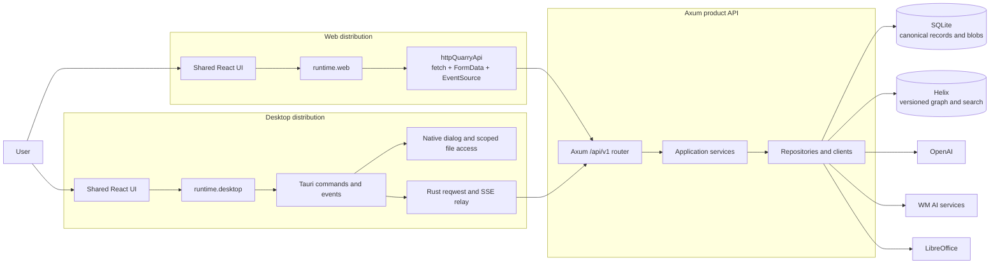
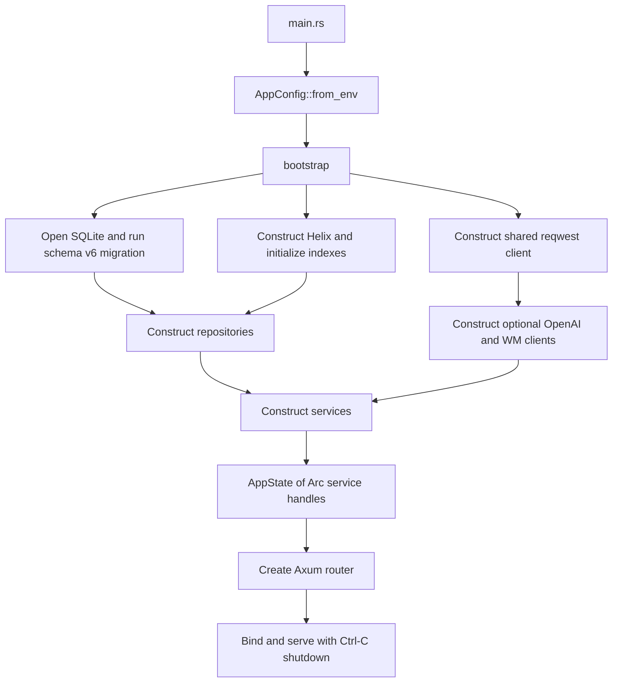
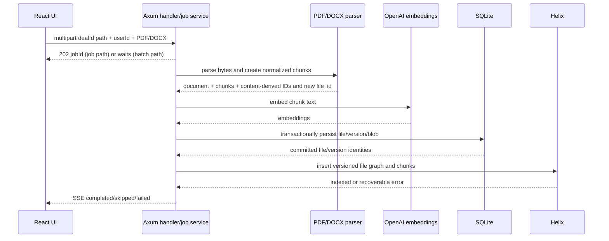

# Quarry architecture

| Field | Value |
| --- | --- |
| Status | Canonical current-state architecture reference |
| Last verified | 2026-08-31 |
| Repository snapshot | `main` at `4e5830c`, including the active working-tree changes |
| Audience | Quarry developers, reviewers, operators, and coding agents |
| Scope | Shared React/Vite UI, web transport, Tauri desktop shell, Axum API, persistence, integrations, and verification |

This document describes the implementation in the live repository, not an idealized target.
When it disagrees with code, manifests, lockfiles, or tests, the executable repository is the
authority and this document should be corrected in the same change.

The snapshot includes substantial uncommitted frontend work. In particular, the Deals table,
Kanban view, sidebar switcher, React View Transition integration, related UI primitives, and
tests are present in the working tree but are not yet committed. Confirm `git status --short`
before relying on those files as a stable baseline.

The root README and [ADR 0001](adr/0001-shared-runtime-boundary.md) retain parts of the original
desktop design. The current code has a broader Tauri boundary: desktop product API traffic,
PDF bytes, multipart uploads, and document-job events cross Tauri IPC before reaching the same
Axum API used by the browser. This document records that implemented path.

## Maintenance contract

Every feature, refactor, fix, API/data/configuration change, and infrastructure change must begin
by reading the relevant sections of this document and end with an architecture-impact check.
Update this file in the same change when implementation changes any documented behavior,
responsibility, boundary, flow, schema, contract, integration, configuration, security control,
verification command, feature maturity, or known limitation. If no update is needed, the handoff
must state `Architecture impact: none — <specific reason>`.

## 1. Executive summary

Quarry is a multiplatform diligence application built from three cooperating runtimes:

1. A single React application under `frontend/src/`, compiled by Vite for either a browser or a
   Tauri webview.
2. A thin Tauri 2 Rust shell under `frontend/src-tauri/`, responsible for validated native
   capabilities and the current desktop-to-Axum transport gateway.
3. An Axum 0.8 product API under `backend/`, responsible for product behavior, configuration,
   persistence, document processing, AI integrations, search, and background jobs.

The web and desktop distributions share pages, components, hooks, contracts, and product routes.
Build-time aliases select the router and runtime adapter:

- Web: `BrowserRouter` plus direct browser HTTP, multipart, binary, and `EventSource` transport.
- Desktop: `HashRouter` plus Tauri `invoke`/events; Rust `reqwest` then forwards product traffic
  to the same Axum `/api/v1` routes.

The backend uses explicit construction. `AppConfig` parses process configuration once,
`bootstrap` opens and migrates SQLite, constructs external clients and repositories, assembles
services, and places service handles in `AppState`. Handlers remain the Axum delivery layer.

SQLite is the canonical store for users, deals, logical files, immutable file versions, and
file bytes. Helix is the versioned document graph and search projection. Document ingestion
persists SQLite first and then indexes Helix, so cross-store writes are intentionally recoverable
through an exact-content re-upload today rather than transactionally atomic. A general reindex
utility is not implemented.

Quarry is a tested development foundation, not a production-secure deployment. There is no
inbound authentication, tenant authorization, rate limiting, durable job queue, production
database/object store, CI pipeline, or deployment manifest. The current login screen performs
profile lookup/creation and must not be described as an authentication boundary.

## 2. System context



The Tauri shell is not a second product backend. It does not own users, deals, document jobs,
AI orchestration, or durable product state. Its generic API relay is a local transport hop; Axum
remains the final product router and trust boundary for server-owned data.

## 3. Repository topology

```text
Quarry/
├── AGENTS.md                         repository-wide agent rules
├── docs/
│   ├── ARCHITECTURE.md               this canonical Markdown reference
│   ├── adr/                          accepted architectural decisions
│   └── architecture/                 retained point-in-time DOCX reports
├── .agents/skills/                   project-local development skills
├── frontend/
│   ├── src/                          shared React application
│   ├── scripts/                      runtime-boundary enforcement
│   ├── src-tauri/                    Tauri desktop crate
│   ├── package.json                  npm scripts and declared dependencies
│   ├── package-lock.json             npm lockfile
│   └── vite.config.ts                build-mode composition root
├── backend/
│   ├── src/                          Axum application and utility binaries
│   ├── tests/                        manually included Rust test modules
│   ├── Cargo.toml                    backend crate manifest
│   ├── Cargo.lock                    Rust lockfile
│   ├── .env.example                  configuration schema, with known drift
│   └── helix.toml                    local Helix metadata, partly stale
└── plans/                            ignored, non-canonical local plans
```

### 3.1 Independent build roots

| Root | Package | Primary commands | Relationship to product build |
| --- | --- | --- | --- |
| `frontend/` | npm application | `npm test`, typechecks, Vite builds | Shared web and desktop UI |
| `frontend/src-tauri/` | Cargo crate `quarry-desktop` | Rust format, Clippy, tests | Native desktop shell |
| `backend/` | Cargo crate `quarry-backend` | Rust format, Clippy, tests | Product API |

There is no root workspace file or root orchestration command. The backend contains an isolated
Rust SharePoint client under `backend/src/core/clients/sharepoint_client/`; it is tested but not
assembled into application state or exposed through routes. Treat it as inactive infrastructure
until ownership and product integration are explicitly decided.

## 4. Distribution and runtime composition

### 4.1 Shared application entry

[`frontend/src/main.tsx`](../frontend/src/main.tsx) mounts one application:

```text
React.StrictMode
  -> build-selected AppRouter
      -> ThemeModeProvider
          -> shared route manifest and pages
```

The app does not perform runtime sniffing to choose its host. Vite mode and the corresponding
TypeScript project select the implementation before the bundle runs.

### 4.2 Build-time aliases

[`frontend/vite.config.ts`](../frontend/vite.config.ts) maps:

| Stable import | Web mode | Desktop mode |
| --- | --- | --- |
| `@quarry/router` | `src/platform/Router.web.tsx` | `src/platform/Router.desktop.tsx` |
| `@quarry/runtime` | `src/platform/runtime.web.ts` | `src/platform/runtime.desktop.ts` |

`tsconfig.web.json` and `tsconfig.desktop.json` repeat these paths and exclude the opposite
platform modules. This is deliberate: shared code must compile independently against both host
contracts. Any alias change must update Vite and both TypeScript configurations together.

Every Vite mode other than the literal `desktop` mode resolves to the web target. Vitest therefore
uses the web runtime in its normal test mode unless a test directly exercises the Tauri adapter.

### 4.3 Development ports

| Process | Default address | Notes |
| --- | --- | --- |
| Vite | `http://localhost:1420` | Strict port; `/api` proxies to Axum |
| Axum | `http://127.0.0.1:3001` | Configurable host/port |
| Helix | `http://127.0.0.1:6969` | Required during normal backend bootstrap |

An empty browser `VITE_API_BASE_URL` uses Vite's `/api` proxy in development. Static web hosting
must rewrite application routes to `index.html` because web mode uses normal history URLs.
Desktop mode uses hash routing so the bundled static assets do not need server-side route rewrites.

## 5. Frontend architecture

### 5.1 Technology baseline

The live frontend is an npm package using:

- React/React DOM 19 canary in the active working tree
- Vite 7 and TypeScript 5.8 with strict/no-unused/no-emit checks
- React Router DOM 7
- Tailwind CSS 4's CSS-first Vite integration
- Radix/shadcn primitives, Lucide icons, Motion, and dnd-kit
- react-pdf/pdf.js for document preview
- Vitest, Testing Library, user-event, and per-file happy-dom tests

The repository does not pin Node, set `packageManager`/`engines`, or define ESLint/Prettier.
The current uncommitted `.npmrc` enables `legacy-peer-deps`, supporting the canary dependency
combination. Manifest and lockfile state must be inspected before dependency work.

### 5.2 Route map

[`frontend/src/App.tsx`](../frontend/src/App.tsx) declares the shared routes:

| Route | Page | Loading |
| --- | --- | --- |
| `/` | Redirect to `/login` | eager |
| `/login` | `LoginPage` | eager |
| `/hub` | `HubPage` | eager |
| `/hub/account` | `AccountPage` | eager |
| `/hub/vault` | `GlobalVaultPage` | lazy |
| `/hub/initiatives/vault` | `VaultPage` | lazy |
| `/hub/summarize` | `SummarizePage` | lazy |
| `/hub/logs` | `LogsPage` | lazy |
| `/hub/deals` | `Deals` | lazy; currently uncommitted |
| `/hub/deals/:dealId` | `DealRoomPage` | eager |
| `/hub/deals/:dealId/data-room` | `DataRoomPage` | lazy |
| all other paths | Redirect to `/login` | eager |

There is no authenticated route guard. Workspace email is carried in router state and mirrored to
`sessionStorage` under `quarry.workspace.email`. These navigation conveniences are not identity or
authorization controls.

### 5.3 Layer responsibilities

| Frontend area | Responsibility | Examples |
| --- | --- | --- |
| `pages/` | Route-level orchestration and screen composition | login, hub, deals, data room, summarize |
| `components/<feature>/` | Product feature UI | deal room, data room, deals, PDF viewer |
| `components/ui/` | Reusable primitives and interaction foundations | button, dialog, popover, view transition |
| `hooks/` | Cross-component state and synchronization | workspace session/deals, theme |
| `data/` | UI domain types, fixtures, mapping, pure selectors | workspace, deal extraction, deals view |
| `contracts/` | Transport-neutral application contract | `QuarryApi`, runtime and platform capabilities |
| `api/` | Browser and Tauri transport adapters | HTTP, multipart, binary, SSE, IPC mapping |
| `platform/` | Build-selected router/runtime composition | web and desktop adapters |
| `lib/` | Shared utilities and activity logging | class merging, bounded/redacted activity log |

### 5.4 State and data ownership

Quarry currently uses React-local state, narrow contexts, and pure data modules rather than a
global state or query-cache library.

- `ThemeModeProvider` owns the `slate-frost`/`dark` choice, mirrors it to the root element and
  `localStorage`, and updates the browser theme color.
- `WorkspaceHomeShell` loads deals and provides them through a context. The context currently
  defaults to an empty array rather than failing outside the provider.
- `useWorkspaceDeals` fetches once, maps persisted deals, merges server records with static
  `workspaceDeals` fixtures by ID, and silently falls back to fixtures when the request fails.
- The PDF viewer uses an internal context plus focused hooks for document loading, zoom,
  virtualization, keyboard behavior, selection, page tracking, drop, and printing.
- The activity log uses `useSyncExternalStore`, keeps at most 400 entries for the session, and
  recursively redacts secret-like fields, paths, and email addresses.

Static fixtures make development screens usable when the backend is unavailable, but they are not
authoritative product data. New code must keep fallback data visibly distinct from successful
server state and avoid masking operational failures.

### 5.5 Feature inventory and maturity

| Feature | Implemented behavior | Current limitations |
| --- | --- | --- |
| Login/profile | Web email lookup/user creation; existing-user lookup and workspace navigation on both targets | Not authentication; desktop cannot currently enter the new-user flow; collected API key is development-era data, not AI configuration |
| Hub | Portfolio landing presentation and suggested content | Primarily presentational/fixture-backed |
| Deals | Search/filter, table, lazy read-only Kanban, add-deal flow | Current table/Kanban implementation is uncommitted |
| Deal room | Deal lookup, summary, timeline, activity and selected views | Several diligence/synthesis views remain `UnderConstructionView` placeholders |
| Data room | Stored/local tree, empty/error/loading states, upload jobs, PDF/text preview | Report/chip content is partly fixture-derived; SharePoint connect submission is not implemented |
| Summarize | Manual path, browser file/folder selection, API summary, Markdown render/export | Relies on server filesystem paths for some flows; production policy unresolved |
| Global Vault | File/folder staging UI | Summary behavior is placeholder |
| Initiative Vault | Activity stream | Static data |
| Logs | View/export/clear bounded activity log | Session-local only |
| Account/profile | Displays fetched user details and theme preference | Profile data moves through router/UI state; not an auth session |

### 5.6 UI and styling system

[`frontend/src/index.css`](../frontend/src/index.css) is the styling source of truth. It imports
Tailwind 4, animation utilities, and shadcn CSS, then defines semantic tokens for canvas, surfaces,
content, borders, interaction, sidebar, status, typography, spacing, radii, and shared panels.
Light and dark themes change the tokens rather than component structure.

[`frontend/components.json`](../frontend/components.json) configures shadcn's `radix-nova` style,
CSS variables, Lucide icons, and the `@` aliases. Shared components should use the existing tokens
and primitives instead of adding hard-coded parallel color/spacing systems.

The live working tree includes React canary View Transition wrappers and CSS transition recipes.
Any canary API use must retain feature/fallback behavior, keyboard/focus semantics, and
`prefers-reduced-motion` behavior.

## 6. Web and desktop transports

### 6.1 Shared contract

[`frontend/src/contracts/quarryApi.ts`](../frontend/src/contracts/quarryApi.ts) defines the
transport-neutral `QuarryApi`, `PlatformCapabilities`, `QuarryRuntime`, and shared DTOs. Product
components should express intent through this contract rather than through fetch paths or Tauri
command names.

The contract covers:

- user lookup/creation
- deal create/list/get/archive and metadata extraction
- deal data-room listing and preview
- stored document list/PDF/text
- synchronous and job-based document processing
- document job subscriptions
- keyword/vector document search
- path, selection, and upload summarization
- platform-specific local data-room selection/read and file export

### 6.2 Web path

```text
React feature
  -> runtime.web
  -> httpQuarryApi
  -> fetch / FormData / EventSource
  -> Axum /api/v1
```

The HTTP adapter validates `VITE_API_BASE_URL`, permits HTTPS outside development and loopback HTTP
in development, serializes JSON/multipart, validates PDF content type, reads bytes, normalizes
non-success responses into `BackendApiError`, and logs HTTP/SSE activity. No authentication header
or token is currently attached.

The web platform adapter implements export with a Blob download, has no native folder chooser, and
rejects local source-file reads.

### 6.3 Desktop path

```text
React feature
  -> runtime.desktop
  -> tauriQuarryApi
  -> Tauri invoke/listen
  -> validated Rust command
  -> QuarryApiService / QuarryHttpClient
  -> reqwest or SSE stream
  -> Axum /api/v1
```

`runtime.desktop.ts` is the only frontend file permitted to import `@tauri-apps/*`. It records IPC
activity and adapts Tauri errors to JavaScript errors. `tauriQuarryApi.ts` duplicates the current
endpoint mapping for the desktop transport and base64-encodes multipart files before IPC.

The Rust gateway reads `QUARRY_API_BASE_URL`, defaulting to loopback port 3001. It accepts HTTPS or
HTTP loopback only and rejects query/fragment configuration. Generic proxy paths must start with
`/api/v1/`, contain no traversal, CR/LF, or fragment, and stay within a length limit.

### 6.4 Native command inventory

| Command | Purpose | Important controls |
| --- | --- | --- |
| `quarry_api_get` | Relay versioned JSON GET | main window/origin; path policy; safe base URL |
| `quarry_api_get_pdf` | Relay stored document PDF bytes | exact route shape; PDF MIME/signature; 64 MB cap |
| `quarry_api_post` | Relay versioned JSON POST | main window/origin; path policy |
| `quarry_api_post_multipart` | Rebuild and relay multipart | filename/path/MIME checks; 50 MB file and total cap |
| `subscribe_document_job` | Consume Axum SSE and emit Tauri event | validated identifiers; scoped event payload |
| `select_deal_data_room` | User-mediated folder selection and source scan | canonical root stored as process-local grant |
| `read_deal_source_files` | Read one or two selected source files | authorized-root containment; type and 50 MB total cap |
| `save_text_file` | Native JSON/Markdown export | MIME/extension/title/name checks; 5 MB cap; atomic sibling-temp write |

Every command validates that the caller is the `main` window and originates from the bundled Tauri
origin or the approved debug origin. The capability file currently grants only `core:default`, and
the webview uses a restrictive CSP plus `freezePrototype`.

### 6.5 Desktop transport constraints

- Base64 multipart adds roughly one-third encoding overhead and holds complete copies in the
  webview and Rust process. It is bounded but not a streaming design.
- Removing the TypeScript listener does not explicitly cancel the Rust upstream SSE request.
- The desktop client currently converts many server failures to validation-shaped IPC errors and
  does not preserve a stable HTTP status/retry/operation-ID envelope.
- Desktop new-user login is currently blocked by a specific error-shape mismatch: Axum returns a
  flat `{ "error": "user not found" }` body, while the Tauri relay only extracts
  `{ "error": { "message": ... } }`. It therefore emits a generic 404 string that the TypeScript
  adapter does not recognize as the missing-user result needed to show the account-creation step.
- Endpoint mappings exist independently in the web and Tauri adapters, so contract tests are the
  current protection against drift.
- The production CSP still contains `https://api.example.invalid`; release configuration must align
  it with the real topology if the webview connects directly to additional origins.

## 7. API surface

Axum builds one feature router and mounts it under both `/api` and `/api/v1`. Clients use
`/api/v1`; `/api` is transitional compatibility. Only GET and POST are enabled by the CORS method
allowlist.

### 7.1 System and users

| Method | Path | Purpose | Notes |
| --- | --- | --- | --- |
| GET | `/health` | Shallow process health | Returns `{ "ok": true }`; does not check dependencies |
| GET | `/capabilities` | Static contract feature flags | Does not report actual optional-service availability |
| GET | `/greet` | Demo greeting | Development/demo route |
| POST | `/users` | Create user/profile | Returns 201; currently includes stored `apiKey` |
| GET | `/users/by-email` | Fetch user/profile by email | No authentication |
| POST | `/login-demo` | Demo REST event | Development/demo route |
| POST | `/login-demo/event` | Demo internal event adapter | Development/demo route |

### 7.2 Deals and data rooms

| Method | Path | Purpose | Notes |
| --- | --- | --- | --- |
| GET | `/database/status` | Report SQLite status/path | Exposes server path; development-only posture |
| GET | `/deals` | List persisted deals | Includes metadata when present |
| POST | `/deals` | Create deal and empty metadata | Validates `DEAL-` ID, dates, user, and source choice |
| GET | `/deals/{deal_id}` | Get one deal and metadata | 404 when absent |
| POST | `/deals/{deal_id}/metadata` | Upload/extract deal metadata | Multipart; OpenAI required when files are present |
| POST | `/deals/{deal_id}/extraction/upload` | Compatibility alias for metadata upload | Same handler |
| POST | `/deals/{deal_id}/archive` | Mark a deal archived | Retains associated files |
| GET | `/deals/{deal_id}/data-room` | List configured server data-room tree | Can expose absolute `rootPath` |
| POST | `/deals/{deal_id}/data-room/preview` | Parse/convert a selected relative document | Canonical containment; PDF/DOCX/XLSX/PPTX |

### 7.3 Stored documents, ingestion, jobs, and search

| Method | Path | Purpose | Notes |
| --- | --- | --- | --- |
| GET | `/deals/{deal_id}/documents` | List current logical documents | SQLite source |
| GET | `/deals/{deal_id}/documents/{file_id}/pdf` | Return inline PDF preview | `private, no-store`; source or rendered preview |
| GET | `/deals/{deal_id}/documents/{file_id}/text` | Return canonical extracted text | PDF/DOCX sources |
| POST | `/deals/{deal_id}/documents/process` | Synchronous batch ingestion | PDF/DOCX; multipart `userId` and `files` |
| POST | `/deals/{deal_id}/documents/process_file` | Start one in-memory job | Returns 202 `{jobId, filename}` |
| GET | `/documents/process_file/{job_id}/events` | Job SSE | processing then completed/skipped/failed; 15 s keepalive |
| POST | `/documents/search/vector` | Vector search Helix chunks | Client supplies `workspaceId`, vector, limit |
| POST | `/documents/search/keyword` | Keyword search Helix chunks | Client supplies `workspaceId`, text, limit |

The two document-processing routes raise Axum's body limit to 50 MB plus 1 MB multipart overhead.
Other multipart routes contain service-level 50 MB checks but currently encounter Axum's default
2 MB body limit first; this mismatch is a known contract gap.

### 7.4 Research and summarization

| Method | Path | Purpose | Dependency |
| --- | --- | --- | --- |
| POST | `/files/extract` | WM file extraction/upload | WM AI group |
| POST | `/indexes` | Create WM index | WM AI group |
| GET | `/indexes/{index_id}/status` | Read WM index status | WM AI group |
| POST | `/graphrag/query` | Query WM GraphRAG | WM AI group |
| POST | `/summarize` | Summarize a server path | OpenAI and server filesystem |
| POST | `/summarize/files` | List summarizable files under a server path | Server filesystem |
| POST | `/summarize/selected` | Summarize selected server paths | OpenAI and server filesystem |
| POST | `/summarize/upload` | Summarize uploaded files | OpenAI |
| POST | `/summaries/markdown` | Write Markdown to a server path | Returns 204; development-only trust model |

The API contract is not generated. JSON is generally camelCase, but flattened document search
result properties are currently snake_case because their Rust DTO lacks a rename rule.

## 8. Backend architecture

### 8.1 Startup and composition root



[`backend/src/main.rs`](../backend/src/main.rs) is intentionally thin: dotenv, tracing,
configuration, bootstrap, bind, serve, and graceful shutdown. [`backend/src/bootstrap.rs`](../backend/src/bootstrap.rs)
owns application construction and is the only place that should grow when a new production
adapter must be selected and shared.

`AppState` contains ten `Arc<Service>` handles:

- users
- deals
- data rooms
- database status
- document ingestion
- document jobs
- document search
- document summaries
- stored documents
- research

### 8.2 Module responsibilities

| Module | Owns | Must not own |
| --- | --- | --- |
| `config` | Typed parsing/defaults/validation and secret redaction | Request behavior or client construction |
| `bootstrap` | Migrations and dependency graph construction | HTTP extraction or feature UI concerns |
| `routes` | Endpoint composition and global Tower layers | Business logic |
| `handlers` | Axum extractors, multipart decoding, response/status/SSE adaptation | Ambient configuration, repository access, client construction |
| `services` | Use-case validation and orchestration | Axum state or environment reads |
| `repository` | SQLite and Helix persistence/index capabilities | HTTP response mapping |
| `core/clients` | Concrete infrastructure communication | Axum state |
| `core/parsers` | Bytes-to-normalized-document parsing | Persistence and routing |
| `core/sqlbuilder` | Parameterized SQLite query construction | Domain workflow |
| `core/helix_queries` and `core/nodes` | Versioned graph shape and query construction | HTTP extraction |

[`backend/tests/architecture_tests.rs`](../backend/tests/architecture_tests.rs) enforces that
services/repositories do not depend on `AppState`, request/application layers do not read ambient
configuration, and handlers do not import repositories or construct clients.

### 8.3 Router and middleware

[`backend/src/routes/mod.rs`](../backend/src/routes/mod.rs) merges system, user, deal, document,
data-room, and research routers. Global Tower layers provide:

- generated and propagated `x-request-id`
- HTTP tracing
- gzip response compression
- configurable request timeout returning HTTP 408
- explicit-origin CORS for GET/POST and selected headers
- shared service state

Default CORS origins are the two Vite development origins. CORS is browser policy, not
authentication or authorization.

### 8.4 Errors

The error boundary is layered:

```text
RepositoryError -> ServiceError -> AppError -> HTTP status + { "error": "..." }
```

`AppError` maps validation, not-found, conflict, unavailable, and internal failures to
400/404/409/503/500. Internal context is logged and replaced with `internal server error` in the
response. Built-in Axum extractor rejections do not all use this envelope, so clients must not yet
assume one universal error schema.

### 8.5 Concurrency and blocking work

- Tokio provides the async runtime and job/watch primitives.
- `SqliteClient` owns a single bundled SQLite connection behind a mutex and moves async database
  operations to Tokio's blocking pool.
- Document batch ingestion uses bounded unordered concurrency, default eight.
- Duplicate work for the same deal/document attachment is serialized with per-identity async locks.
- Helix writes are process-serialized and retry bounded concurrent-write conflicts.
- LibreOffice work is bounded to two concurrent conversions with a 45-second subprocess timeout.

Any new filesystem, SQLite, Office, or CPU-heavy work must preserve the async runtime by using the
existing blocking/offload patterns.

## 9. Data architecture

### 9.1 SQLite schema version 6

SQLite is configured with foreign keys, WAL mode, a busy timeout, and parameterized queries. The
schema currently contains:

| Table | Purpose | Active consumer status |
| --- | --- | --- |
| `app_metadata` | Application metadata key/value | No current service/route consumer |
| `users` | Development user/profile records and API key | Used by user/deal services |
| `reminders` | Reminder records | No current service/route consumer |
| `deals` | Core deal record and owner reference | Used |
| `deal_metadata` | Key-question JSON and an optional local/SharePoint source | Used |
| `quarry_files` | Logical file identity, deal/workspace, soft-delete metadata | Used |
| `quarry_file_versions` | Immutable version identity/hash/current marker | Used |
| `quarry_file_blobs` | Original bytes keyed by version | Used |

Key invariants include:

- deals reference an existing user
- deal metadata has at most one of local path or SharePoint link; both may be absent
- logical files belong to one deal/workspace
- versions are unique by `(file_id, version_number)` and `(file_id, content_sha256)`
- at most one current version exists per logical file
- blobs cascade from versions; files/versions cascade through their children
- archiving a deal retains its file records

There is no migrations directory. `PRAGMA user_version` is the migration marker. Databases below
version 6 are upgraded by dropping all application tables and recreating the complete schema;
databases above version 6 fail startup. This is deliberately documented as destructive behavior,
not a production-safe incremental migration strategy.

### 9.2 Helix versioned file graph

```text
QuarryFile
  ├── HAS_VERSION ───────> FileVersion
  └── CURRENT_VERSION ───> FileVersion
FileVersion
  └── HAS_CHUNK ─────────> FileChunk
```

The graph carries workspace, file, version, content hash, byte size, index generation, chunk
hash/order, character/page ranges, section path, text, embedding, and timestamps. Identity behavior
in the current upload path is narrower than the versioned graph shape suggests:

- PDF and DOCX parsers assign a new random `file_id` on each parse.
- `document_id` is deterministic from workspace/user identity plus content hash.
- Ingestion looks up the current SQLite version by deal, workspace, and exact content hash. A match
  reuses its `file_id`; otherwise the parsed random `file_id` becomes a new logical file.
- `version_id` is deterministic from the selected `file_id` plus content hash. Final graph chunk IDs
  are deterministic from workspace, file, version/index generation, chunk order, and chunk hash.
- The repository and schema support later versions when the caller explicitly reuses a `file_id`,
  but ordinary changed-content upload does not currently identify the earlier logical file and
  therefore does not create version 2.

Vector and keyword search query this projection.

SQLite is intended to remain the recovery source. [ADR 0002](adr/0002-versioned-helix-file-graph-rollout.md)
defines a clear-and-reindex operational procedure for the incompatible graph, but the repository
currently contains only the destructive `clear_helix` utility—not a bulk SQLite-to-Helix reindex
command. `clear_helix` is not part of normal startup.

### 9.3 Cross-store consistency

Document persistence is not a distributed transaction:

1. Validate parser-derived identities and chunk invariants.
2. Commit the logical file/version/blob aggregate in SQLite.
3. Build versioned Helix nodes from the committed identity.
4. Insert the graph/index.
5. If Helix fails, return an error naming the already committed file/version.

The implemented recovery path is to re-upload the exact same bytes. The content-hash lookup finds
the committed SQLite version, reuses its `file_id`, and can retry the missing Helix insert. Once a
`file_id` is selected, version and graph-chunk identities are reproducible. General recovery from
SQLite without the original bytes remains an operational design, not implemented tooling; deleting
the SQLite record to conceal a Helix failure would violate source ownership.

### 9.4 Ephemeral state

| State | Implementation | Lifetime |
| --- | --- | --- |
| Document jobs | In-memory map of Tokio watch senders | Lost on process restart; terminal default retention 10 minutes |
| Office preview cache | Bounded in-memory cache | Process lifetime; max 16 entries/128 MB |
| Duplicate-ingestion locks | Weak per-identity async mutexes | Process lifetime |
| Tauri authorized local roots | In-memory canonical path set | Desktop process lifetime |
| Frontend activity log | Module store mirrored to `sessionStorage` | Tab/webview session and reloads within it; max 400 entries |

None of these mechanisms supports multi-instance coordination or durable recovery.

## 10. Core request flows

### 10.1 Deal creation and metadata extraction

```text
Login/profile creates or resolves user
  -> POST /deals validates deal and owner email
  -> SQLite inserts deal + initial metadata
  -> optional POST /deals/{id}/metadata uploads selected source files
  -> DealService sends files and extraction prompt to OpenAI
  -> parsed key questions update deal_metadata
```

The desktop add-deal flow can authorize a local folder and read one or two SOW/timeline files,
then sends them through the same multipart Axum endpoint. The web flow uses browser-selected files
or stores a SharePoint link as metadata. A stored SharePoint URL does not currently trigger a live
SharePoint import.

### 10.2 Document ingestion



Only PDF and DOCX are connected to this ingestion path, even though isolated parser helpers exist
for images, spreadsheets, and PowerPoint.

### 10.3 Stored preview

1. The frontend lists current documents by deal from SQLite.
2. A PDF request returns original PDF bytes or converts a supported stored source to PDF.
3. A text request parses the stored PDF/DOCX into canonical raw text.
4. The frontend's PDF viewer renders bytes with pdf.js/react-pdf.

Stored-document DOCX-to-PDF conversion has a built-in fallback renderer when LibreOffice is
unavailable. Local data-room DOCX, XLSX, and PPTX previews call the Office converter directly and
therefore require LibreOffice.

### 10.4 Search

Keyword and vector requests carry a caller-supplied workspace identity and limit. Services validate
common constraints and delegate to the Helix index repository. There is currently no server-side
identity binding to prove that the caller owns the requested workspace.

## 11. Configuration

### 11.1 Frontend and desktop configuration

| Variable | Runtime | Meaning | Security classification |
| --- | --- | --- | --- |
| `VITE_API_BASE_URL` | Browser bundle | Axum base URL; empty dev value uses Vite proxy | Public build-time value; never a secret |
| `QUARRY_API_BASE_URL` | Tauri Rust process | Axum base URL for desktop relay | Native runtime config; HTTPS or loopback HTTP |

The root README currently says packaged desktop uses `VITE_API_BASE_URL`; that is stale for the
implemented Tauri relay. The Rust client reads `QUARRY_API_BASE_URL`.

### 11.2 Backend core configuration

| Variable | Default/behavior |
| --- | --- |
| `QUARRY_API_HOST` | `127.0.0.1`; IP address only |
| `QUARRY_API_PORT` | `3001` |
| `QUARRY_CORS_ORIGINS` | two Vite development origins |
| `QUARRY_REQUEST_TIMEOUT_SECONDS` | `120`; must be positive |
| `QUARRY_DATABASE_PATH` | explicit SQLite file |
| `QUARRY_DATA_DIR` | fallback directory for `quarry.sqlite3` |
| `HELIX_URL` | `http://127.0.0.1:6969` |
| `HELIX_API_KEY` | optional secret |
| `QUARRY_DATA_ROOM_<NORMALIZED_DEAL_ID>` | optional server-side local data-room root |
| `QUARRY_SOFFICE` | optional LibreOffice executable override |
| `QUARRY_DOCUMENT_CONCURRENCY` | `8`; must be positive |
| `QUARRY_COMPLETED_JOB_RETENTION_SECONDS` | `600` |
| `RUST_LOG` | tracing filter; defaults to Quarry/tower HTTP info |

### 11.3 Optional OpenAI capability group

If any OpenAI setting is present, `OPENAI_API_KEY` is required:

- `OPENAI_API_KEY`
- `OPENAI_DEAL_EXTRACTION_MODEL`
- `OPENAI_EMBEDDING_MODEL`
- `OPENAI_DOCUMENT_SUMMARY_MODEL`
- `OPENAI_IMAGE_DESCRIPTION_MODEL`

The assembled services currently use deal extraction, embedding, and document summary settings.
The image-description model is parsed but not injected into an assembled service.

The “OpenAI API key” collected during profile creation is a separate, development-era user field.
It is stored and returned by the user API but never read when services are assembled. All current
AI use cases share the server-side `OpenAiClient` built only from `OPENAI_API_KEY`; creating a user
profile does not configure or select an AI credential.

### 11.4 Optional WM AI capability group

All fields are required if any one is present:

- `WM_FILE_UPLOAD_SERVICE_URL`
- `WM_FILE_UPLOAD_API_KEY`
- `WM_INDEX_SERVICE_URL`
- `WM_INDEX_SERVICE_API_KEY`
- `WM_GRAPHRAG_URL`
- `WM_GRAPHRAG_API_KEY`
- `WM_GRAPHRAG_APPLICATION_NAME`

### 11.5 Configuration caveats

- Helix is not optional during bootstrap: the client is always constructed and document indexes
  are initialized before the server starts.
- `.env.example` currently supplies model names while leaving `OPENAI_API_KEY` empty. Because
  non-empty model values activate the OpenAI group, copying it unchanged can produce a partial
  configuration error. Treat the example as a schema with known drift, not a guaranteed runnable
  file.
- `.env.example` lists `AZUREAD_*`, but `AppConfig` does not parse or wire them.
- Data-room environment roots are not always a fallback: if a deal metadata row exists with a
  null local path, current service behavior may not consult the per-deal environment mapping.
- Secrets use `SecretString` with redacted debug output. Do not bypass it when adding configuration.

## 12. Security and trust boundaries

### 12.1 Existing positive controls

- Default backend bind is loopback.
- CORS uses an explicit origin list and limited methods/headers.
- Request IDs, tracing, compression, and timeouts are centralized.
- Internal errors are logged and sanitized from 500 responses.
- SQL values are parameterized; file aggregate writes use transactions and constraints.
- Uploads, exports, filenames, paths, MIME types, and many identifiers are bounded and validated.
- Data-room preview and Tauri file reads canonicalize paths and enforce containment.
- Tauri commands validate window/origin and use minimal capabilities plus CSP.
- The browser activity log redacts sensitive field names, paths, emails, long values, and arrays.
- LibreOffice runs with fixed arguments, isolated temporary/profile directories, bounded output,
  concurrency, and a timeout.

### 12.2 Development-only or missing controls

The following are current facts, not merely future enhancements:

- No inbound authentication, authorization, or tenant enforcement exists.
- Routes trust caller-supplied email, `userId`, `workspaceId`, deal ID, and paths.
- User API keys are stored in plaintext SQLite and returned by user APIs, but are not used by AI
  services; those use the server's `OPENAI_API_KEY`.
- `/database/status` exposes the SQLite path.
- Data-room responses can expose absolute server roots.
- Summary endpoints can enumerate/read/write caller-selected server filesystem paths.
- Server HTTP is plaintext unless an external deployment layer terminates TLS.
- No rate limiting or abuse protection exists.
- Health and capability responses do not verify live dependencies.
- Tauri's proxy path restriction is not product authorization.

Before public deployment, identity and tenancy must be enforced in Axum, server secrets must be
server-managed, filesystem operations must be policy-scoped, sensitive response fields removed,
and deployment TLS/rate limits/observability established.

## 13. Observability and failure behavior

### 13.1 Backend

- `tracing-subscriber` uses `RUST_LOG`, with Quarry and tower HTTP info defaults.
- `TraceLayer` logs HTTP request/response activity.
- `x-request-id` is generated and returned.
- Internal application errors log contextual detail while returning a generic message.
- Parser and AI-client paths record selected timing/failure context.

There is no metrics backend, distributed tracing exporter, audit store, alerting, or durable job
telemetry in the repository.

### 13.2 Frontend and desktop

The activity log records browser API, SSE, and desktop IPC events for the Logs page. It is bounded
and redacted but not durable. The Tauri error type adds process-local operation IDs; the generic
API relay does not yet preserve an end-to-end server request/error identity.

## 14. Verification architecture

### 14.1 Frontend test model

Vitest runs through the Vite configuration. Pure modules use the default environment; interaction
tests opt into happy-dom per file. Coverage currently includes:

- HTTP and Tauri API mappings
- runtime selection and boundary behavior
- activity-log redaction and bounds
- workspace/deal/data-room selectors and mapping
- Deals table/filter/modal/Kanban interactions in the uncommitted work
- sidebar/layout interactions
- PDF source normalization and page tracking

There is no browser end-to-end suite or visual regression suite.

### 14.2 Backend test model

`autotests = false` means Rust tests under `backend/tests/` are manually included from source
modules. Adding a test file without adding a `#[cfg(test)] #[path = ...] mod tests;` hook will not
make Cargo execute it.

Coverage includes configuration, secret redaction, dependency boundaries, schema migration and
constraints, SQLite transactions/concurrency, repositories, services, router contracts,
multipart boundaries, parsing/chunking, Helix query construction, OpenAI/WM mapping, stored
previews, and isolated SharePoint behavior.

There is no live integration suite for Helix, OpenAI, WM AI, Microsoft Graph, or LibreOffice.

### 14.3 Standard gates

From `frontend/`:

```sh
npm run typecheck
npm run check:boundaries
npm test
npm run build:web
npm run check:web-bundle
npm run build:desktop-ui
```

From `backend/`:

```sh
cargo fmt --all -- --check
cargo check --locked --all-targets
cargo clippy --locked --all-targets -- -D warnings
cargo test --locked --all-targets
```

From `frontend/src-tauri/` when native code or the desktop contract changes:

```sh
cargo fmt --all -- --check
cargo clippy --locked --all-targets -- -D warnings
cargo test --locked --all-targets
```

Backend `cargo run` is a runtime/integration operation, not a harmless compile check: it opens and
migrates SQLite, requires Helix, and initializes indexes. Use it only with known disposable/local
configuration. Never use `clear_helix` as verification.

## 15. Known gaps and documentation drift

| Area | Current condition | Consequence |
| --- | --- | --- |
| Identity | Profile lookup/creation only; no auth middleware | All reachable routes are effectively public |
| Tenancy | Caller-supplied user/workspace IDs | No server proof of data ownership |
| User secrets | Plaintext per-user `api_key`, returned but unused by AI services | Sensitive development-only field; server AI uses `OPENAI_API_KEY` |
| Desktop onboarding | Tauri loses the flat Axum not-found message | A new desktop user cannot reach the account-creation step |
| Persistence | Local SQLite; destructive pre-v6 migration | Not a production migration/storage strategy |
| Search | Helix required; non-atomic with SQLite | Exact-content re-upload can retry a partial failure |
| Reindex tooling | ADR defines clear/reindex operations, but only `clear_helix` exists | No general rebuild from canonical SQLite data |
| Logical versioning | Changed-content upload receives a new `file_id` | Normal product ingestion does not create version 2 for a revision |
| Jobs | In-memory map and SSE | Lost on restart; not multi-instance |
| Upload limits | Some routes validate 50 MB after Axum's 2 MB default | Effective contract differs by route |
| Error schema | App errors normalized; extractor/Tauri errors differ | Clients cannot rely on one envelope |
| API mapping | Handwritten in web and desktop adapters | Drift risk without shared descriptors/generation |
| SharePoint | Modal, stored URL, dormant Rust client | No completed product import flow |
| Deployment | No CI, container, provider, signing, updater, or TLS config | Repository is not independently deployable |
| Health | Shallow process check | Cannot determine dependency readiness |
| Docs | README/ADR 0001 describe older desktop boundary | This file should be used for current code |
| Plans | Ignored and sometimes stale after implementation | Must not be treated as tracked contract |

The retained `docs/architecture/*.docx` files are useful point-in-time assessments. Their file
paths and recommendations may refer to earlier snapshots; this Markdown file is the maintainable
current-state reference.

## 16. Architectural invariants for future work

1. Maintain one React product tree and one shared route manifest.
2. Choose web/desktop implementations at the composition boundary, not throughout features.
3. Keep raw browser transport under `src/api` and raw Tauri imports in the desktop runtime adapter.
4. Keep Tauri narrow, validated, least-privileged, and free of product persistence/business logic.
5. Treat `/api/v1` as the product client contract; use `/api` only for temporary compatibility.
6. Parse ambient configuration once and construct infrastructure only in bootstrap/composition code.
7. Keep handlers transport-oriented, services use-case-oriented, and repositories storage-oriented.
8. Treat SQLite as canonical and Helix as a recoverable projection unless a new ADR changes owner.
9. Preserve exact-content idempotency and deterministic document/version/chunk IDs after `file_id`
   selection; do not assume changed-content uploads retain logical-file identity.
10. Never confuse browser/Tauri validation, CORS, or route state with server authorization.
11. Keep server secrets out of Vite variables, browser bundles/storage, and logs.
12. Make transient state and development fixtures explicit rather than presenting them as durable.
13. Add a test and documentation update when a boundary or contract changes.

## 17. Change-impact map

| Change | Inspect/update | Minimum verification |
| --- | --- | --- |
| Shared component or hook | component, consumers, UI tests, both TS targets | focused test, `typecheck`, boundaries, frontend tests |
| Route/page | `App.tsx`, router state, shell/sidebar, lazy boundary | both TS targets, route interaction, web/desktop navigation |
| Quarry API method | contract, HTTP adapter, Tauri adapter/relay, Axum route/DTO/service | adapter tests, both TS targets, Tauri tests if touched, backend tests |
| Multipart/binary/SSE | every transport hop and limits/error/lifecycle | contract tests, route tests, desktop tests, runtime observation |
| Tauri native capability | platform contract, desktop runtime, Rust command, security/CSP/capabilities | frontend desktop typecheck/boundary, Tauri fmt/Clippy/tests |
| Backend handler | route, extractor, error mapping, service call | focused route test, backend fmt/Clippy/tests |
| Service/repository | constructor, bootstrap, architecture tests, failure mapping | focused unit tests and full backend gates |
| SQLite schema | bootstrap migration, repository, state tests, recovery/ADR | disposable database tests; never real local data |
| Helix graph/query | nodes, query builders, repository, ADR/reindex policy | graph/query tests and explicit integration plan |
| Config | parser/default/example/bootstrap | config tests, secret redaction, startup plan with disposable config |
| Styling/theme | semantic tokens, light/dark, reduced motion, affected primitives | typecheck/tests plus visual/keyboard inspection |

## 18. Primary source map

| Concern | Primary source |
| --- | --- |
| Shared application mount/routes | [`frontend/src/main.tsx`](../frontend/src/main.tsx), [`frontend/src/App.tsx`](../frontend/src/App.tsx) |
| Build/runtime aliases | [`frontend/vite.config.ts`](../frontend/vite.config.ts), `frontend/tsconfig.*.json` |
| Runtime contract | [`frontend/src/contracts/quarryApi.ts`](../frontend/src/contracts/quarryApi.ts) |
| Web transport | [`frontend/src/api/httpQuarryApi.ts`](../frontend/src/api/httpQuarryApi.ts) |
| Desktop TypeScript transport | [`frontend/src/platform/runtime.desktop.ts`](../frontend/src/platform/runtime.desktop.ts), [`frontend/src/api/tauriQuarryApi.ts`](../frontend/src/api/tauriQuarryApi.ts) |
| Runtime boundary enforcement | [`frontend/scripts/check-runtime-boundaries.mjs`](../frontend/scripts/check-runtime-boundaries.mjs) |
| Tauri command registration/security | [`frontend/src-tauri/src/lib.rs`](../frontend/src-tauri/src/lib.rs), [`frontend/src-tauri/src/security.rs`](../frontend/src-tauri/src/security.rs) |
| Tauri API gateway | `frontend/src-tauri/src/quarry_api/` |
| Tauri native files/export | [`frontend/src-tauri/src/deal_files.rs`](../frontend/src-tauri/src/deal_files.rs), [`frontend/src-tauri/src/save_file.rs`](../frontend/src-tauri/src/save_file.rs) |
| Backend process/composition | [`backend/src/main.rs`](../backend/src/main.rs), [`backend/src/config.rs`](../backend/src/config.rs), [`backend/src/bootstrap.rs`](../backend/src/bootstrap.rs) |
| Axum state/router/errors | [`backend/src/state.rs`](../backend/src/state.rs), [`backend/src/routes/mod.rs`](../backend/src/routes/mod.rs), [`backend/src/errors.rs`](../backend/src/errors.rs) |
| Use cases/persistence | `backend/src/services/`, `backend/src/repository/` |
| Parsers/clients/query models | `backend/src/core/` |
| Schema and migration | [`backend/src/bootstrap.rs`](../backend/src/bootstrap.rs), [`backend/tests/state_tests.rs`](../backend/tests/state_tests.rs) |
| Dependency guard tests | [`backend/tests/architecture_tests.rs`](../backend/tests/architecture_tests.rs) |
| Versioned graph rollout | [ADR 0002](adr/0002-versioned-helix-file-graph-rollout.md) |

## 19. Glossary

| Term | Meaning in Quarry |
| --- | --- |
| Shared UI | The single React source tree compiled for web and desktop |
| Runtime adapter | Build-selected implementation of `QuarryRuntime` |
| Platform capability | Host-specific operation such as native folder selection or export |
| Tauri gateway | The desktop IPC/Rust transport hop to Axum, plus native capabilities |
| Product API | Axum's versioned `/api/v1` contract |
| Composition root | Vite/runtime selection on the client; `bootstrap.rs` on the server |
| Canonical store | SQLite records and blobs used for recovery and product persistence |
| Search projection | Helix graph/index intended to be recoverable from canonical file versions; bulk rebuild tooling is not implemented |
| Logical file | A `quarry_files` record that can own immutable versions; changed-content upload currently creates a new one |
| Current version | The version marked current in canonical SQLite; Helix should project it but can be absent or stale after a partial indexing failure |
| Document job | Process-local ingestion task exposed through an SSE event stream |
| Development fixture | Static UI data used for demos/fallbacks, not server authority |
