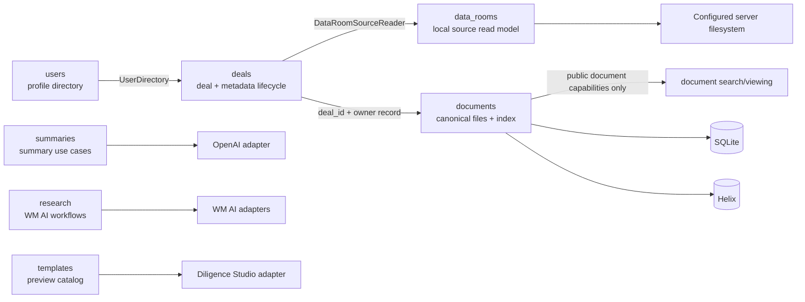
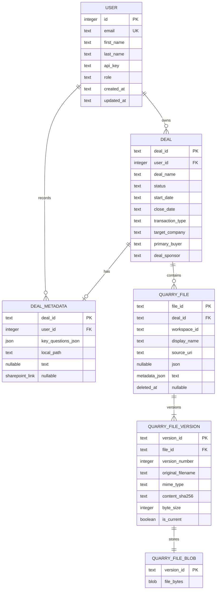

# Quarry domain and data model

| Field | Value |
| --- | --- |
| Status | Current-state companion to `ARCHITECTURE.md` |
| Last verified | 2026-09-11 |
| Repository snapshot | Live working tree, including the backend domain modularization |
| Audience | Quarry product engineers, reviewers, and coding agents |
| Scope | Product-domain ownership, durable entities, projections, ephemeral models, and known gaps |

This document explains what Quarry's domains mean and which data models actually exist today. It
is a companion to [`ARCHITECTURE.md`](ARCHITECTURE.md), which remains the canonical source for
runtime topology, request routes, infrastructure, configuration, and verification. Code,
manifests, migrations, and tests remain authoritative when either document drifts.

Here, **model** means the product and data model, not an OpenAI or other AI model selection.
Configured AI models are infrastructure concerns described in the architecture guide.

## 1. How to read the domain tree

Quarry's Axum backend is a modular monolith. A domain is a product capability boundary, not a
deployment boundary or necessarily a database table. An implemented domain may own routes,
handlers, services, domain models, and persistence ports. Concrete SQLite, Helix, AI, Office, and
external-service mechanisms live under `backend/src/adapters/` and are injected at bootstrap.

The directory tree deliberately contains both active modules and comment-only ownership markers:

- **Implemented** means the module is registered from `backend/src/domains/mod.rs`, assembled in
  `backend/src/app/bootstrap.rs`, and has working service or route behavior.
- **Partial** means some related behavior exists, but the named domain does not yet own a complete
  durable lifecycle or production boundary.
- **Reserved** means the directory states intended ownership only. A reserved `mod.rs` is not an
  API, entity, table, service, or claim that the product capability works.

Do not activate a reserved domain by adding it to the registry alone. Define its model,
invariants, authorization policy, persistence or external capabilities, service boundary, routes,
and tests first.

## 2. Domain map

### 2.1 Active domains

| Domain | Current responsibility | Durable model | Important boundary or limitation |
| --- | --- | --- | --- |
| `users` | Development profile creation and lookup by email | `users` | Profile lookup is not authentication; the development-era `api_key` is not an AI provider key |
| `deals` | Deal lifecycle, metadata, data-source selection, and file-assisted key-question extraction | `deals`, `deal_metadata` | Archive is a status update; owner email is resolved through the public `UserDirectory` facade |
| `data_rooms` | Browse and preview a deal's configured local filesystem source | None of its own | Reads a local root from deal metadata or server configuration; does not own stored document blobs or activate SharePoint |
| `documents` | Parse, ingest, persist, version, index, search, and view deal documents | `quarry_files`, `quarry_file_versions`, `quarry_file_blobs`; Helix projection | SQLite is canonical; Helix is a search projection; jobs and locks are process-local |
| `summaries` | List summarizable server files, summarize paths/uploads, and write Markdown | None | OpenAI-backed when configured; filesystem-oriented operations have a development trust model |
| `research` | Forward WM AI file, index, status, and GraphRAG workflows | None in Quarry | Operates on upstream WM AI models; broader product research ownership is not implemented |
| `templates` | Expose and mutate the validated app-scoped slide-template catalog | None in Quarry | Diligence Studio owns PPTX conversion, slide splitting, preview rendering, and template persistence; no deal ownership or selection |
| `system` | Health/capability/database-status operations | Reads infrastructure state only | Health is shallow; database status can expose a server path and has development-only posture |
| `dev_support` | Demo greeting/login-event behavior | None | Explicitly development/demo behavior, not a product identity or event domain |

The registered backend domain list is defined by
[`backend/src/domains/mod.rs`](../backend/src/domains/mod.rs). Bootstrap decides which concrete
capabilities each domain receives and merges already-state-bound feature routers.

### 2.2 Partial and reserved domains

| Domain | Intended ownership | Current reality |
| --- | --- | --- |
| `identity` | Authenticated principals and credential verification | Reserved; no inbound authentication or principal extractor |
| `workspaces` | Tenant workspace lifecycle | Reserved; no workspace table or trusted workspace aggregate |
| `memberships` | Principal-to-workspace roles and access policy | Reserved; no server-side tenant authorization |
| `user_settings` | Durable user preferences | Reserved backend boundary; current theme/preferences are client-local |
| `connections` | External data-source connection lifecycle | Reserved; SharePoint adapter is dormant and the UI modal does not submit an integration |
| `diligence` | Questions, findings, evidence, and review state | Reserved; some frontend review/search content is fixture-derived |
| `workflow` | Durable tasks, approvals, and workflow execution | Reserved; there is no durable queue or workflow engine |
| `deliverables` | Generated/user-managed deal artifacts and provenance | Reserved; current completed/in-progress UI has no backing API |
| `vaults` | Durable knowledge collections and access rules | Reserved; current vault screens are presentation/staging experiences |
| `notebooks` | Source-linked notes and notebook organization | Reserved; no persisted notebook model |
| `unified_search` | Authorized cross-domain search composition | Reserved; implemented search is document-chunk search only |
| `assistant` | Conversations, messages, citations, and interaction orchestration | Reserved; no assistant conversation API or durable thread model |
| `activity` | Durable product activity history | Reserved; frontend activity logs are session-local and separate |
| `notifications` | Preferences, delivery requests, attempts, and retry policy | Reserved; no notification queue or delivery adapter is active |

The separate `templates` and `deliverables` boundaries are intentional: reading or importing an
upstream template does not create a deliverable, associate one with a deal, or implement artifact
generation.

## 3. Active domain relationships



Cross-domain dependencies use small public facades rather than another domain's private handler,
service, or repository modules:

- `deals` asks `users::UserDirectory` to resolve a profile by email.
- `data_rooms` asks `deals::DataRoomSourceReader` for the configured local root.
- `documents` owns document storage/indexing and validates its deal relationship at persistence;
  it does not make `data_rooms` the owner of uploaded document bytes.
- `summaries`, `research`, and `templates` depend on injected adapter capabilities, not on each
  other's internal models.

Handlers validate transport input and call services. Services own use-case transitions.
Repositories own persistence/index operations. Adapters implement concrete mechanisms. None of
these lower layers reads ambient configuration or imports application-wide state.

## 4. Canonical relational model

SQLite schema version 6 is the canonical durable product store. The active relationships are:



`app_metadata` and `reminders` also exist in schema version 6, but no current registered domain
service or route consumes them. They are dormant schema, not evidence of implemented application
metadata or reminder domains.

### 4.1 Development user profile

A `User` is currently a development profile with a numeric SQLite ID and unique email. Deals use
the numeric ID as their owner reference. The profile's `api_key` field is returned by current API
responses, but Quarry's OpenAI features use server-side `OPENAI_API_KEY`; creating a profile does
not configure AI.

There is no authenticated principal attached to requests. Email, `userId`, and `workspaceId`
values supplied by clients are not trustworthy identity assertions.

### 4.2 Deal aggregate

A `Deal` is the primary current product aggregate. Its stable key is `deal_id`; creation currently
requires an ID beginning with `DEAL-`, non-empty descriptive fields, parseable start/close dates,
and a close date that is not before the start date.

`DealMetadata` is an optional one-to-one extension keyed by `deal_id`. It owns:

- extracted key questions serialized as a JSON array;
- an optional local data-room path; or
- an optional HTTPS SharePoint link.

The local path and SharePoint link are mutually exclusive, but both may be absent. A SharePoint
link is metadata only today. Archiving sets deal status to `Archived`; it does not delete the deal,
metadata, files, versions, or blobs.

### 4.3 Logical file aggregate

A `QuarryFile` is the stable logical attachment within a deal/workspace scope. It owns one or more
immutable `QuarryFileVersion` records, and each version owns exactly one byte blob.

Core invariants enforced by schema and repository logic include:

- a file belongs to exactly one existing deal and one stored `workspace_id`;
- a reused `file_id` cannot move between deals or workspace IDs;
- soft-deleted files are excluded from active reads and cannot be silently restored by ingestion;
- version numbers and content hashes are unique within a file;
- at most one version is current for a file;
- a version ID, byte size, content hash, and blob must agree for an idempotent write;
- child versions/blobs cascade when the owning file or version is deleted;
- an archived deal rejects new document persistence but retains existing records.

The current ingestion path uses the request's normalized `userId` value as `workspace_id` and
checks it against the deal owner's normalized email before persistence. This is a consistency
check, not authorization, because the request has no authenticated principal. The naming reflects
an incomplete tenant model and should not be generalized into a trusted Workspace entity.

## 5. Document identity and version lifecycle

The parser and persistence layers use several identifiers with different meanings:

| Identifier | Current derivation | Meaning |
| --- | --- | --- |
| `deal_id` | Client-supplied, validated `DEAL-...` string | Deal aggregate identity |
| `file_id` | Random on parse unless exact-content lookup reuses an existing file | Logical file identity |
| `content_sha256` | SHA-256 of original bytes | Exact content identity |
| `document_id` | SHA-256 of normalized request identity plus content hash | Ingestion/result identity; not the logical file key |
| `version_id` | SHA-256 of file ID plus content hash | Immutable file-version identity |
| `chunk_id` | Deterministic from file/version/index generation, order, and chunk hash | Search projection chunk identity |
| `index_generation` | Currently the version ID | Identifies the projected chunk generation |

The ordinary ingestion lifecycle is:

1. Validate the deal/request and compute the uploaded content hash.
2. Look for a current SQLite attachment with the same deal, stored workspace identity, and exact
   content hash.
3. If both SQLite and Helix already contain the same current version, report the upload as
   successfully skipped.
4. Otherwise parse PDF/DOCX, produce normalized chunks, and generate embeddings.
5. Persist the logical file, immutable version metadata, and original bytes in one SQLite
   transaction.
6. Project the committed file/version/chunks into Helix.

Parsers assign a new random `file_id`. Exact-content re-upload can reuse a committed file ID, but
changed content normally becomes a new logical file rather than version 2. The schema and
repository support later versions when a caller explicitly supplies the same file ID; ordinary
ingestion does not yet resolve changed bytes to an earlier logical attachment.

## 6. Helix search projection

Helix is not a second canonical store. It contains the query-oriented projection:

```text
QuarryFile
  ├── HAS_VERSION ───────> FileVersion
  └── CURRENT_VERSION ───> FileVersion
FileVersion
  └── HAS_CHUNK ─────────> FileChunk
```

- `QuarryFile` projects workspace ID, file ID, and display name.
- `FileVersion` projects immutable version/content metadata and index generation.
- `FileChunk` projects ordered text, embedding, hashes, token count, page/character ranges,
  section path, and timestamps.
- Keyword and vector search operate on current projected chunks within a caller-supplied workspace
  identity.

SQLite commits before Helix indexing. If the Helix write fails, the canonical SQLite version and
blob remain committed. Re-uploading the exact bytes can reuse that identity and retry projection.
There is no general SQLite-to-Helix reindex command, so canonical rows must not be deleted merely
to hide a projection failure.

## 7. Non-canonical read and process models

Not every type returned by a domain is an entity that Quarry owns durably.

### 7.1 Local Data Room tree

`DealDataRoom` and `DataRoomTreeNode` are request-time filesystem read models. The `data_rooms`
domain resolves a configured root, canonicalizes it, walks visible files/folders, and returns
relative paths plus preview metadata. It does not copy those files into SQLite. Local PDF previews
read validated bytes; DOCX/XLSX/PPTX previews are converted through the injected Office adapter.

The frontend currently merges this local tree with stored `documents` summaries for display. That
merge is a UI read model, not a backend aggregate and not proof that both sources have identical
lifecycle or authorization semantics.

### 7.2 Document jobs

`DocumentJobEvent` is a process model with `processing`, `completed`, `skipped`, and `failed`
states. Job records are in-memory Tokio watch channels, not durable entities. They are lost on
restart and cannot coordinate multiple backend instances.

### 7.3 Summaries and research

Summary text, selected paths, WM AI uploads, WM indexes, status responses, and GraphRAG query
responses are use-case DTOs or externally owned records. Quarry does not persist a Summary or
Research aggregate today.

### 7.4 Slide templates and previews

`TemplatePreviewPage`, pagination, and preview records are validated external read models supplied
by Diligence Studio. Single-slide and deck PPTX imports are external write processes whose compact
results contain only the selected mode and imported/warning counts. Diligence Studio converts and
persists one template per selected source slide; Quarry does not persist imported templates or
previews. A template preview is not a deliverable and has no current deal ownership, selection, or
generation lifecycle. Imported templates without an upstream-generated preview are durable there
but absent from Quarry's preview-only gallery.

### 7.5 Frontend view models and fixtures

Types such as `WorkspaceDeal`, `DealRoomData`, `DataRoomTreeNode`, file-review rows, timeline items,
and search results may combine server data with explicit frontend fixtures. They are presentation
models, not automatically canonical backend entities. Fixture-backed findings, metrics, tasks,
timeline entries, and search excerpts must not be documented or treated as persisted facts.

## 8. State ownership by durability

| Class | Current examples | Owner | Lifetime/recovery |
| --- | --- | --- | --- |
| Canonical durable state | Users, deals, metadata, files, versions, blobs | SQLite through owning domain repositories | Survives restart; subject to current schema migration policy |
| Search projection | File/version/chunk graph | Helix through `documents::index` | Rebuild intended from SQLite, but general tooling is missing |
| External read/process state | WM AI indexes/results, Diligence Studio templates/previews/imports | External provider; Quarry adapter/service maps it | Provider-defined |
| Server ephemeral state | Document jobs, ingestion locks, Office preview cache | Owning service/process | Lost on restart; not multi-instance |
| Desktop ephemeral authority | Authorized local roots | Tauri process | Lost on desktop restart |
| Client session state | Activity log, route state, modal/view state | React/module/session storage | Tab/webview or route lifetime |
| Development fixtures | Portfolio, review, search, and other placeholder records | `frontend/src/fixtures/` | Shipped development data; never authoritative |

## 9. Known model gaps

- Identity, workspace, and membership aggregates do not exist, so current resource scoping is not
  tenant authorization.
- `workspace_id` in the document model currently carries a normalized client-supplied identity
  that is checked against deal-owner email; it is not backed by a Workspace table.
- The development `users.api_key` field is exposed through profile DTOs and should not be treated
  as a production-safe secret model.
- Changed-content uploads usually create new logical files rather than later versions of an
  existing attachment.
- SQLite-to-Helix recovery is incomplete without a general reindex command.
- Document jobs, workflow-like processing, caches, and locks are not durable or distributed.
- Local paths and SharePoint links describe mutually exclusive deal sources, but only local
  filesystem browsing is active; SharePoint import is not wired.
- Diligence questions/findings/evidence, deliverables, notebooks, vaults, assistant conversations,
  notifications, and durable activity have reserved owners but no canonical backend models.
- `reminders` and `app_metadata` tables have no current domain consumer and should not be expanded
  until ownership is decided.
- Search endpoints trust caller-supplied workspace identity, and the Data Room search overlay is a
  separate fixture-backed frontend experience rather than a consumer of those endpoints.

## 10. Rules for extending the model

When adding or changing a domain model:

1. Name the owning domain and decide whether the data is canonical, projected, external, ephemeral,
   or fixture-backed.
2. Define stable IDs, scope/ownership, lifecycle states, invariants, deletion/retention behavior,
   idempotency, and failure recovery before choosing storage.
3. Enforce transport facts in handlers, use-case transitions in services, and storage invariants in
   repositories or model helpers.
4. Keep adapters infrastructure-specific and inject them from bootstrap; domains must not construct
   clients or read environment variables.
5. Use public domain facades for cross-domain collaboration. Do not import another domain's private
   handler, service, or repository modules.
6. Treat authentication and authorization as server boundaries. Client route state, IDs, CORS, and
   Tauri validation are not authorization.
7. For SQLite changes, define forward migration and recovery behavior, update migration/invariant
   tests, and protect existing local data. The current pre-v6 migration is destructive.
8. For Helix changes, preserve SQLite ownership, deterministic projection identity, and the
   reindex/rollback constraints in `ARCHITECTURE.md`.
9. Update this document when domain ownership or model semantics change, and update
   [`ARCHITECTURE.md`](ARCHITECTURE.md) when the runtime boundary, route/API, schema, integration,
   security posture, or operational behavior also changes.

## 11. Primary implementation references

- Domain registry and ownership markers: [`backend/src/domains/`](../backend/src/domains/)
- Application composition: [`backend/src/app/bootstrap.rs`](../backend/src/app/bootstrap.rs)
- SQLite schema: [`backend/src/app/migrations.rs`](../backend/src/app/migrations.rs)
- User model/repository: [`backend/src/domains/users/`](../backend/src/domains/users/)
- Deal model/repository: [`backend/src/domains/deals/`](../backend/src/domains/deals/)
- Local Data Room read model: [`backend/src/domains/data_rooms/`](../backend/src/domains/data_rooms/)
- Document canonical store: [`backend/src/domains/documents/store/`](../backend/src/domains/documents/store/)
- Document ingestion and identity mapping: [`backend/src/domains/documents/ingestion/`](../backend/src/domains/documents/ingestion/)
- Helix projection/search model: [`backend/src/domains/documents/index/`](../backend/src/domains/documents/index/)
- Shared identifier functions: [`backend/src/shared/ids.rs`](../backend/src/shared/ids.rs)
- Frontend transport DTOs: [`frontend/src/contracts/quarryApi.ts`](../frontend/src/contracts/quarryApi.ts)
- Frontend presentation models: [`frontend/src/data/`](../frontend/src/data/)
- Current runtime/API/data architecture: [`docs/ARCHITECTURE.md`](ARCHITECTURE.md)
- Versioned Helix rollout and recovery: [`ARCHITECTURE.md` section 9.2](ARCHITECTURE.md#92-helix-versioned-file-graph)
