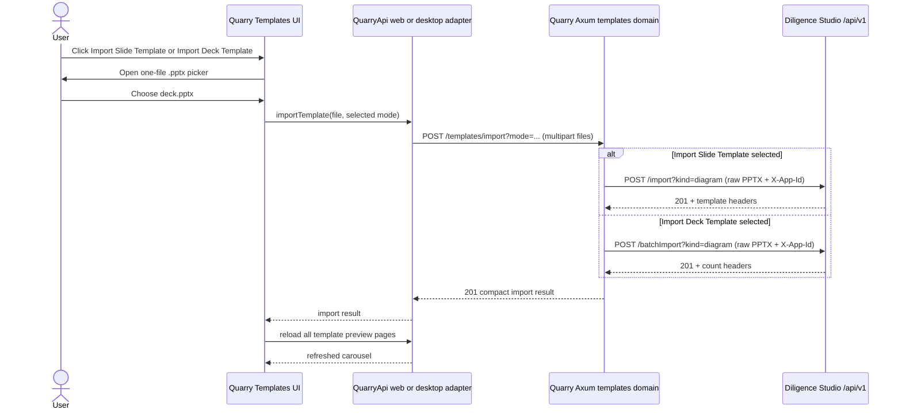

# Diligence Studio slide- and deck-template import integration plan

Status: proposed

Revalidated: 2026-09-11 against the live Quarry and Diligence Studio working trees

Scope: make the existing **Import Slide Template** control in Quarry's Templates header import one
selected one-slide `.pptx`, and add a second **Import Deck Template** control that imports every
slide in one selected `.pptx`. Both actions use Quarry's web and desktop transports and write to
Diligence Studio's app-scoped template catalog. The slide action uses Diligence Studio's single
import API; the deck action uses its batch import API.

## Outcome

The populated Templates header exposes two adjacent actions:

- **Import Slide Template** opens a one-file picker and sends the selected `.pptx` through the
  single-slide import path.
- **Import Deck Template** opens a one-file picker and sends the selected `.pptx` directly through
  the batch import path, creating one template per source slide.

After either selection, Quarry uploads the file immediately, disables both import actions while
work is in progress, and refreshes the template-preview carousel after a successful import. The
empty-catalog state mirrors both choices: its existing drop/browse affordance is explicitly for a
single-slide template, and it adds an **Import Deck Template** action for batch import.

The selected action determines the upstream API; Quarry does not infer the mode from the file and
does not fall back between APIs:

1. Quarry sends the PPTX and the explicit `single` or `batch` mode to its own
   `POST /api/v1/templates/import` endpoint.
2. For `single`, Axum calls Diligence Studio's `POST /api/v1/import?kind=diagram` endpoint.
3. For `batch`, Axum calls Diligence Studio's `POST /api/v1/batchImport?kind=diagram` endpoint.
4. Quarry reloads the preview catalog after the selected upstream write completes.

This makes the potentially many-template deck action deliberate, exercises both specialized
upstream APIs without double-converting a multi-slide deck, and avoids adding a PowerPoint parser
to the browser or desktop shell. If a user selects a multi-slide file through **Import Slide
Template**, Quarry surfaces the definitive single-slide validation error and directs the user to
**Import Deck Template**; it does not retry automatically.

## Verified current state

### Quarry

- `DeliverablesHeader.tsx` renders the pictured button only when the preview catalog is populated.
  `DeliverableTemplatesView.tsx` renders the corresponding drop zone only when the catalog is
  successfully loaded and empty.
- The current header and empty-state controls accept one `.pptx` through `useFileUpload`, but
  neither supplies `onFilesAdded`; selected files are currently discarded. Existing tests
  explicitly call this behavior inert. There is not yet a distinct deck-import control.
- `TemplatePreviewStore.tsx` owns catalog reads and deletes. It has no import action or way to
  refresh its catalog without replacing the provider's `requestKey`.
- The shared `QuarryApi` contract and web/Tauri adapters support preview listing and deletion only.
- Axum's `templates` domain exposes preview GET and template DELETE routes. The injected,
  integration-wide `DiligenceStudioClient` already owns the configured `/api/v1/` base and fixed
  `X-App-Id: Quarry_WestMonroe` identity.
- The generic Tauri multipart command already transports one file to a versioned Quarry path. It
  enforces a 50 MiB file/total limit and does not need a new native command or capability grant.
- Axum's default buffered-body limit is 2 MiB. A template upload route therefore needs a scoped
  body-limit override; relying only on service validation would reject ordinary PPTX files too
  early.
- The template gallery lists rendered previews, not all stored templates. An upstream import whose
  preview is unavailable is durable in Diligence Studio but is absent from Quarry's current
  preview-only carousel.

### Diligence Studio server

The current, uncommitted server worktree implements and tests these contracts:

| Operation | Contract |
| --- | --- |
| Single import | `POST /api/v1/import?kind=diagram`; raw PPTX body; exactly one slide; `201`; template ID and preview status in response headers |
| Batch import | `POST /api/v1/batchImport?kind=diagram`; raw PPTX body; one atomically stored template per source slide; `201`; imported count and warning count in response headers |
| App scope | `X-App-Id: Quarry_WestMonroe`; app IDs segregate catalog access but are not authentication |
| Upload limit | 25 MiB by default through `MAX_PPTX_UPLOAD_BYTES` |
| Timeout | 30 seconds per request by default |
| Single/multi discriminator | Multi-slide input to the single endpoint returns `422` with `error.code = template_must_have_one_slide` and stores nothing |
| Preview behavior | Headless rendering normally produces one PNG per imported slide; preview-disabled/failing imports may still persist without appearing in the preview listing |

The integration should not ship until these Diligence Studio API changes and their app-identity
behavior are committed or otherwise version-pinned. Quarry must consume the versioned API rather
than depend on uncommitted implementation details indefinitely.

## Stable boundaries and non-goals

- The browser and Tauri webview call Quarry only. They never call port `43127`, set `X-App-Id`, or
  receive the Diligence Studio base URL.
- Axum's `templates` domain owns the import use case and user-facing result. The
  `adapters/diligence_studio` module owns HTTP paths, headers, raw-body transport, upstream wire
  shapes, response limits, and exact error-code inspection.
- Diligence Studio remains the only owner of PowerPoint conversion, slide splitting, preview
  rendering, template persistence, asset persistence, and atomic batch insertion.
- Quarry does not persist imported template JSON, preview images, warnings, or template IDs.
- Imported records are app-scoped to `Quarry_WestMonroe`, not deal-scoped. Do not add or fabricate
  a `dealId` in this slice.
- Both actions import `kind=diagram`, matching the gallery's slide-template purpose. They differ
  only in whether Diligence Studio treats the file as one slide template or a batch deck. This
  change does not add a diagram/commentary selector.
- Do not add direct `fetch` to feature components, raw `@tauri-apps/*` imports outside
  `runtime.desktop.ts`, a new Tauri command, a second Diligence Studio client, a generic arbitrary
  upstream proxy, a new database table, or a fixture fallback.
- Do not add automatic retries for timeouts, connection failures, or 5xx responses. Diligence
  Studio's import endpoints do not currently expose idempotency, so retrying after an uncertain
  outcome can create duplicates.
- Deliverable generation, editing, template titles, batch progress streaming, import cancellation,
  and deal-level template ownership are outside this change.

## Proposed product contract

Add one transport-neutral operation with an explicit import mode to
`frontend/src/contracts/quarryApi.ts`:

```ts
export type TemplateImportMode = "single" | "batch";

export type TemplateImportResult = {
  importMode: TemplateImportMode;
  importedCount: number;
  warningCount: number;
};

export interface QuarryApi {
  importTemplate(file: File, importMode: TemplateImportMode): Promise<TemplateImportResult>;
}
```

The corresponding Quarry endpoint is:

```http
POST /api/v1/templates/import?mode=single|batch
Content-Type: multipart/form-data

files=<one .pptx file>
```

Reject a missing or unsupported `mode` before calling upstream. Success returns `201 Created`
with the compact camelCase `TemplateImportResult`, whose `importMode` must match the requested
mode. Do not relay the single endpoint's hydrated canvas JSON or the batch endpoint's
`templateJson` objects through Quarry: the gallery needs only the counts/mode, then obtains images
from its existing paginated preview contract. This avoids copying potentially large,
base64-hydrated presentation payloads through Axum, Tauri, activity logs, and React state.

Use the upstream response headers as the compact success contract:

- single: require a valid `X-Template-Id`, `X-Template-Preview-Status`, and non-negative
  `X-PowerPoint-Warning-Count`; return `importedCount: 1`;
- batch: require a positive, bounded `X-Imported-Template-Count` and non-negative
  `X-PowerPoint-Warning-Count`; return the imported count;
- reject malformed or contradictory headers as an invalid upstream response and return a
  sanitized `503` from Quarry.

The adapter may discard successful upstream bodies after validating status, content type, and
required headers. The batch body contains every hydrated `templateJson`, so it should not be
buffered merely to reproduce counts already provided in headers.

## End-to-end flow



## Implementation slices

### 1. Extend the Diligence Studio adapter

Keep the new methods in `backend/src/adapters/diligence_studio/templates.rs` alongside preview and
delete behavior:

- add a typed `import_template(bytes, mode)` method, backed by focused single and batch helpers;
- route `single` directly to the single endpoint and `batch` directly to the batch endpoint; never
  infer the mode from the PPTX or fall back to the other endpoint;
- join relative `import` and `batchImport` paths against the normalized `/api/v1/` base so the
  version prefix is preserved;
- explicitly append `kind=diagram` and send the fixed `X-App-Id` header;
- send the supplied bytes as the raw request body with
  `application/vnd.openxmlformats-officedocument.presentationml.presentation`;
- retain a per-request timeout compatible with Diligence Studio's 30-second request timeout;
- inspect at most a small bounded JSON error body when either import endpoint rejects the file;
- preserve the exact `template_must_have_one_slide` classification so the service can return an
  actionable error for the slide action, but do not turn it into a batch request;
- do not retry or switch modes for malformed PowerPoint, empty content, oversized content, other
  4xx responses, timeouts, connection errors, or 5xx responses;
- require `201 Created`, JSON content type, and the operation-specific headers described above;
- cap count/warning headers and validate template IDs using the same ID policy already used by
  preview/delete operations;
- avoid logging filenames, PPTX bytes, template JSON, upstream bodies, or full upstream URLs.

Rename the current preview-specific client error only if necessary to make it honestly cover
preview, delete, and import operations. Preserve granular variants internally so the template
service can distinguish a definitive file rejection from an availability failure without leaking
upstream internals.

### 2. Add the Axum upload route and service use case

Extend the existing templates route rather than adding a new product domain:

- register `POST /templates/import` before the parameterized `/templates/{template_id}` route;
- attach `DefaultBodyLimit::max(26 * 1024 * 1024)` to this route only, allowing the 25 MiB file
  plus bounded multipart framing without expanding unrelated endpoints;
- accept multipart as the last handler extractor;
- require exactly one `mode=single|batch` query value and pass it as a typed service input;
- require exactly one `files` part and reject unknown non-empty file parts, duplicate files,
  missing/blank filenames, path-like filenames, empty bytes, and names without a case-insensitive
  `.pptx` extension;
- enforce a 25 MiB file limit in the collector even though the route also has a total body limit;
- do not trust a browser-supplied MIME value as proof of file type; the upstream parser remains the
  structural OOXML validator;
- pass an owned upload value and typed mode into `TemplateService`, which checks that the optional
  Diligence Studio capability is configured and calls only its typed import method;
- return `201` and the compact import DTO on success;
- map known invalid input to a sanitized 400-class response, definitive upstream availability or
  invalid-contract failures to sanitized `503`, and unexpected internal failures to a sanitized
  500;
- preserve the existing `GET /templates/previews` and `DELETE /templates/{template_id}` contracts.

No blocking PowerPoint or ZIP inspection belongs in the handler or service. The upstream service
already owns that work.

### 3. Extend both frontend transports

Web adapter:

- append the file under the exact multipart field name `files`;
- call `POST /api/v1/templates/import?mode=single|batch` through the existing `postForm` helper,
  URL-encoding the explicit mode selected by the UI;
- never set the multipart `Content-Type` manually, so the browser supplies the boundary;
- log only summarized multipart metadata through the existing redacted activity-log path.

Desktop adapter:

- reuse `multipartFiles` and `postMultipart` with the same versioned path and field name;
- normalize an empty browser MIME value to the PowerPoint MIME before IPC, after validating the
  `.pptx` extension;
- retain the existing 50 MiB native hard ceiling while the feature-level contract rejects files
  above 25 MiB;
- add path/relay regression coverage, but do not add a command, permission, CSP origin, or desktop
  environment variable.

### 4. Make `TemplatePreviewStore` own import and refresh

Add `importTemplate(file, importMode)` and a catalog `reload()` action to the existing
request-scoped store. Keep the carousel data visible during an import rather than replacing it
with the initial loading skeleton.

Represent the success state with one mutually exclusive active operation, for example
`{ type: "import"; importMode }`, `{ type: "delete"; templateId }`, or `null`, plus separate action
feedback. This prevents slide import, deck import, and delete overlap without combining
independent booleans into impossible states.

Import transitions:

1. validate the selected file locally;
2. retain current slides, clear stale action feedback, mark import active, and notify subscribers;
3. call `runtime.api.importTemplate(file, importMode)`;
4. after API success, reload every preview page with the existing pagination/duplicate guards;
5. replace slides only after the complete refreshed catalog validates;
6. clear the active operation and expose a concise success message with imported and warning
   counts.

Treat write success followed by refresh failure as a distinct partial-success state:

- retain the previous carousel;
- say that the templates were imported but the gallery could not be refreshed;
- offer a **Refresh templates** action that only reloads the catalog;
- do not label the write as failed or encourage re-upload, because a manual retry could create
  duplicates.

If the import request itself fails, retain the current slides, show a sanitized alert, and allow a
manual retry. Ignore stale refresh completion after a newer store operation. Navigating away may
not cancel a desktop IPC request or an upstream import, so do not expose a cancel control or claim
that cancellation prevents persistence.

### 5. Wire the two import buttons and empty-state actions

Keep the existing **Import Slide Template** button's label, icon, size, navy/purple styling, and
placement. Add an adjacent **Import Deck Template** button using the same visual system with a
distinct accessible name. Their interactions are:

- clicking either button opens its hidden native picker;
- each picker accepts one `.pptx` file;
- a valid slide-button selection begins a `single` import immediately;
- a valid deck-button selection begins a `batch` import immediately;
- reset the hidden input after selection so the same file can be selected again after a definite
  validation failure;
- while either action is active, disable both pickers and the drop target and show mode-specific
  `Importing slide…` or `Importing deck…` feedback with `aria-busy=true` or an equivalent labelled
  status;
- show result/error messaging in the template gallery area so the fixed-height header does not
  jump;
- restore focus to the trigger after a rejected selection or completed picker interaction where
  browser behavior requires it.

Mirror both actions in `TemplateUploadEmptyState`. Keep its drop/browse affordance explicitly
labelled for a single-slide template and route it to `single`; add an **Import Deck Template**
button that routes its picker to `batch`. Reuse `useFileUpload`; supply its `onFilesAdded`,
`onError`, and `maxSize` options instead of creating a second file-input implementation. Accept
by extension because some browsers provide an empty MIME type, but require a non-empty file and a
maximum of 25 MiB.

If the single endpoint returns `template_must_have_one_slide`, tell the user to retry with
**Import Deck Template**. Do not automatically submit the same file to the batch endpoint.

After a successful import, the refreshed upstream newest-first order should place imported
previews at the start of the carousel. If `warningCount > 0`, explain that the import completed
with warnings and that templates without generated previews will not appear in this preview-only
gallery. Do not fabricate a preview or treat an unavailable preview as a failed persistence write.

## File-level change map

| Area | Expected files |
| --- | --- |
| Shared frontend contract | `frontend/src/contracts/quarryApi.ts` |
| Web transport | `frontend/src/api/httpQuarryApi.ts`, `frontend/tests/api/httpQuarryApi.test.ts` |
| Desktop TypeScript transport | `frontend/src/api/tauriQuarryApi.ts`, `frontend/tests/api/tauriQuarryApi.test.ts` |
| Tauri relay regression | `frontend/src-tauri/tests/quarry_api/service_tests.rs` and, only if required by the existing test seams, nearby relay tests |
| Feature state | `frontend/src/components/deal-room/TemplatePreviewStore.tsx` and its focused tests |
| Header import buttons | `frontend/src/components/examples/c-file-upload-3.tsx`, `frontend/src/components/deal-room/DeliverablesHeader.tsx`, and header tests |
| Empty gallery upload | `frontend/src/components/examples/c-file-upload-4.tsx`, `frontend/src/components/deal-room/DeliverableTemplatesView.tsx`, and view tests |
| Axum request layer | `backend/src/domains/templates/handler.rs`, `backend/src/domains/templates/route.rs` |
| Axum use case | `backend/src/domains/templates/service.rs` |
| Upstream transport | `backend/src/adapters/diligence_studio/templates.rs` |
| Backend tests | mirrored unit tests under `backend/tests/unit/domains/templates/` and `backend/tests/unit/adapters/diligence_studio/`, plus `backend/tests/integration/http_tests.rs` |
| Canonical documentation | `docs/ARCHITECTURE.md`, and `docs/DOMAIN_MODEL.md` if its template ownership/integration section would otherwise become stale |

Before implementation, re-check whether the two `components/examples` files are still used only
by this feature. If they are production-owned despite their names, a focused rename into
`components/deal-room/` may be done in the same change; do not combine the integration with a
broad examples-directory cleanup.

## Error and consistency policy

| Condition | Required result |
| --- | --- |
| Picker cancelled | No request and no error |
| Wrong extension, empty file, or file over 25 MiB | Local alert; no network request |
| Missing/unsupported mode or missing/multiple/invalid multipart files | Quarry 400-class response; no upstream request |
| Diligence Studio not configured | Quarry 503; existing catalog remains visible |
| **Import Slide Template** succeeds | Return mode `single`, refresh catalog, report one imported template |
| Slide action receives exact multi-slide error | Do not call batch; direct the user to **Import Deck Template** |
| Slide action returns any other 4xx/5xx or invalid payload | No mode switch; sanitized failure |
| **Import Deck Template** succeeds | Return mode `batch`, refresh catalog, report upstream imported/warning counts |
| Deck action is rejected | Do not call single; surface a sanitized, mode-appropriate failure |
| Upstream timeout or connection loss | Do not auto-retry; explain that outcome may be uncertain |
| Import succeeds but preview reload fails | Preserve old slides; show partial-success message and reload-only action |
| Preview generation unavailable | Import remains successful; warn that the preview-only gallery may omit the template |
| Duplicate user click/drop during import | Ignore/disable until the active operation finishes |

## Tests

### Backend adapter and service

- Single mode sends byte-identical PPTX data to `/import` with the exact PowerPoint content type,
  `kind=diagram`, and `X-App-Id: Quarry_WestMonroe`; it validates all required headers.
- Batch mode sends byte-identical PPTX data directly to `/batchImport` with the same content type,
  query kind, and app identity; it never probes the single endpoint first.
- Exact `422 template_must_have_one_slide` from single mode is preserved as an actionable rejection
  and does not cause a batch request.
- Other 422 codes, malformed error JSON, 413, timeout, connection error, and 5xx do not trigger a
  request to the other import endpoint.
- Batch success validates positive imported count and non-negative warning count.
- Missing, malformed, excessive, or contradictory headers become sanitized upstream-contract
  failures.
- The unconfigured optional client maps to 503 without affecting startup or existing routes.
- Service tests prove import orchestration stays in `TemplateService` and does not expose raw
  upstream errors.

Use an ephemeral fake HTTP upstream. Do not call the live Diligence Studio database or renderer in
routine tests.

### Axum route

- Valid one-file multipart input with either supported mode returns `201` with camelCase compact
  JSON whose `importMode` matches the request.
- Missing/unsupported mode, missing file, multiple files, empty file, unsafe filename, non-PPTX
  extension, and over-limit payload are rejected.
- The scoped body limit permits a representative file above Axum's default 2 MiB and rejects the
  configured maximum without changing other routes.
- `/api/v1/templates/import` and the temporary `/api/templates/import` composition behave
  consistently, while frontend clients target only `/api/v1`.

### Frontend and state

- Clicking **Import Slide Template** invokes its hidden file input and calls `importTemplate` once
  with `single` after a valid selection.
- Clicking **Import Deck Template** invokes its hidden file input and calls `importTemplate` once
  with `batch` after a valid selection.
- Local validation rejects wrong type, empty content, and over-25-MiB files without an API call.
- The header and empty state expose both explicit modes; the empty-state drop zone remains mapped
  to single-slide import and is labelled accordingly.
- Import retains the existing carousel, disables both import buttons, prevents overlapping
  import/delete actions, and exposes a mode-specific labelled in-progress status.
- Single and batch results render correct singular/plural counts and warning messaging.
- API success triggers a complete sequential catalog reload and displays the newest upstream
  ordering.
- Import failure retains the old carousel; refresh-after-write failure uses the partial-success
  message and reload-only action.
- The file input resets so the same file can be selected after a definite validation failure.
- Unmount or a newer operation prevents stale UI commits even when the underlying transport cannot
  cancel persistence.

### Transport parity

- `httpQuarryApi` posts one `files` multipart field to the exact versioned route with the requested
  `single` or `batch` query mode and does not set a manual multipart content type.
- `tauriQuarryApi` sends the same route and mode, field name, filename, PowerPoint MIME, and base64
  bytes.
- Tauri path validation accepts both mode-qualified `/api/v1/templates/import` requests, and the
  existing multipart size and filename controls remain effective.

## Verification

Run the Diligence Studio source-contract test first, without starting its real server or touching
its file-backed SQLite database:

```sh
cd /Users/rgambhir/diligence-studio
npm run test --workspace @diligence-studio/server -- test/importApi.test.ts
npm run typecheck --workspace @diligence-studio/server
```

Run focused Quarry frontend tests, then the shared frontend gates:

```sh
cd /Users/rgambhir/Quarry/frontend
npm test -- tests/components/deal-room/DeliverablesHeader.test.tsx
npm test -- tests/components/deal-room/DeliverableTemplatesView.test.tsx
npm test -- tests/api/httpQuarryApi.test.ts tests/api/tauriQuarryApi.test.ts
npm run typecheck
npm run check:boundaries
npm test
npm run build:web
npm run check:web-bundle
npm run build:desktop-ui
```

Run focused backend tests followed by the full Axum gates:

```sh
cd /Users/rgambhir/Quarry/backend
cargo test template_import
cargo fmt --all -- --check
cargo check --locked --all-targets
cargo clippy --locked --all-targets -- -D warnings
cargo test --locked --all-targets
```

Run the Tauri crate gates because desktop multipart behavior is part of the contract:

```sh
cd /Users/rgambhir/Quarry/frontend/src-tauri
cargo fmt --all -- --check
cargo clippy --locked --all-targets -- -D warnings
cargo test --locked --all-targets
```

Do not use Quarry `cargo run` as a check: backend startup opens/migrates SQLite and requires Helix.
Do not run a live import against Diligence Studio's file-backed database during routine
verification. If the user separately authorizes an end-to-end smoke test, use a disposable
Diligence Studio SQLite path, a disposable one-/multi-slide fixture, confirmed preview-renderer
availability, and exact process/port cleanup.

Manual inspection in web and desktop must cover:

- both populated-header buttons, picker cancel, one-slide success through **Import Slide Template**,
  multi-slide success through **Import Deck Template**, a multi-slide rejection through the slide
  action, validation error, upstream error, and empty-catalog single-slide drag/drop;
- duplicate-submission prevention, focus visibility/restoration, status and alert announcements,
  and stable header/carousel layout while importing;
- refreshed imported previews at the front of the carousel;
- warning/preview-unavailable and write-success/refresh-failure messaging;
- no direct browser/webview request to Diligence Studio, no console error, and no raw file data or
  template JSON in activity logs.

Finish with `git diff --check`, inspect the complete diff and lockfiles, and re-run
`git status --short` in both repositories. No dependency addition is expected for the proposed
explicit-mode design.

## Rollout prerequisites and operational notes

- Commit or pin the current Diligence Studio import/app-identity contracts before implementing
  Quarry against them.
- Configure Quarry's existing `DILIGENCE_STUDIO_API_BASE_URL` to the versioned upstream base; do
  not add endpoint-specific environment variables.
- Ensure Diligence Studio's upload limit is at least Quarry's 25 MiB product limit.
- Ensure the Diligence Studio preview provider can reach its configured internal preview-render
  page and that Chromium is installed when `headless` is selected. Otherwise imports may persist
  but remain invisible in Quarry's preview-only gallery.
- Monitor multi-slide latency. A deck import makes one direct batch request and must fit within
  Quarry's 120-second request timeout and Diligence Studio's per-request timeout.
- Before production exposure, replace the fixed app identifier with real authenticated,
  authorized service-to-service and tenant context. The current `X-App-Id` is segregation, not a
  security boundary.
- Add upstream idempotency before introducing automatic retries. Until then, an uncertain network
  failure must not be presented as a definite non-write.

## Architecture documentation impact when implemented

Update `docs/ARCHITECTURE.md` in the implementation change to:

- add `importTemplate(file, importMode)` to the shared runtime contract and both transport
  mappings;
- add `POST /api/v1/templates/import`, its multipart limit, compact result DTO, and error behavior;
- document the two explicit UI actions, the `single|batch` request mode, and their direct upstream
  mappings through the shared `DiligenceStudioClient`;
- change the Templates feature inventory from inert/discarded uploads to an API-backed import with
  explicit pending, success, warning, error, and refresh states;
- document that Diligence Studio owns persistence and atomic slide splitting, while Quarry keeps
  no template copy;
- retain the limitation that preview-unavailable imports are not visible in the preview-only
  gallery;
- record the non-idempotent retry constraint and the fact that `X-App-Id` is not authorization.

Update `docs/DOMAIN_MODEL.md` only if its current template ownership or integration narrative
would otherwise contradict the implemented flow.

## Acceptance criteria

- Clicking **Import Slide Template** opens one `.pptx` picker and sends the selected file only to
  Diligence Studio `/api/v1/import`; the empty-gallery drop zone uses this same explicitly labelled
  single-slide action.
- Clicking the adjacent **Import Deck Template** button opens one `.pptx` picker and sends the
  selected file directly to Diligence Studio `/api/v1/batchImport`, where every source slide
  becomes a separately persisted template.
- A multi-slide rejection from the single-slide action directs the user to **Import Deck
  Template** and never triggers an automatic batch retry; a batch rejection never triggers the
  single endpoint.
- Every source slide in a batch becomes a separately persisted Diligence Studio template through
  its existing atomic batch behavior.
- Quarry clients call only `POST /api/v1/templates/import?mode=single|batch`; Axum supplies the
  fixed app identity and calls the selected Diligence Studio endpoint through the existing typed
  adapter.
- The upload is exactly one non-empty `.pptx`, capped at 25 MiB in the UI and Axum, and the route's
  multipart body limit is scoped rather than global.
- Quarry returns only mode/count/warning metadata and never relays hydrated template JSON or PPTX
  bytes back to React.
- Both buttons and the drop zone remain disabled during either operation, duplicate writes are
  prevented, and all pending/success/warning/error/partial-success states are visible and
  accessible.
- A successful write triggers a complete validated preview refresh; a refresh failure never
  misreports the write as failed or encourages a duplicate re-import.
- Preview-unavailable imports remain successful and are explained honestly instead of receiving a
  fabricated local preview.
- Web and desktop use the same `QuarryApi` method and behavior, with no new Tauri command,
  permission, CSP origin, direct upstream URL, or frontend secret/configuration.
- Fake-upstream backend tests, frontend contract/state tests, Tauri relay tests, all applicable
  repository gates, and manual web/desktop inspection pass.
- The implementation updates canonical architecture documentation and preserves all unrelated
  uncommitted work in both repositories.
