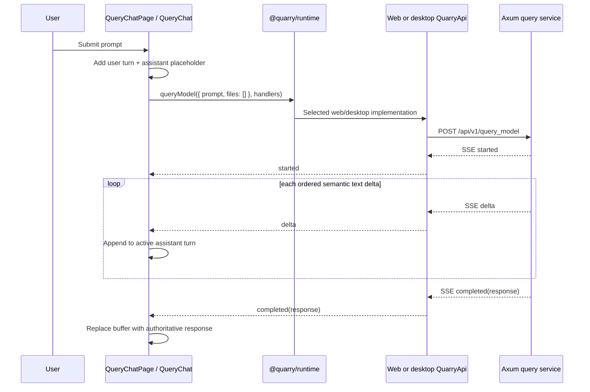

# Quarry query chat UI follow-up plan

Status: proposed

Depends on: [Quarry send-query SSE plan](quarry-send-query-sse-plan.md)

Scope: a new shared React chat page, assistant-ui standalone Elements-derived chat primitives,
and consumption of the planned `QuarryApi.queryModel` stream

Baseline: source strategy revised on 2026-09-01; preserve the pre-existing deletion of
`frontend/src/components/deal-room/DiligenceGraphView.tsx`

Active route: `/hub/summarize`

Legacy page retained: [`frontend/src/pages/SummarizePage.tsx`](../frontend/src/pages/SummarizePage.tsx)

## Outcome

Add a Claude Code-inspired Quarry chat surface that can submit a text prompt and render one
assistant response incrementally from the send-query SSE operation. Keep the existing workspace
shell and sidebar exactly as they are.

The active route will move to a new `QueryChatPage`; it will not replace, delete, or refactor the
existing `SummarizePage`. `SummarizePage`, `components/summarize/ChatPanel.tsx`, and
`components/summarize/PanelTab.tsx` will remain in source, compile under both TypeScript targets,
and have no route or application entrypoint. This keeps the current summarization UI isolated for
possible later reuse while excluding it from the web and desktop bundles.

The first chat release will:

- keep `/hub/summarize`, the Research > Explore sidebar link, and
  `activeHomeSection="summarize"` unchanged;
- submit only `{ files: [], prompt }` through `runtime.api.queryModel`;
- omit `model` and `systemInstructions` so Axum resolves the server-owned defaults;
- show the user turn immediately and append each assistant `delta` in order;
- treat `completed.response` as the authoritative final response, including completion without
  prior deltas;
- support one active request at a time with visible Send, Stop, failure, retry, and completion
  states;
- retain a page-local transcript of independent single-shot exchanges until route unmount, while
  clearly not representing earlier turns as provider context;
- compose the standalone assistant-ui Elements for Composer, Chat Panel, Scroll Anchor, Message
  Pair, Error State, and Stopped Run into Quarry-owned chat components, adapted to Quarry's theme,
  existing shared primitives, transport contract, and accessibility rules;
- keep assistant-ui at the presentation layer: do not initialize its runtime, add an assistant-ui
  provider, or replace Quarry's `runtime.api.queryModel` transport;
- work through the same React tree in web and desktop without raw `fetch`, `EventSource`, or Tauri
  imports;
- avoid attachments, model selection, system-instruction editing, persistence, and server/API
  changes in this slice.

## Prerequisite gate

This plan is a consumer of `quarry-send-query-sse-plan.md`, not an alternative implementation of
it. Do not start the page integration until that plan is complete and the live tree contains all
of the following:

- `QueryModelInput`, `SendQueryEvent`, `SendQueryEventHandlers`, and
  `QuarryApi.queryModel` in `frontend/src/contracts/quarryApi.ts`;
- browser POST-SSE support and cancellation in `frontend/src/api/httpQuarryApi.ts`;
- desktop TypeScript mapping plus the narrow Tauri send/cancel relay;
- `POST /api/v1/query_model` with the documented multipart fields, event union, defaults, and
  cancellation behavior;
- focused web, desktop, Tauri, service, route, parsing, redaction, and cancellation tests;
- the predecessor's `docs/ARCHITECTURE.md` and `backend/.env.example` updates.

Run the predecessor's focused and broad gates first. If any item is missing, finish that plan
instead of adding a page-local transport shim, mock production adapter, direct HTTP call, or
desktop-only exception.

## Decisions

### Route, shell, sidebar, and legacy summarize isolation

- Create `frontend/src/pages/QueryChatPage.tsx` and lazy-load it from `App.tsx` at the existing
  `/hub/summarize` path.
- Remove only the `App.tsx` lazy import of `SummarizePage`; do not rename or delete the old file.
- Keep `WorkspaceHomeShell`, `WorkspaceLayout`, `WorkspaceSidebar`, sidebar labels, sidebar order,
  workspace session state, and the `ActiveHomeSection` union unchanged.
- Render the new page with
  `WorkspaceHomeShell activeHomeSection="summarize"` and a `WorkspaceHeader` titled `Ask Quarry`.
- Leave the old summary endpoints and `QuarryApi.summarizePath`, `summarizeSelected`, and
  `summarizeUpload` methods in place. Removing their active UI caller is not authorization to
  remove their contract, adapters, backend routes, or tests.
- Keep `SummarizePage.tsx` and its summarize components unreachable from active application code.
  Add focused route coverage so future route edits do not accidentally register both pages.

### Single-shot query semantics in a chat-shaped UI

The backend operation has no conversation ID, prior-message input, `previous_response_id`, durable
job, replay, or resume. The UI may keep completed exchanges visible for continuity, but each send
contains only the new prompt. It must not concatenate or silently send earlier turns.

Use one in-flight exchange at a time:

| State | Visible behavior | Allowed action |
| --- | --- | --- |
| Empty | Compact Ask Quarry introduction and focused composer | Send a non-blank prompt |
| Connecting | User turn plus empty assistant turn and progress text | Stop |
| Streaming | Ordered partial assistant Markdown is visible | Stop; scrolling remains usable |
| Completed | Authoritative final Markdown replaces the partial buffer | Send another independent prompt |
| Server failed | Partial output, if any, plus the sanitized `failed` message | Retry or send a new prompt |
| Connection failed | Partial output, if any, plus a distinct transport error | Retry or send a new prompt |
| Stopped | Partial output remains and is marked stopped | Retry or send a new prompt |

Do not show inactive attachment, model, or system-instruction controls. A minimal interface with no
dead affordances is preferable to buttons that do nothing.

### Query event mapping

On submit:

1. Validate with `prompt.trim()` and reject whitespace-only input, but preserve and send the
   original string.
2. Create stable user and assistant turn IDs before opening the stream.
3. Add the user turn and an assistant placeholder in one reducer transition, clear the draft, and
   mark the request active.
4. Call `runtime.api.queryModel({ files: [], prompt }, handlers)`. Do not include `model` or
   `systemInstructions` keys with empty strings.
5. Store the returned cleanup function outside render state.

Map callbacks as follows:

| Callback | Reducer behavior |
| --- | --- |
| `started` | Move connecting to streaming and retain the resolved model as optional metadata; do not add a new turn. |
| `delta` | Append `event.delta` once, in arrival order, to the active assistant turn. |
| `completed` | Replace the accumulated buffer with `event.response`, mark completed, and clear the active request. |
| `failed` | Preserve any partial buffer, record the sanitized server error, mark failed, and clear the active request. |
| `onConnectionError` | Preserve any partial buffer, record a transport error, mark connection-failed, and clear the active request. |

Use a discriminated reducer instead of independent booleans that can express impossible states.
Give each request a generation/token. Every callback must match the active token so late events
from a stopped, failed, retried, or unmounted request are ignored.

The cleanup contract must be exact:

- Stop calls cleanup once, marks the exchange stopped, and restores composer availability.
- Route unmount calls cleanup once without creating user-visible state after unmount.
- A retry reuses the original prompt and assistant slot rather than duplicating the user turn.
- Terminal callbacks clear the active cleanup reference.
- If a test adapter invokes a terminal callback synchronously before `queryModel` returns its
  cleanup, immediately dispose the returned cleanup instead of retaining a settled stream.
- Duplicate terminal callbacks and callbacks after cancellation do not change rendered state.

### assistant-ui Elements source adoption and collision policy

Use the official assistant-ui Elements directory as the source of the chat presentation layer.
The relevant official sources are:

- [assistant-ui](https://www.assistant-ui.com/)
- [Composer](https://www.assistant-ui.com/elements/composer)
- [Chat Panel](https://www.assistant-ui.com/elements/chat-panel)
- [Scroll Anchor](https://www.assistant-ui.com/elements/scroll-anchor)
- [Message Pair](https://www.assistant-ui.com/elements/message-pair)
- [Error State](https://www.assistant-ui.com/elements/error-state)
- [Stopped Run](https://www.assistant-ui.com/elements/stopped-run)
- [Model Selector](https://www.assistant-ui.com/elements/model-selector), retained as a future
  source reference once Quarry defines an allowed model catalog and request policy;
- [shadcn CLI](https://ui.shadcn.com/docs/cli).

Choose only each component's props-driven standalone `@assistant-ui/elements-*` variant. Do not
use the runtime-bound `@assistant-ui/*` variant, run `npx assistant-ui init`, add
`@assistant-ui/react` or `@assistant-ui/ai-sdk`, introduce an `/api/chat` route, or put a second
provider/transport around `runtime.api.queryModel`.

The registry is mutable. On the implementation date, inspect every selected manifest and diff
again before installing:

```sh
cd frontend
npx shadcn@latest add "@assistant-ui/elements-composer" --dry-run
npx shadcn@latest add "@assistant-ui/elements-composer" --diff
npx shadcn@latest add "@assistant-ui/elements-chat-panel" --dry-run
npx shadcn@latest add "@assistant-ui/elements-chat-panel" --diff
npx shadcn@latest add "@assistant-ui/elements-scroll-anchor" --dry-run
npx shadcn@latest add "@assistant-ui/elements-scroll-anchor" --diff
npx shadcn@latest add "@assistant-ui/elements-message-pair" --dry-run
npx shadcn@latest add "@assistant-ui/elements-message-pair" --diff
npx shadcn@latest add "@assistant-ui/elements-error-state" --dry-run
npx shadcn@latest add "@assistant-ui/elements-error-state" --diff
npx shadcn@latest add "@assistant-ui/elements-stopped-run" --dry-run
npx shadcn@latest add "@assistant-ui/elements-stopped-run" --diff
```

After reviewing the proposed files, dependencies, and CSS, install only that selected set:

```sh
cd frontend
npx shadcn@latest add \
  "@assistant-ui/elements-composer" \
  "@assistant-ui/elements-chat-panel" \
  "@assistant-ui/elements-scroll-anchor" \
  "@assistant-ui/elements-message-pair" \
  "@assistant-ui/elements-error-state" \
  "@assistant-ui/elements-stopped-run"
```

Never use `--overwrite`, install the full Elements directory, or accept a generated replacement
for a customized Quarry primitive. Keep the generated standalone sources under
`frontend/src/components/assistant-ui/elements/` as resolved by `components.json`, record the
upstream page URL in each retained source, and compose them behind feature-facing files in
`frontend/src/components/chat/`.

The 2026-09-01 registry inspection found that this selected set generates Composer, Chat Panel,
Scroll Anchor, Message Pair, Error State, and Stopped Run source plus shared standalone `surfaces`
and `range` utilities. It declares only `lucide-react` as a package dependency, which Quarry
already has. Reinspect rather than treating that snapshot as a permanent contract.

Reconcile the standalone source deliberately:

| assistant-ui proposal | Quarry decision |
| --- | --- |
| `components/assistant-ui/elements/surfaces.tsx` and `range.ts` | Retain only the utilities used by the selected Elements, retheme them with Quarry semantic tokens, and keep them out of generic `components/ui`. |
| Composer shell, bar, toolbar, actions, and send affordance | Use as the structural source, but compose Quarry's existing `Button`, `Tooltip`, icons, and `cn` where equivalent instead of duplicating shared primitives. |
| Standalone `ComposerInput` | Do not use its single-line `<input>` for this release. Keep a chat-scoped wrapper around Quarry's existing `Textarea` so multiline input, Shift+Enter, IME composition, labels, and focus behavior remain explicit. |
| Chat Panel and Message Pair | Drive them from Quarry's reducer state and disable/remove any internal reveal behavior that would animate or duplicate already-streamed deltas. |
| Scroll Anchor | Keep pin-to-bottom and unseen-content state page-local. Follow only while the reader is already at the bottom and expose an accessible jump control. |
| Error State and Stopped Run | Map Quarry's server-failed, connection-failed, stopped, and retry states into props; do not introduce assistant-ui run state. |
| Markdown Text | Do not add it because its published component is runtime-bound rather than standalone. Keep `react-markdown` and `remark-gfm` as the authoritative safe renderer. |
| Model Selector | Do not install either `@assistant-ui/model-selector` or `@assistant-ui/elements-model-selector` in this slice. Quarry has no approved client model catalog yet, and the request intentionally omits `model`. |

The selected standalone set should not require a new direct package. If the live manifest changes,
add only packages directly imported by retained sources and inspect `package.json` and
`package-lock.json` for focused churn. In particular, do not add Command/cmdk solely for the
deferred Model Selector.

The project uses a React 19 canary and `legacy-peer-deps=true`. A successful registry install is
not proof of compatibility. Verify runtime rendering, both TypeScript targets, and both production
UI builds after source or dependency changes.

### Styling and layout

Aim for Claude Code's restrained conversation hierarchy, not a visual clone:

- keep the Quarry workspace chrome, sidebar, inset main surface, theme tokens, and typography;
- use a full-height page-local flex column with `min-h-0`, a scrollable thread, and a composer at
  the bottom;
- render user turns as compact, visually distinct blocks and assistant turns as open Markdown
  content rather than matching speech bubbles;
- use monospace only for code, not for the whole product surface;
- show an unobtrusive streaming indicator without shifting the transcript;
- show a jump-to-latest control only when the reader has scrolled away from the bottom;
- preserve the reader's position while scrolled up instead of forcing every delta into view;
- keep the composer comfortably usable at narrow and wide workspace widths;
- avoid changing `WorkspaceLayout` unless runtime inspection proves a page-local layout cannot
  prevent double scrolling. Any shared layout change needs its own focused regression tests.

Retheme the retained assistant-ui Elements classes and standalone `surfaces` utilities with the
semantic tokens in `frontend/src/index.css`. Do not import a parallel assistant-ui palette or
hard-code a terminal-only dark theme. Preserve both Quarry themes.

Keep `react-markdown` and `remark-gfm`; no assistant-ui Markdown runtime or additional Tailwind
package source is required for this slice. Prefix/scope chat Markdown, code block, and scrollbar
selectors under Chat data slots so they cannot alter legacy summary Markdown, the PDF viewer, or
other code elements. Do not delete `.vault-markdown`; the isolated `SummarizePage` still depends
on it.

### Keyboard, focus, motion, and announcements

- The textarea has a persistent visible label or accessible name of `Message`.
- Enter sends; Shift+Enter inserts a newline.
- Enter does not send while an IME composition is active.
- Whitespace-only content and duplicate sends are blocked.
- The send button is named `Send message`; while active it becomes a `Stop response` button.
- Retry controls name the exchange they retry without exposing prompt text in the accessible name.
- Keep focus in the composer after submit where practical; if it is disabled during streaming,
  restore focus after completion, stop, or failure.
- Message turns use semantic articles/labels, and the thread exposes a meaningful region name.
- Mark the response region busy while active. Announce coarse state changes in a polite live
  region; do not put the full delta-updated Markdown in a live region.
- Give the jump-to-latest control an explicit accessible name.
- Disable smooth scrolling/animated streaming indicators under `prefers-reduced-motion: reduce`.

### Content and security posture

- The chat feature obtains product API behavior only from `@quarry/runtime`; raw browser and Tauri
  transport remain in their established adapters.
- Do not store the transcript, draft, prompt, response, or model in localStorage, sessionStorage,
  URLs, route state, analytics, or the activity log.
- Do not log prompt text, response text, Markdown ASTs, or callback payloads to the console.
- Keep prompt/response fixtures synthetic in tests.
- Render assistant Markdown without enabling arbitrary raw HTML. Preserve the renderer's safe URL
  behavior and validate any new link target behavior.
- Display only the sanitized messages supplied by the Quarry contract. Do not surface raw provider
  bodies or IPC error details.
- The current server still lacks production identity, authorization, tenancy, quota, and abuse
  controls. The new interface must not be described as public-production safe.

## Current-state findings

| Area | Current implementation | Consequence |
| --- | --- | --- |
| Active route | `App.tsx` lazy-loads `SummarizePage` at `/hub/summarize`. | Repoint only this lazy route to `QueryChatPage`; keep the path. |
| Sidebar | Research > Explore links to `/hub/summarize`; sidebar tests lock hierarchy and exclude Quick Chat. | Do not add, rename, reorder, or remove sidebar items. |
| Summary page | `SummarizePage.tsx` owns file/path selection, summary requests, Markdown/export, and Summary/Chat tabs. | Leave the entire page isolated and unchanged; do not mine it for active chat state. |
| Existing chat panel | `components/summarize/ChatPanel.tsx` is an inert uncontrolled textarea with inactive add/send buttons. | Keep it only as a dependency of the isolated summary page; the new route uses the new chat feature. |
| Query transport | No `queryModel`, query SSE contract, Axum query route/service, or Tauri query relay exists in the baseline. | The predecessor plan must land first. |
| Shared UI | Quarry already has customized Button, Textarea, Avatar, Tooltip, Icon, theme tokens, and shadcn aliases. | Reuse them beneath assistant-ui Elements or add Chat-prefixed wrappers; do not overwrite them. |
| Markdown | `react-markdown` and `remark-gfm` are already used; assistant-ui Markdown Text has no props-driven standalone variant. | Keep the existing renderer authoritative, add a chat-scoped wrapper, and do not adopt assistant-ui runtime only for Markdown. |
| Scrolling | `WorkspaceLayout` owns the workspace content scroller; standalone Chat Panel and Scroll Anchor provide props-driven presentation. | Keep pin/unseen state page-local and verify there is no nested/double scroll before changing shared layout. |
| Tests | There is no summarize or chat page test. | Add focused QueryChat lifecycle and route composition coverage. |

## Target flow



Stop or route unmount invokes the cleanup returned by `queryModel`; adapters remain responsible
for aborting the browser Fetch reader or desktop Tauri upstream request.

## Planned file changes

| Path | Change |
| --- | --- |
| `frontend/src/App.tsx` | Lazy-load `QueryChatPage` at the existing `/hub/summarize` route and remove the active import of `SummarizePage`. |
| `frontend/src/pages/QueryChatPage.tsx` | New thin route page preserving `WorkspaceHomeShell`, active sidebar state, and header. |
| `frontend/src/components/chat/QueryChat.tsx` | Own page-level chat composition and connect the reducer/hook to the Chat primitives. |
| `frontend/src/components/chat/queryChatState.ts` | Typed reducer, turn model, event mapping, and retry/cancel transitions. |
| `frontend/src/components/chat/useQueryChat.ts` | Own the runtime subscription, cleanup ref, request generations, unmount cleanup, and focus handoff. |
| `frontend/src/components/assistant-ui/elements/{composer,chat-panel,scroll-anchor,message-pair,error-state,stopped-run,surfaces,range}.*` | Reviewed standalone assistant-ui Element sources and their small shared utilities, rethemed without assistant-ui runtime ownership. Exact generated extensions and paths follow the inspected registry. |
| `frontend/src/components/chat/ChatComposer.tsx` | Compose assistant-ui's standalone Composer structure with Quarry's existing multiline `Textarea`, controls, and IME-safe submit behavior. |
| `frontend/src/components/chat/ChatThread.tsx` | Compose standalone Chat Panel and Scroll Anchor with page-local bottom-following state and an accessible jump control. |
| `frontend/src/components/chat/ChatMessage.tsx` | Compose standalone Message Pair with Quarry turn/status props and the safe Markdown renderer. |
| `frontend/src/components/chat/ChatMarkdown.tsx` | Chat-scoped `react-markdown`/`remark-gfm` renderer; no assistant-ui Markdown runtime or raw HTML. |
| `frontend/src/components/chat/queryChatState.test.ts` | Pure transition coverage. |
| `frontend/src/pages/QueryChatPage.test.tsx` | Runtime/page interaction, event order, cleanup, keyboard, and accessibility coverage. |
| `frontend/src/App.test.tsx` | Route coverage proving `/hub/summarize` resolves to `QueryChatPage` and not the dormant summarize page. |
| `frontend/package.json` and `frontend/package-lock.json` | Expect no new direct package for the selected standalone set; change only if the re-inspected manifests prove a retained source needs one. |
| `frontend/src/index.css` | Add scoped assistant-ui Element and Chat Markdown styling rules using existing semantic tokens. |
| `docs/ARCHITECTURE.md` | Document the active chat page, dormant summarize page, local state, dependency/UI layer, limitations, and tests. |

Explicitly unchanged:

- `frontend/src/pages/SummarizePage.tsx`;
- `frontend/src/components/summarize/ChatPanel.tsx`;
- `frontend/src/components/summarize/PanelTab.tsx`;
- sidebar components and labels;
- `QuarryApi`/web/Tauri/Axum behavior already delivered by the predecessor;
- old summary API operations and backend routes.

## Implementation sequence

### Phase 0 — Prove the predecessor and preserve boundaries

1. Re-run `git status --short` and record user-owned changes.
2. Verify every prerequisite symbol, route, adapter, command, and focused test listed above.
3. Run the predecessor's web, desktop, Tauri, and backend focused gates before changing UI code.
4. Confirm the route remains `/hub/summarize`, sidebar label remains Explore, and the page will use
   only `runtime.api.queryModel`.
5. Record the current assistant-ui standalone Element manifests, generated paths, registry
   dependencies, package dependencies, and CSS additions without mutating existing shared
   primitives.

Exit criteria:

- A delayed fake query stream already reaches both adapters with cancellation and terminal rules.
- The UI needs no contract or transport invention.
- The worktree baseline and dependency proposal are understood.

### Phase 1 — Import and reconcile the minimal assistant-ui Elements source

1. Run the dry-run/diff commands and compare every proposed file with Quarry's existing shared
   primitives.
2. Install only the standalone Composer, Chat Panel, Scroll Anchor, Message Pair, Error State, and
   Stopped Run sources after review; retain upstream source references.
3. Keep those low-level sources in `components/assistant-ui/elements` and compose them behind
   Chat-prefixed feature exports rather than moving assistant-ui state or transport into the page.
4. Reuse existing Button, Textarea, Tooltip, Avatar, Icon/Lucide, `cn`, `radix-ui`, and semantic
   tokens. Replace the standalone Composer's single-line input with the chat-scoped existing
   Textarea composition needed for multiline and IME behavior.
5. Remove or omit unused model, attachment, voice, suggestion, tool, and runtime-bound branches.
   Do not install Model Selector, assistant-ui runtime packages, Command/cmdk, or an AI SDK.
6. Add a direct package only if it is imported by retained source after the live manifest review.
   Inspect peer warnings and lockfile churn; keep `react-markdown` and `remark-gfm`.
7. Merge only chat-scoped Element/Markdown styles into `index.css`.
8. Run both TypeScript targets before page work so registry adaptation errors are isolated.

Exit criteria:

- No existing `components/ui` file was overwritten or broadly reformatted.
- All new feature-facing exports use `Chat...` names; assistant-ui paths remain low-level source
  ownership markers.
- No assistant-ui provider/runtime, second transport, unused attachment/model/tool component,
  Command/cmdk dependency, second icon system, or Markdown plugin was added.
- Light/dark tokens and reduced-motion rules apply to the primitives.

### Phase 2 — Build the deterministic query lifecycle

1. Define the exchange/turn types and discriminated reducer.
2. Implement submit, started, ordered delta, authoritative completion, server failure, connection
   failure, stop, retry, and reset transitions as pure operations.
3. Add request generation checks and make stale/duplicate terminal events no-ops.
4. Implement `useQueryChat` around `runtime.api.queryModel`, including synchronous-callback safety,
   exactly-once cleanup, and unmount behavior.
5. Keep the transcript page-local and make each request payload contain only its own original
   prompt plus `files: []`.
6. Test the reducer before composing the page.

Exit criteria:

- Partial text appears before completion and is replaced by the full authoritative response.
- Stop and unmount cancel work; late events cannot resurrect or corrupt a turn.
- Retry does not duplicate the user turn.
- No state is persisted or logged.

### Phase 3 — Add the active chat page and isolate summarize

1. Compose the empty state, standalone Chat Panel/Scroll Anchor, Message Pair turns, Error State,
   Stopped Run, retry action, and Composer shell in `QueryChat`, all driven by Quarry props and
   reducer state.
2. Create `QueryChatPage` with the unchanged workspace shell/sidebar selection and Ask Quarry
   header.
3. Repoint only the `/hub/summarize` lazy route from `SummarizePage` to `QueryChatPage`.
4. Verify no active source imports `SummarizePage`; do not edit or delete it or its summarize
   components.
5. Confirm production builds omit the legacy page chunk and include the new lazy chat chunk.
6. Keep the composer/text thread within the existing main surface without changing the sidebar or
   adding a global layout mode unless runtime evidence requires it.

Exit criteria:

- Research > Explore opens the new chat in web and desktop.
- The sidebar looks and behaves exactly as before.
- The legacy summarize page remains in source, unregistered, and absent from active bundles.
- No inert add-file, model, or system-instruction control is visible.

### Phase 4 — Cover interaction, accessibility, and regressions

Add focused tests for:

- blank/whitespace prompts and duplicate submission prevention;
- click-to-send, Enter-to-send, Shift+Enter newline, and IME composition;
- exact `{ files: [], prompt: originalPrompt }` mapping with optional fields absent;
- immediate user rendering and assistant placeholder creation;
- synchronous `started`/terminal callbacks from a test adapter;
- multiple ordered deltas visible before completion;
- completion with no deltas and authoritative response replacement;
- distinct retryable `failed` and `onConnectionError` states;
- Stop and route unmount invoking cleanup exactly once;
- late callbacks and duplicate terminals being ignored;
- retry reusing the exchange without duplicating the user turn;
- a later prompt not including earlier transcript content;
- composer disabled/enabled state and focus restoration;
- semantic message labels, busy state, polite coarse announcements, and accessible control names;
- no raw HTML rendering in assistant Markdown;
- `App.tsx` registering `QueryChatPage`, not `SummarizePage`, for `/hub/summarize`;
- the existing sidebar order and Explore link tests continuing to pass unchanged.

Use synthetic content only. Manual/browser verification owns pixel layout, real scrolling geometry,
and streamed timing that happy-dom cannot prove.

Exit criteria:

- Focused tests cover every reducer terminal and cancellation path.
- Existing shared-layout/sidebar/adapter tests remain green.
- No test depends on live OpenAI, Helix, SQLite, or a real Tauri process.

### Phase 5 — Runtime verification and architecture update

1. Update `docs/ARCHITECTURE.md` after implementation, not before.
2. Run the full frontend gates and inspect the final manifest/lockfile/diff.
3. Use the predecessor's delayed loopback fake stream to observe web and desktop behavior.
4. Verify first delta before terminal completion, Stop cancellation, retry, completion without
   deltas, and a post-start failure.
5. Inspect console, browser network, desktop IPC/activity logs, and bundles for prompt/response
   leakage and legacy-page inclusion.
6. Inspect narrow and wide viewports, light/dark themes, reduced motion, keyboard/focus behavior,
   scrolled-up transcript behavior, and jump-to-latest behavior.
7. Re-run `git status --short` and distinguish any pre-existing user work.

Exit criteria:

- Both distributions show genuine incremental rendering and cancellation.
- The sidebar and other workspace routes are unaffected.
- Architecture documentation describes current code rather than this plan.
- Final diff/status contains no generated `dist`, accidental primitive overwrite, secret, real
  prompt/response, or unrelated dependency churn.

## Verification commands for implementation

Run focused checks first using the exact files added.

From `frontend/`:

```sh
npm test -- src/components/chat/queryChatState.test.ts
npm test -- src/pages/QueryChatPage.test.tsx
npm test -- src/App.test.tsx
npm test -- src/api/httpQuarryApi.test.ts
npm test -- src/api/tauriQuarryApi.test.ts
npm test -- src/platform/runtime.contract.test.ts
npm test -- src/components/hub/sidebar/HomeWorkspaceSidebar.test.tsx
npm run typecheck
npm run check:boundaries
npm test
npm run build:web
npm run check:web-bundle
npm run build:desktop-ui
```

`check:web-bundle` must run after `build:web`. Inspect both production build manifests/chunks to
confirm `QueryChatPage` is lazy-loaded and `SummarizePage` is absent.

The follow-up is frontend-only once the predecessor is complete, so backend and Tauri Rust gates
do not need to be repeated solely for page composition. If implementation changes the shared
query contract, adapter, native relay, or backend to fill a prerequisite gap, that work belongs to
the predecessor and requires its complete frontend/Tauri/backend matrix.

For runtime inspection, use `npm run dev:web` and `npm run dev:desktop` with only disposable test
configuration and the delayed loopback provider seam established by the predecessor. Do not use a
live OpenAI request as routine UI verification.

Before handoff:

```sh
git diff --check
git status --short
```

## Architecture documentation impact during implementation

Update the relevant sections of `docs/ARCHITECTURE.md` in the implementation change:

- route map: `/hub/summarize` now lazy-loads `QueryChatPage`;
- feature inventory: Explore is an active single-shot streaming query UI;
- frontend layer map: add standalone assistant-ui Elements-derived presentation sources,
  Chat-prefixed feature composition, and local reducer/hook ownership;
- state narrative: transcript and in-flight cleanup are page-local and ephemeral;
- transport narrative: the page consumes the already-documented `queryModel` contract through
  `@quarry/runtime`;
- UI/styling narrative: standalone assistant-ui Element sources are adapted into Quarry's
  component/token system without adopting assistant-ui runtime, transport, or a parallel theme;
- verification narrative: add query chat reducer/page coverage;
- known gaps: no provider conversation context, persistence, resume, attachments, model picker,
  system-instruction UI, identity, authorization, rate limit, or quota;
- legacy behavior: `SummarizePage` and old summary API operations remain in source but the page has
  no active route.

No ADR is required: the plan does not change the runtime split, trust boundary, data owner, public
API version, or destructive rollout.

## Risks and mitigations

| Risk | Mitigation |
| --- | --- |
| Registry install overwrites customized shadcn primitives. | Dry-run/diff every assistant-ui Element first, never use `--overwrite`, and require a final diff review of all generated and shared component files. |
| assistant-ui source accidentally brings its runtime or a second transport. | Select only props-driven `@assistant-ui/elements-*` variants, forbid runtime initialization and AI SDK packages, and assert all sends still call only `runtime.api.queryModel`. |
| The standalone Composer input breaks multiline or IME behavior. | Use the Composer shell/actions but retain Quarry's existing `Textarea` behind a chat-scoped wrapper; cover Enter, Shift+Enter, composition, labels, and focus. |
| Registry dependencies reject the React prerelease peer version or churn the lockfile. | Reinspect manifests and peers, expect no new package for the selected set, and require both target typechecks/builds plus runtime checks for any change. |
| Streaming Markdown flickers or incomplete code fences render poorly. | Keep the existing safe `react-markdown`/`remark-gfm` renderer, replace partial content with authoritative completion, and test split Markdown/code input. |
| Every delta steals scroll position or causes excessive announcements. | Use bottom-follow only while already at bottom and announce coarse state outside the changing Markdown. |
| A cancelled/old stream mutates a new exchange. | Token every request, invoke cleanup exactly once, and ignore stale callbacks. |
| The transcript implies conversational memory. | Send only the new prompt, document the single-shot limitation in the UI/architecture, and test payload isolation. |
| Legacy summarize code accidentally returns to the route or enters bundles. | Assert the App import/route target and inspect web/desktop build output. |
| Global copied CSS changes other product surfaces. | Prefix Chat exports/data slots and scope code/scrollbar rules; preserve existing theme and `.vault-markdown` rules. |
| Prompt or response content reaches logs. | No page-level logging or persistence; retain predecessor redaction tests and inspect web/desktop activity logs. |

## Out of scope

- Deleting, moving, renaming, modernizing, or reusing `SummarizePage`.
- Removing old summarize API methods, adapters, Axum routes, OpenAI calls, or tests.
- Changing the route path or sidebar label/order.
- File attachments, drag/drop, paste uploads, or attachment previews.
- Model selection, system-instruction editing, or provider settings.
- Sending earlier transcript turns as model context.
- Conversation IDs, `previous_response_id`, persistence, search, history, replay, reconnect, or
  resume.
- Multiple simultaneous queries, branching, edit-and-resend, regenerate variants, or tool calls.
- Feedback controls, citations, reasoning/tool panels, image generation, web search, or file
  search.
- Replacing `react-markdown`, importing the entire assistant-ui Elements directory, initializing
  assistant-ui runtime, or adding a second chat transport/provider.
- Installing the linked Model Selector before Quarry defines the allowed model catalog and
  request/default policy.
- Backend, Tauri, SQLite, Helix, configuration, or authentication changes beyond the completed
  predecessor plan.

## Definition of done

- `/hub/summarize` loads the new `QueryChatPage` through the shared lazy route in web and desktop.
- The existing sidebar is visually and behaviorally unchanged, with Explore still active on the
  route.
- `SummarizePage.tsx`, its `ChatPanel`, and `PanelTab` remain unchanged in source, have no active
  route/import entrypoint, and are absent from production bundles.
- A non-blank prompt is sent once as the original string with `files: []`; model and instructions
  remain omitted and server-owned.
- The user turn appears immediately, deltas appear once and in order before terminal completion,
  and the final response is replaced by authoritative `completed.response`.
- Stop, failure, connection failure, retry, completion-without-deltas, unmount, duplicate terminal,
  and stale callback paths behave deterministically.
- Only one request is active; prior displayed exchanges are never silently sent as context or
  persisted.
- The selected standalone assistant-ui Elements coexist with Quarry's existing shared primitives
  without an overwrite, assistant-ui runtime/provider, second transport, or second theme/icon
  system.
- Keyboard, IME, focus, accessible names, busy/live feedback, scroll preservation, reduced motion,
  light/dark themes, and responsive layouts are verified.
- No prompt, response, raw provider error, secret, or real user content appears in logs, storage,
  URLs, tests, or generated artifacts.
- Focused tests, full frontend gates, both production UI builds, and delayed-stream runtime checks
  pass.
- `docs/ARCHITECTURE.md` reflects the active chat page and dormant summarize page.
- `git diff --check` is clean and final status review distinguishes pre-existing work from the
  implementation.
