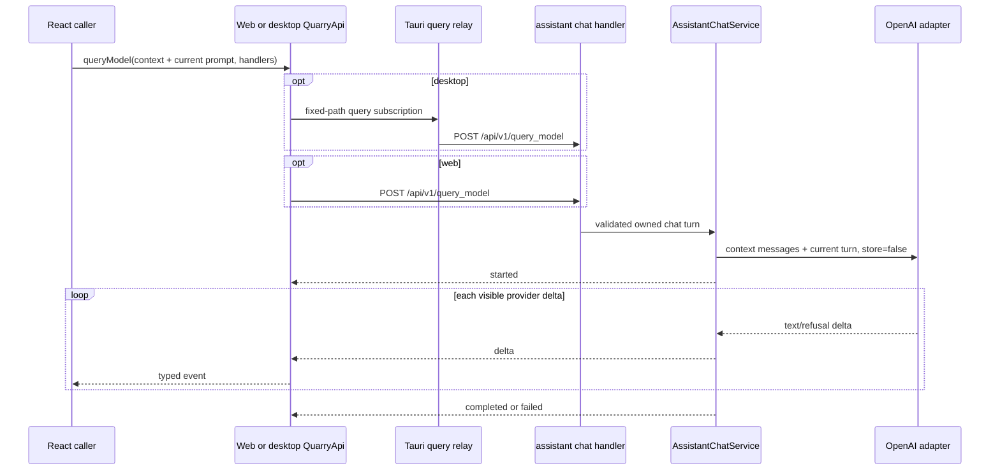

# Quarry send-query SSE plan

Status: proposed

Baseline: live working tree revalidated 2026-09-15, after the backend domain modularization,
frontend route/state decomposition, and bundle-budget work

Scope: transport-neutral frontend contract, browser POST-SSE adapter, narrow Tauri relay,
`assistant::chat` Axum vertical slice, and the existing OpenAI Responses adapter

Primary client endpoint: `POST /api/v1/query_model`

## Outcome

Add an ephemeral multi-turn chat transport. Each request accepts the current required prompt, an
ordered snapshot of prior completed user/assistant turns, optional model and system-instruction
overrides, and zero or more files for the current turn. Axum streams Quarry-owned events as OpenAI
produces visible text. Web and desktop consumers receive the same typed lifecycle, pass the same
conversation snapshot, and can cancel upstream work.

This is conversational chat, but not a durable conversation aggregate:

- no Quarry or OpenAI conversation ID, `previous_response_id`, persistence, replay, or resume;
- every turn explicitly replays the prior completed textual transcript to OpenAI;
- no provider reasoning items, tool calls/results, or hidden model state are carried between turns;
- no SQLite or Helix write;
- no durable job registry;
- no provider key, provider URL, server path, remote URL, or provider file ID exposed to clients;
- no React page or chat component in this plan.

The follow-up UI plan consumes this contract from
[`quarry-query-chat-ui-plan.md`](quarry-query-chat-ui-plan.md). That dependent plan currently
describes isolated prompts and must be rebaselined to send completed prior turns before UI
implementation begins.

## Research decisions

- Keep the existing `adapters::openai::client::OpenAiClient`. It already owns the direct reqwest
  integration with `POST /v1/responses`, the request builder, file inputs, and an unused streaming
  seam. Do not add another OpenAI client, SDK, or direct provider call from `assistant::chat`.
- Continue using the Responses API. Official OpenAI guidance recommends it for stateful model
  interactions and documents both automatic continuation and manual message replay. Quarry will
  use manual replay so `store: false` remains explicit and neither a provider response ID nor a
  provider conversation ID becomes part of Quarry's client contract. See [Conversation
  state](https://developers.openai.com/api/docs/guides/conversation-state) and [Create a model
  response](https://developers.openai.com/api/reference/cli/resources/responses/methods/create).
- For every turn, send the server-owned `instructions`, then all validated prior `user` and
  `assistant` text messages in chronological order, then the new user message with any current
  files. Do not enable automatic compaction or truncation. The current Responses reference marks
  the `truncation` request field deprecated and documents disabled behavior as the default, so the
  new chat method omits it and lets an over-context request fail visibly.
- Manual replay intentionally preserves conversational text only. Official guidance says a
  stateless reasoning/tool workflow must replay all relevant output items, including reasoning
  items. That provider-specific continuation state belongs to the future `assistant::agent`
  sibling, not this text-chat contract.
- Model current-turn attachments as typed Responses content parts. Supported raster images use
  `input_image`; PDFs, text files, rich documents, presentations, and spreadsheets use
  `input_file`. Quarry sends inline base64 data URLs through the existing client and does not
  expose OpenAI file IDs or remote URLs. See [File inputs](https://developers.openai.com/api/docs/guides/file-inputs)
  and [Images and vision](https://developers.openai.com/api/docs/guides/images-vision).
- Preserve an important provider distinction in UI copy and tests: PDF `input_file` processing on
  vision-capable models includes extracted text and page images, while non-PDF document inputs
  extract text only and do not preserve embedded charts or images. Users who need visual document
  content interpreted must send a PDF or the source image separately.
- Parse only the semantic streaming events needed by the chat lifecycle. The official streaming
  contract identifies `response.output_text.delta`, `response.completed`, and `error` as core
  events; Quarry also retains its refusal and failure handling. See [Streaming API
  responses](https://developers.openai.com/api/docs/guides/streaming-responses).
- Replayed context consumes input tokens again on each request and still counts against the
  selected model's context window. Bound message count and text size, never silently trim in the
  backend, and make the UI's rolling-context policy observable and testable.

## Live baseline and revisions from the earlier plan

| Area | Live working tree on 2026-09-15 | Planning consequence |
| --- | --- | --- |
| Backend topology | `backend/src/app`, `domains`, `adapters`, and `shared`; there is no global `AppState` or horizontal `handlers`, `routes`, `services`, `repository`, or `core` root. | Implement the use case under `domains/assistant/chat` and merge its already-state-bound router in `app/bootstrap.rs`. Do not recreate removed layers. |
| Assistant ownership | `domains/assistant/mod.rs` is a comment-only, unregistered scaffold naming interaction/conversation ownership. | Activate `assistant::chat` as the text-chat child. Reserve `assistant::agent` as a future sibling, but do not create an empty agent implementation now. |
| OpenAI | `adapters/openai/client.rs` owns the existing Responses request builder and unused streaming entry point; the current builder sends only one user prompt; config is in `app/config.rs`. | Add chat-message input support to this client and inject the same instance from bootstrap. Handlers must not import the adapter. |
| Router | `app/http/mod.rs` mounts one assembled API under `/api/v1` and compatibility `/api`; feature route files declare unprefixed paths. | The assistant route declares `/query_model`; clients use `/api/v1/query_model`. |
| Middleware | Request ID, tracing, gzip, 120-second timeout, and CORS are applied globally. | Streaming must have an explicit compression and timeout policy; do not assume the current global layers are safe for a long-lived body. |
| Configuration | The repository intentionally has no maintained `.env.example`; `docs/ARCHITECTURE.md` is the environment schema. | Add and test chat-specific `OPENAI_CHAT_MODEL`, leaving room for a separate future agent model policy, then update the architecture table. Do not create a second env-shaped template. |
| Tests | Frontend tests live under `frontend/tests`; backend tests mirror `src` under `backend/tests/unit` and are included manually; cross-module HTTP/architecture tests live under `backend/tests/integration`; Tauri tests live under `frontend/src-tauri/tests`. | Put every new test in the matching test tree and add source-module inclusion hooks where required. |
| Browser transport | `httpQuarryApi.ts` uses `fetch`/`FormData`; document-job GET streams use `EventSource`. | POST multipart SSE needs `fetch`, `ReadableStream`, an incremental parser, and `AbortController`. |
| Desktop transport | `quarry_api/{client,models,service,commands}.rs` relays JSON, PDF, multipart, and document-job SSE; the reqwest client has a 120-second total timeout. | Add a fixed-path query-stream capability with explicit cancellation and a stream-safe timeout policy. |
| Activity log | Requests/events are stored in a bounded `sessionStorage` log; current key redaction covers many content-like names but not `prompt` or `context` explicitly. | Log only safe query metadata and add explicit context/prompt/instruction/generated-content regression coverage. |
| Frontend composition | `App.tsx` now keeps Login eager and lazy-loads one `/hub/*` `WorkspaceRoutes` boundary whose persistent `WorkspaceProvider` owns workspace state. `QuarryApi`, `httpQuarryApi`, `tauriQuarryApi`, and the build-selected runtime aliases are unchanged. | This plan remains transport-only: do not edit `App.tsx`, `WorkspaceRoutes`, `WorkspaceProvider`, pages, or workspace state. The follow-up UI must derive and send context from its page-local completed transcript. |
| Frontend bundles | Web and desktop builds now emit manifests and target stamps. Checked-in guards enforce a 350,000-byte entry budget and a 500,000-byte application-chunk ceiling. | Run each target's bundle-size check immediately after its matching build. Do not raise budgets or add query code to an eager route merely to complete the transport. |

The old plan's references to `backend/src/core/clients/openai.rs`, `AppState`,
`bootstrap::assemble_state`, root `services/handlers/routes`, frontend tests under `src`, and
`backend/.env.example` are obsolete and must not guide implementation.

The 2026-09-13 frontend restructuring does not alter the request, SSE event, cancellation, or
security contract below. It only strengthens the requirement that transport work stay below the
shared runtime boundary and out of route/page composition until the follow-up UI is implemented.

## Stable public contract

### Request

```text
POST /api/v1/query_model
Content-Type: multipart/form-data
Accept: text/event-stream
```

| Multipart field | Cardinality | Contract |
| --- | --- | --- |
| `prompt` | exactly one text field | Required; trim only to test non-blank; preserve original content; at most 100,000 Unicode scalar values. |
| `context` | exactly one JSON text field | Required JSON array; empty for the first turn; at most 64 prior messages and 400,000 Unicode scalar values across their `content` fields. |
| `model` | zero or one text field | Omission selects the configured server default; supplied values are trimmed, non-blank, at most 128 characters, and contain no control characters. |
| `systemInstructions` | zero or one text field | Omission selects the server-owned default; supplied values are non-blank and at most 50,000 Unicode scalar values; preserve original content. |
| `files` | repeated file field | Optional current-turn attachments; at most 20 files, 50 MB each, and 50 MB aggregate. Each file must match the allowlist and provider mapping below. |

Each context item has exactly `{ "role": "user" | "assistant", "content": string }`. Context is
chronological and contains only complete prior exchange pairs: it is empty or has an even message
count, begins with `user`, alternates roles, and ends with `assistant`. Every content value must be
non-blank, is preserved as the exact decoded Unicode string, and is individually limited to
100,000 Unicode scalar values. Reject extra object keys and all `system`, `developer`, `tool`, or
unknown roles. The separate current `prompt` always becomes the final user message.

Reject duplicate scalar fields, unknown fields, malformed or structurally invalid context, empty
files, unsafe filenames, unsupported file types, and limit violations before returning the SSE
response. Give the route a scoped body limit of the 50 MB file aggregate plus 4 MB for the bounded
context JSON, other structured text, multipart encoding, and headers so Axum's default 2 MB limit
does not silently replace the documented contract.

Use the existing `shared::file_policy` byte constants where their meaning matches. Keep a
query-specific allowlist/classifier under the assistant chat module because document ingestion
currently accepts only PDF/DOCX and the summary helper's extension list is not a provider-security
contract. The public TypeScript and multipart contracts carry ordinary browser `File` values;
callers do not choose an OpenAI content-part type. The backend derives the following mapping from
the normalized leaf filename and validated bytes:

| Accepted extension | Canonical effective MIME | OpenAI Responses content part | Validation requirement |
| --- | --- | --- | --- |
| `.png` | `image/png` | `input_image` using inline `image_url` and `detail: "auto"` | PNG signature. |
| `.jpg`, `.jpeg` | `image/jpeg` | `input_image` using inline `image_url` and `detail: "auto"` | JPEG signature. |
| `.webp` | `image/webp` | `input_image` using inline `image_url` and `detail: "auto"` | RIFF/WEBP signature. |
| `.gif` | `image/gif` | `input_image` using inline `image_url` and `detail: "auto"` | GIF87a/GIF89a and exactly one image frame; animated GIFs are rejected. |
| `.pdf` | `application/pdf` | `input_file` using inline `filename` and `file_data` | PDF signature. |
| `.txt` | `text/plain` | `input_file` using inline `filename` and `file_data` | Valid, non-empty UTF-8 text. |
| `.md` | `text/markdown` | `input_file` using inline `filename` and `file_data` | Valid, non-empty UTF-8 text. |
| `.json` | `application/json` | `input_file` using inline `filename` and `file_data` | Valid, non-empty UTF-8; JSON syntax need not be parsed by transport validation. |
| `.html` | `text/html` | `input_file` using inline `filename` and `file_data` | Valid, non-empty UTF-8 text. |
| `.csv` | `text/csv` | `input_file` using inline `filename` and `file_data` | Valid, non-empty UTF-8 text. |
| `.doc` | `application/msword` | `input_file` using inline `filename` and `file_data` | OLE compound-document signature. |
| `.docx` | `application/vnd.openxmlformats-officedocument.wordprocessingml.document` | `input_file` using inline `filename` and `file_data` | Valid ZIP container with the DOCX content-type/family marker. |
| `.pptx` | `application/vnd.openxmlformats-officedocument.presentationml.presentation` | `input_file` using inline `filename` and `file_data` | Valid ZIP container with the PPTX content-type/family marker. |
| `.xlsx` | `application/vnd.openxmlformats-officedocument.spreadsheetml.sheet` | `input_file` using inline `filename` and `file_data` | Valid ZIP container with the XLSX content-type/family marker. |

Treat multipart/browser MIME as advisory. Accept an empty or generic browser MIME when extension
and bytes establish one allowlisted type; reject contradictory specific MIME values unless they
are an explicitly tested platform alias. Preserve attachment order. Extending this allowlist is a
deliberate chat-contract change with validation and request-mapping tests, even when OpenAI
supports additional formats.

Perform ZIP-family inspection in memory with explicit bounds on entry count, inspected entry
bytes, and decompressed size; never expand an uploaded Office archive to disk. File-type
inspection must be cancellation-aware and must not monopolize a Tokio worker.

Do not expose `FilePath`, `FileUrl`, or `FileId` variants through this route. Files belong only to
the current user turn. Prior file bytes/provider file handles are not retained or replayed, so a
later question about a prior attachment must resend that file. This transport supports file
attachments even if the separate first chat UI release does not yet expose an attachment picker.

### Defaults and provider request

- Add `chat_model: String` to `OpenAiConfig` and parse `OPENAI_CHAT_MODEL` with the current
  `gpt-5.5` default.
- Include the new key in the existing optional OpenAI capability-group detection: if any OpenAI
  model setting is supplied, `OPENAI_API_KEY` remains required.
- Resolve the model and default system instructions in the assistant chat service. Define
  the current `You are a helpful assistant.` default as assistant-owned policy; leave the
  adapter's generic fallback intact for existing callers. Web, desktop TypeScript, and Tauri Rust
  must preserve omission rather than insert defaults.
- A present-but-blank override is invalid; it is not equivalent to omission.
- Always pass the validated prompt, so this operation never uses `DEFAULT_RESPONSES_PROMPT`.
- Add a chat-message input type and chat-specific streaming method to the existing `OpenAiClient`.
  Reuse/refactor its request and SSE helpers rather than constructing another reqwest/OpenAI
  client. Existing extraction, summary, embedding, and image-description call signatures and
  behavior remain unchanged.
- Build the Responses `input` array as the validated context messages followed by exactly one
  current `user` message whose content contains current files first and the prompt last. Preserve
  message order and the original context/prompt/instruction Unicode strings exactly after
  validating non-blankness; do not pass trimmed copies or concatenate roles into one prompt
  string. The already-validated model uses its trimmed value.
- Send `stream: true` and `store: false` for this operation. Omit `previous_response_id`,
  `conversation`, deprecated `truncation`, and automatic context-management/compaction options.
  Repeat the resolved instructions on every turn. Do not change storage behavior for unrelated
  OpenAI calls.
- Keep production OpenAI endpoints fixed inside the adapter. Any loopback endpoint seam is
  test-only or constructor-injected exclusively by bootstrap/test support, never request data.

The second turn with a PNG and PDF maps to this provider shape (base64 values abbreviated):

```json
{
  "model": "gpt-5.5",
  "instructions": "You are a helpful assistant.",
  "input": [
    { "role": "user", "content": "What is EBITDA?" },
    { "role": "assistant", "content": "EBITDA is a financial metric." },
    {
      "role": "user",
      "content": [
        {
          "type": "input_image",
          "image_url": "data:image/png;base64,base64_encoded_image_bytes",
          "detail": "auto"
        },
        {
          "type": "input_file",
          "filename": "memo.pdf",
          "file_data": "data:application/pdf;base64,base64_encoded_pdf_bytes"
        },
        { "type": "input_text", "text": "How is it used here?" }
      ]
    }
  ],
  "stream": true,
  "store": false
}
```

Files, when present, retain their multipart order and precede the final `input_text` part in the
last user message. A PDF is still `input_file`, not `input_image`; OpenAI performs its PDF page
image handling behind that input type. The request has no `previous_response_id` or `conversation`
field.

### SSE response

Successful validation and capability resolution return:

```text
200 OK
Content-Type: text/event-stream
Cache-Control: no-cache, no-store
```

| Event | JSON data | Rule |
| --- | --- | --- |
| `started` | `{ "type": "started", "model": "gpt-5.5" }` | First event; reports the resolved model. |
| `delta` | `{ "type": "delta", "delta": "text" }` | One event per semantic `response.output_text.delta` or `response.refusal.delta`, in provider order and without coalescing. |
| `completed` | `{ "type": "completed", "response": "full text" }` | Exactly one successful terminal. Use non-empty text from the provider's completed response when present; otherwise use the exact accumulated deltas. The terminal is authoritative even when no deltas arrived. |
| `failed` | `{ "type": "failed", "error": "query generation failed" }` | Exactly one sanitized terminal for failure after HTTP 200 starts. |

Serialize with Axum `Event::json_data`, emit a 15-second keepalive, and suppress proxy buffering.
Ignore provider events that have no user-visible text, but treat provider failure/incomplete/error
events, malformed JSON, invalid UTF-8, premature EOF, and a completion with no usable text as
failures.

Pre-stream HTTP failures are:

- 400 for multipart, scalar, filename, type, or limit validation;
- 503 when OpenAI is not configured;
- 500 for unexpected internal failures through the sanitized `AppError` boundary.

After HTTP 200 begins, do not attempt to change status. Emit one `failed` terminal and close.

### Shared TypeScript API

Add to `frontend/src/contracts/quarryApi.ts`:

```ts
export type ChatContextMessage = {
  content: string;
  role: "user" | "assistant";
};

export type QueryModelInput = {
  context: ChatContextMessage[];
  files: File[];
  model?: string;
  prompt: string;
  systemInstructions?: string;
};

export type SendQueryEvent =
  | { model: string; type: "started" }
  | { delta: string; type: "delta" }
  | { response: string; type: "completed" }
  | { error: string; type: "failed" };

export type SendQueryEventHandlers = {
  onConnectionError?: (message: string) => void;
  onEvent: (event: SendQueryEvent) => void;
};

queryModel(input: QueryModelInput, handlers: SendQueryEventHandlers): () => void;
```

The returned cleanup function is idempotent. It cancels upload/stream work and suppresses later
callbacks. `failed` is a valid server terminal; `onConnectionError` is for a non-2xx response,
wrong content type, malformed Quarry frame/event, transport failure, or EOF without a terminal.
Each adapter delivers at most one terminal notification.

`context` is a caller-owned immutable snapshot for that request. Adapters may validate it but must
not trim, reorder, mutate, infer, or append the current prompt. The chat UI derives it from prior
successfully completed exchange pairs at submit time. Failed, stopped, connecting, or partially
streamed assistant turns never enter a later context snapshot; retry reuses the same snapshot as
the original attempt.

When all completed pairs fit, the UI sends all of them. When either context limit would be
exceeded, it sends the newest suffix of whole completed pairs that satisfies both limits, never
splits a pair or message, and shows a non-blocking notice that older chat context was not sent. The
server validates the submitted snapshot but never applies a second hidden truncation policy.

## Runtime ownership and target flow



Backend ownership is:

```text
app/config parses ambient values
  -> app/bootstrap constructs one OpenAiClient and AssistantChatService
  -> domains/assistant/chat/route binds private HTTP state
  -> handler validates transport input
  -> chat service owns context/default/run/cancellation/terminal policy
  -> adapters/openai owns provider HTTP and provider SSE parsing

domains/assistant
  -> chat   (this plan: textual multi-turn chat)
  -> agent  (future sibling: tools, reasoning/output-item state, agent lifecycle)
```

The public path remains `/query_model` for this proposed contract; the code and product ownership
are `assistant::chat`. A future agent endpoint must get a separate request/event contract rather
than widening the chat DTO with tool or run state. No assistant handler or route imports
`crate::adapters`; no domain code reads ambient environment values or constructs infrastructure.

## Planned file changes

| Path | Change |
| --- | --- |
| `frontend/src/contracts/quarryApi.ts` | Add chat-context/query/event/handler types and `QuarryApi.queryModel`. |
| `frontend/src/api/querySse.ts` | Strict incremental browser SSE framing and typed Quarry event validation. |
| `frontend/src/api/httpQuarryApi.ts` | Add multipart POST-SSE mapping, exact context JSON serialization, cancellation, terminal rules, and metadata-only activity logging. |
| `frontend/src/api/tauriQuarryApi.ts` | Add context/file-to-IPC mapping and subscription/cancel lifecycle behind the shared synchronous cleanup contract. |
| `frontend/src/platform/runtime.desktop.ts` | Wire dedicated send/cancel invokes and filtered `quarry-query-event` listening without logging raw query payloads. |
| `frontend/tests/api/querySse.test.ts` | Parser/framing/event-union tests. |
| `frontend/tests/api/httpQuarryApi.test.ts` | Browser context serialization/preservation, streaming, error, cancellation, and redaction coverage. |
| `frontend/tests/api/tauriQuarryApi.test.ts` | Desktop context mapping/preservation, subscription isolation, sync cleanup, and cancellation coverage. |
| `frontend/tests/platform/runtime.contract.test.ts` | Keep both runtime targets structurally aligned. |
| `frontend/tests/lib/activityLog.test.ts` | Explicit context, prompt, instruction, filename, file-content, and generated-text redaction tests. |
| `frontend/src-tauri/src/quarry_api/{models,client,service,commands,mod}.rs` | Add fixed query request/event/control models, stream client behavior, strict parsing, cancellation registry, commands, and exports. Split a focused `query_stream.rs` helper if that keeps `service.rs` cohesive. |
| `frontend/src-tauri/src/lib.rs` | Manage query-subscription state and register only the narrow send/cancel commands. |
| `frontend/src-tauri/tests/quarry_api/service_tests.rs` | Fixed path, multipart limits, SSE, terminal, timeout, and cancellation tests. Add a mirrored test file only when the production module is split. |
| `backend/src/app/config.rs` | Add `OPENAI_CHAT_MODEL` parsing/default/capability detection. |
| `backend/src/app/bootstrap.rs` | Construct and inject the assistant chat service and merge its state-bound router. |
| `backend/src/app/http/{mod,middleware}.rs` | Adjust only as needed to give SSE a deliberate no-buffer/timeout policy while preserving common request ID, trace, CORS, and error behavior. |
| `backend/src/domains/mod.rs` | Activate the `assistant` domain. |
| `backend/src/domains/assistant/mod.rs` | Activate only `chat`; document `agent` as a future sibling without creating an empty implementation. |
| `backend/src/domains/assistant/chat/{mod,model,upload,service,handler,route}.rs` | Own chat/context DTOs, validation, stream lifecycle, private route state, and `/query_model`. Combine small files when clearer; do not create empty layers merely to match this table. |
| `backend/src/adapters/openai/client.rs` | Add chat-message request construction to the existing client; make its streaming seam cancellation/backpressure aware, set chat options, and recognize all terminal/failure cases. |
| `backend/tests/unit/app/config_tests.rs` | New config default, override, activation, and missing-key tests. |
| `backend/tests/unit/adapters/openai/client_tests.rs` | Exact role/order/content mapping; `input_image`/`input_file` data-URL, filename, detail, and attachment-order mapping; chat request options; and provider-stream parsing/cancellation coverage. |
| `backend/tests/unit/domains/assistant/chat/*_tests.rs` | Mirrored context/service/upload tests for every accepted type, spoofed extensions/MIME, signatures, animated GIFs, bounded Office ZIP inspection, and limits, with explicit `#[cfg(test)] #[path = ...]` hooks in owning source modules. |
| `backend/tests/integration/http_tests.rs` | `/api/v1` and `/api` route, context JSON/role/order rejection, multipart, HTTP/SSE, body-limit, and unavailable-capability coverage. |
| `backend/tests/integration/architecture_tests.rs` | Add `assistant` to domain ownership checks and preserve the no-global-state/dependency rules. |
| `docs/ARCHITECTURE.md` | Record the implemented assistant chat/context contract, `chat`/future-`agent` ownership, route, transport, config, middleware, logging, limits, and known gaps. |
| `plans/quarry-query-chat-ui-plan.md` | Before UI implementation, replace its single-shot/context-isolation contract with completed-turn context snapshots matching this transport. |

Do not add `backend/.env.example`; it is intentionally absent.

## Implementation sequence

### Phase 1: Lock the contract and streaming policy

1. Add the TypeScript contract and backend chat context/event/request models.
2. Add context sequence/count/per-message/aggregate limits and query/file validation tests,
   reusing byte-limit constants without widening other domains' file allowlists. Cover every
   extension/MIME/provider-type row, empty and generic browser MIME, contradictory MIME, spoofed
   signatures, animated GIF rejection, bounded Office ZIP inspection, and attachment order. Prove
   the scoped HTTP body limit can carry the maximum legal UTF-8/JSON encoding plus file bytes.
3. Add `OPENAI_CHAT_MODEL` to config and tests.
4. Decide and test the full stream timeout behavior at both server and Tauri layers. Preserve the
   120-second bound for ordinary requests; for query SSE use a documented connection/idle or
   explicit maximum-duration policy that does not accidentally inherit a whole-response timeout.
5. Ensure SSE is not gzip-buffered and retains request ID, trace, CORS, and sanitized errors.

Exit: context semantics, defaults, omission semantics, validation, body limit, and the long-lived
response policy are explicit and executable.

### Phase 2: Harden the OpenAI adapter seam

1. Add a chat-specific streaming method and role/message input type to the existing
   `OpenAiClient`; share/refactor the current Responses request, file, and SSE helpers rather than
   creating another provider client or changing unrelated public methods.
2. Build one provider `input` array with prior text messages in exact chronological order followed
   by the current user content containing current files and prompt. Assert images serialize as
   ordered `input_image` data URLs with `detail: "auto"`, documents serialize as ordered
   `input_file` data URLs with normalized leaf filenames, and `input_text` is last. Set
   `stream: true` and `store: false`; assert provider state IDs, deprecated `truncation`, automatic
   context management, and compaction are absent and instructions are present on every request.
3. Give its delta sink a result/async contract so a bounded Tokio channel can apply backpressure
   and receiver closure can stop reading the upstream body promptly.
4. Preserve arbitrary byte boundaries, LF/CRLF, comments, and multi-line `data:` behavior; reject
   invalid UTF-8 and malformed semantic events.
5. Recognize `response.completed`, failed/incomplete/top-level error events, and EOF. Treat
   non-empty completed-response text as authoritative; fall back to the exact accumulated deltas
   only when the completion payload omits visible text, and fail when neither source has text.
6. Add a loopback/fake Responses endpoint seam usable only by automated tests.
7. For this path, log provider status/category and timing only. Do not log raw provider bodies,
   prompts, instructions, filenames, uploads, deltas, or completed text.

Exit: exact context mapping, ordered deltas, completion fallback, backpressure, cancellation, and
failure classification are covered without live OpenAI.

### Phase 3: Implement `assistant::chat`

1. Replace the comment-only assistant marker with an active `chat` submodule and declare the
   assistant domain from `domains/mod.rs`. Reserve the future `agent` sibling in module
   documentation only; do not add a placeholder route/service.
2. Collect multipart fields, including the decoded context array, into owned bytes/strings. The
   spawned task must not borrow Axum multipart fields.
3. Keep transport/JSON/role-sequence validation in handler/model/upload helpers and
   context/default/run/terminal orchestration in `AssistantChatService`.
4. Fail before 200 when OpenAI is unavailable. After starting, use a bounded channel and emit
   `started`, ordered deltas, and exactly one terminal.
5. Bind `AssistantChatHttpState` inside `route::routes(...)`; merge that router from
   `assemble_api`. Do not add global state.
6. Declare the feature path as `/query_model` and let `app/http` provide both API mounts.

Exit: both prefixes expose the same behavior, `/api/v1` is the client target, dependency guards
pass, and no sensitive content enters logs.

### Phase 4: Implement browser POST-SSE

1. Build `FormData` in `httpQuarryApi.ts`, serializing the immutable context snapshot once,
   omitting absent optional values, and preserving original context/prompt/instruction strings.
2. Start an async `fetch` reader behind a synchronous, idempotent cleanup function.
3. Validate status, `text/event-stream`, event names, JSON shapes, order, and exactly-one-terminal.
4. Parse streaming UTF-8 incrementally across arbitrary chunks. Support LF/CRLF, comments,
   repeated `data:` lines, and multiple frames per chunk.
5. Abort the upload/body reader and suppress late callbacks on cleanup.
6. Record metadata only: route, selected model if safe, context message count, file
   count/aggregate bytes, event name, delta character count, duration, cancellation, and terminal
   class. Never record context contents or per-message sizes.

Exit: the first delta is observable before completion, corrupt streams become one connection
error, and logs contain no context or query content.

### Phase 5: Implement the Tauri relay

1. Add a dedicated request model without a caller-controlled path; the Rust service always posts
   to `/api/v1/query_model`.
2. Reuse multipart metadata/base64 validation and byte limits, and validate context structure plus
   query scalar fields on both IPC and Axum boundaries. Serialize one bounded `context` JSON
   multipart field without logging or copying it more than necessary.
3. Use a stream-capable reqwest client/policy that does not change ordinary JSON/PDF timeouts.
4. Parse SSE strictly. Emit server events only for the four allowed event types, wrapped with a
   validated subscription ID. Use a separate subscription-scoped `connectionError` control
   payload for Rust HTTP/content-type/framing/EOF failures; it is not a fifth server SSE event.
5. Manage request-scoped cancellation senders in dedicated Tauri state. `send_query_stream`
   registers the subscription, spawns its worker, and returns only after registration succeeds;
   `cancel_query_stream` signals and removes exactly that worker. The worker removes itself on
   every terminal/error path. Avoid raw task abort as the normal path so cleanup code still runs.
   Concurrent subscription IDs must not cross-deliver.
6. Validate the main window/origin in both commands. No capability or CSP expansion is required.
7. In TypeScript, install the event listener before invoking send. If cleanup happens during file
   encoding, listener setup, or before the start acknowledgement, immediately cancel any
   later-acknowledged subscription and dispose the listener. Map only the scoped control payload
   to `onConnectionError`.
8. Use a dedicated redacted activity-log path; never pass raw query args to the generic IPC logger.

Exit: desktop event order matches web, cleanup reaches the upstream reqwest body, and no stale
handle/listener remains.

### Phase 6: Cross-runtime verification and documentation

1. Run focused parser, adapter, service, route, cancellation, timeout, and redaction tests.
2. Run the full backend, frontend, and Tauri gates.
3. Capture the loopback provider request to prove a two-turn context is ordered as
   `user, assistant, user`; one image is encoded as `input_image`; one PDF is encoded as
   `input_file`; both current files retain order and attach only to the final user item; the prompt
   is last; instructions are repeated; and no provider state identifier, storage, automatic
   truncation, or compaction is enabled.
4. Use synthetic delayed loopback responses to prove first-delta-before-completion, authoritative
   completion that differs from partial deltas, no-delta completion, post-start failure, malformed
   EOF, cancellation, and concurrent desktop isolation.
5. Rebaseline `quarry-query-chat-ui-plan.md` so later turns derive context from completed exchange
   pairs and exclude failed/stopped/partial turns.
6. Update `docs/ARCHITECTURE.md` from the final implementation, including the
   `assistant::{chat, agent}` ownership boundary and the fact that chat context is client-managed,
   ephemeral, textual, and re-sent on every turn.
7. Inspect both Vite manifests and run the matching bundle-size guard after each build; confirm no
   query UI or assistant presentation/runtime dependency entered the frontend graph and the
   transport additions stay within the existing entry/application-chunk budgets.
8. Inspect final diff/status for generated output, dependency churn, secrets, or real user data.

## Verification commands for implementation

Use actual added test names/paths if they differ from the examples below.

From `backend/`:

```sh
cargo test query_model
cargo test assistant_chat
cargo test openai_chat_stream
cargo fmt --all -- --check
cargo check --locked --all-targets
cargo clippy --locked --all-targets -- -D warnings
cargo test --locked --all-targets
```

From `frontend/`:

```sh
npm test -- tests/api/querySse.test.ts
npm test -- tests/api/httpQuarryApi.test.ts
npm test -- tests/api/tauriQuarryApi.test.ts
npm test -- tests/lib/activityLog.test.ts
npm test -- tests/platform/runtime.contract.test.ts
npm run typecheck
npm run check:boundaries
npm test
npm run build:web
npm run check:web-bundle
npm run check:bundle-size:web
npm run build:desktop-ui
npm run check:bundle-size:desktop
```

`check:web-bundle` and `check:bundle-size:web` must follow `build:web`; the desktop size check must
immediately follow `build:desktop-ui` so it cannot inspect stale or wrong-target output. These
checks verify the shared transport remains within the current bundle contract; they are not
authorization to raise either threshold.

From `frontend/src-tauri/`:

```sh
cargo test query_stream
cargo fmt --all -- --check
cargo clippy --locked --all-targets -- -D warnings
cargo test --locked --all-targets
```

Do not use `cargo run` as a build check. A runtime smoke test requires disposable SQLite/Helix
configuration and a loopback provider; otherwise route/service tests are the authoritative
streaming evidence. Never call live OpenAI in routine verification.

Before handoff:

```sh
git diff --check
git status --short
```

## Security and operational requirements

- OpenAI credentials and endpoints remain server-owned.
- Treat every context message, including a client-labeled `assistant` message, as untrusted caller
  input. Only server policy or the separately validated `systemInstructions` field can populate
  OpenAI `instructions`; never promote context text to `system` or `developer` authority.
- Do not log context, prompts, instructions, filenames, file contents, generated text, raw provider
  bodies, or request IPC payloads. Synthetic tests must assert absence, not merely successful
  redaction.
- Bound file count, decoded bytes, base64 amplification, queue capacity, frame/buffer size,
  per-message/aggregate context, per-event size, total accumulated response size, idle time, and
  request lifetime deliberately.
- `store: false` and manual transcript replay avoid provider-side response/conversation state for
  this feature, but they are not a claim that live request processing is erased. Context is sent to
  OpenAI again on every turn and is billed/counts toward the selected model's context window.
- The server never silently drops old messages. The UI must show when its bounded rolling policy
  excludes older completed pairs; provider context-limit rejection becomes a sanitized failure.
- Cancellation is best-effort at the provider transport after the reqwest body is dropped; never
  claim provider-side erasure.
- The route inherits Quarry's development-only lack of identity, tenant authorization, rate
  limiting, quota, and abuse controls. It is not safe for public production exposure until Axum
  adds those controls.
- A caller-selected model can affect cost and availability. Do not silently substitute a model;
  provider rejection becomes a sanitized failure. A server allowlist/policy is a separate product
  decision unless added before implementation.
- Streaming partial output has a different moderation posture from waiting for a complete answer;
  content policy/moderation controls remain a production-readiness decision and must not be
  represented as solved by transport validation.
- No migration, graph change, ADR, or destructive rollout is required.

## Out of scope

- Chat/composer UI and response rendering.
- Frontend route registration, `App.tsx`, `WorkspaceRoutes`, `WorkspaceProvider`, workspace data
  sourcing/notices, and other page or shell behavior.
- Durable conversations, server-side messages, interaction records, history APIs, replay,
  reconnect, or resume. A browser/webview refresh loses the page-local transcript.
- Provider-managed continuation through `previous_response_id` or the Conversations API, and
  stateless replay of provider reasoning/output items.
- The future `assistant::agent` sibling: tools, tool results, agent runs, reasoning state,
  compaction, handoffs, approvals, or background execution.
- Document search/retrieval context, citations, web search, file search, structured output, or
  function calling.
- Automatic reuse of prior attachments; files apply to the current turn only.
- Caller-selected server paths, remote URLs, or provider file IDs.
- Billing, quotas, production identity/tenancy, or a model catalog/picker.
- Changing existing extraction, summary, embedding, or image-description defaults/behavior.

## Definition of done

- `QuarryApi.queryModel` works through both web and desktop against
  `POST /api/v1/query_model`; compatibility `/api/query_model` is server-only.
- `assistant::chat` owns textual multi-turn chat through an already-state-bound feature router;
  the future `assistant::agent` sibling remains separate, and no global state or removed
  horizontal backend root returns.
- Required context/prompt, role/sequence rules, optional overrides, file allowlist, counts, byte
  limits, and omission/default semantics are validated and tested.
- Current-turn files work through both browser and desktop transports: accepted raster images map
  to ordered `input_image` parts, accepted documents map to ordered `input_file` parts, the prompt
  follows them, and spoofed, animated, malformed, or unsupported inputs fail before streaming.
- A later turn sends every included completed prior user/assistant message in order followed by
  the current prompt; failed/stopped/partial turns are excluded and retry reuses the original
  immutable context snapshot.
- The existing `OpenAiClient` sends that input through the Responses API with repeated
  instructions, `stream: true`, `store: false`, and no provider state ID, automatic context
  management, truncation, or compaction; no second provider client or SDK is introduced.
- Provider text/refusal deltas arrive once and in order before exactly one completed/failed
  terminal; completed-response text is authoritative over partial deltas, and corrupt or premature
  transport failure becomes exactly one connection error.
- Browser and desktop cleanup cancel the active upstream read and suppress late callbacks.
- Streaming compression, body limits, total/idle timeouts, buffer bounds, and Tauri base64 memory
  amplification have explicit tested policies.
- Logs, errors, fixtures, and generated artifacts contain no sensitive context/query/provider
  content.
- Focused tests and all affected backend/frontend/Tauri gates pass without live external services;
  both frontend builds pass their existing target-specific bundle-size guards without threshold
  changes.
- `docs/ARCHITECTURE.md` documents the implemented contract, `assistant::{chat, agent}` ownership,
  client-managed context, domain maturity, transport, configuration, security limits, and
  verification coverage; no `.env.example` is added.
- `git diff --check` is clean and final status review distinguishes implementation changes from
  user-owned work.
