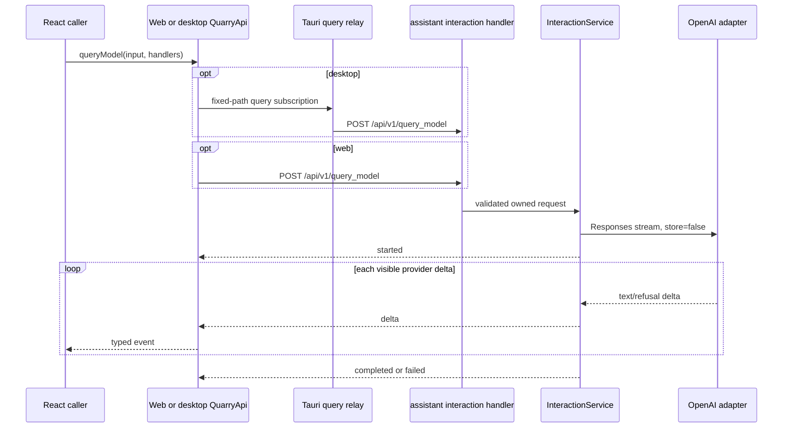

# Quarry send-query SSE plan

Status: proposed

Baseline: live repository verified 2026-09-12, after the backend domain modularization and
template-import work

Scope: transport-neutral frontend contract, browser POST-SSE adapter, narrow Tauri relay,
`assistant::interactions` Axum vertical slice, and the existing OpenAI Responses adapter

Primary client endpoint: `POST /api/v1/query_model`

## Outcome

Add one stateless query interaction that accepts a required prompt, optional model and system
instruction overrides, and zero or more user-selected files. Axum streams Quarry-owned events as
OpenAI produces visible text. Web and desktop consumers receive the same typed lifecycle and can
cancel upstream work.

This remains an interaction run, not a conversation:

- no conversation ID, prior-message input, `previous_response_id`, persistence, replay, or resume;
- no SQLite or Helix write;
- no durable job registry;
- no provider key, provider URL, server path, remote URL, or provider file ID exposed to clients;
- no React page or chat component in this plan.

The follow-up UI plan consumes this contract from
[`quarry-query-chat-ui-plan.md`](quarry-query-chat-ui-plan.md).

## Live baseline and revisions from the earlier plan

| Area | Live repository on 2026-09-12 | Planning consequence |
| --- | --- | --- |
| Backend topology | `backend/src/app`, `domains`, `adapters`, and `shared`; there is no global `AppState` or horizontal `handlers`, `routes`, `services`, `repository`, or `core` root. | Implement the use case under `domains/assistant/interactions` and merge its already-state-bound router in `app/bootstrap.rs`. Do not recreate removed layers. |
| Assistant ownership | `domains/assistant/mod.rs` is a comment-only, unregistered scaffold naming interaction/conversation ownership. | Activate only `assistant::interactions`. Conversations and context resolution remain future work. |
| OpenAI | `adapters/openai/client.rs` owns the existing Responses request builder and unused streaming entry point; config is in `app/config.rs`. | Evolve this adapter seam and inject it from bootstrap. Handlers must not import the adapter. |
| Router | `app/http/mod.rs` mounts one assembled API under `/api/v1` and compatibility `/api`; feature route files declare unprefixed paths. | The assistant route declares `/query_model`; clients use `/api/v1/query_model`. |
| Middleware | Request ID, tracing, gzip, 120-second timeout, and CORS are applied globally. | Streaming must have an explicit compression and timeout policy; do not assume the current global layers are safe for a long-lived body. |
| Configuration | The repository intentionally has no maintained `.env.example`; `docs/ARCHITECTURE.md` is the environment schema. | Add and test `OPENAI_QUERY_MODEL`, then update the architecture table. Do not create a second env-shaped template. |
| Tests | Frontend tests live under `frontend/tests`; backend tests mirror `src` under `backend/tests/unit` and are included manually; cross-module HTTP/architecture tests live under `backend/tests/integration`; Tauri tests live under `frontend/src-tauri/tests`. | Put every new test in the matching test tree and add source-module inclusion hooks where required. |
| Browser transport | `httpQuarryApi.ts` uses `fetch`/`FormData`; document-job GET streams use `EventSource`. | POST multipart SSE needs `fetch`, `ReadableStream`, an incremental parser, and `AbortController`. |
| Desktop transport | `quarry_api/{client,models,service,commands}.rs` relays JSON, PDF, multipart, and document-job SSE; the reqwest client has a 120-second total timeout. | Add a fixed-path query-stream capability with explicit cancellation and a stream-safe timeout policy. |
| Activity log | Requests/events are stored in a bounded `sessionStorage` log; current key redaction covers many content-like names but not `prompt` explicitly. | Log only safe query metadata and add explicit prompt/instruction/generated-content regression coverage. |

The old plan's references to `backend/src/core/clients/openai.rs`, `AppState`,
`bootstrap::assemble_state`, root `services/handlers/routes`, frontend tests under `src`, and
`backend/.env.example` are obsolete and must not guide implementation.

## Stable public contract

### Request

```text
POST /api/v1/query_model
Content-Type: multipart/form-data
Accept: text/event-stream
```

| Multipart field | Cardinality | Contract |
| --- | --- | --- |
| `prompt` | exactly one text field | Required; trim only to test non-blank; preserve original content; at most 100,000 Unicode scalar values. |
| `model` | zero or one text field | Omission selects the configured server default; supplied values are trimmed, non-blank, at most 128 characters, and contain no control characters. |
| `systemInstructions` | zero or one text field | Omission selects the server-owned default; supplied values are non-blank and at most 50,000 Unicode scalar values; preserve original content. |
| `files` | repeated file field | Optional; at most 20 files, 50 MB each, and 50 MB aggregate. |

Reject duplicate scalar fields, unknown fields, empty files, unsafe filenames, unsupported file
types, and limit violations before returning the SSE response. Give the route a scoped body limit
of the 50 MB aggregate plus 1 MB multipart overhead so Axum's default 2 MB limit does not silently
replace the documented contract.

Use the existing `shared::file_policy` byte constants where their meaning matches. Keep a
query-specific allowlist/classifier under the assistant interaction module because document
ingestion currently accepts only PDF/DOCX and the summary helper's extension list is not a
provider-security contract. Images map to `ResponsesFileInput::ImageData { detail: "auto" }`;
supported documents map to `ResponsesFileInput::FileData`. Derive the effective MIME type from a
normalized leaf filename and validate available magic bytes; never trust only the browser MIME.

Do not expose `FilePath`, `FileUrl`, or `FileId` variants through this route.

### Defaults and provider request

- Add `query_model: String` to `OpenAiConfig` and parse `OPENAI_QUERY_MODEL` with the current
  `gpt-5.5` default.
- Include the new key in the existing optional OpenAI capability-group detection: if any OpenAI
  model setting is supplied, `OPENAI_API_KEY` remains required.
- Resolve the model and default system instructions in the assistant interaction service. Define
  the current `You are a helpful assistant.` default as assistant-owned policy; leave the
  adapter's generic fallback intact for existing callers. Web, desktop TypeScript, and Tauri Rust
  must preserve omission rather than insert defaults.
- A present-but-blank override is invalid; it is not equivalent to omission.
- Always pass the validated prompt, so this operation never uses `DEFAULT_RESPONSES_PROMPT`.
- Send `stream: true` and `store: false` for this operation. Do not change storage behavior for
  unrelated extraction, summary, embedding, or image-description calls.
- Keep production OpenAI endpoints fixed inside the adapter. Any loopback endpoint seam is
  test-only or constructor-injected exclusively by bootstrap/test support, never request data.

### SSE response

Successful validation and capability resolution return:

```text
200 OK
Content-Type: text/event-stream
Cache-Control: no-cache, no-store
```

| Event | JSON data | Rule |
| --- | --- | --- |
| `started` | `{ "type": "started", "model": "gpt-5.5" }` | First event; reports the resolved model. |
| `delta` | `{ "type": "delta", "delta": "text" }` | One event per semantic `response.output_text.delta` or `response.refusal.delta`, in provider order and without coalescing. |
| `completed` | `{ "type": "completed", "response": "full text" }` | Exactly one successful terminal; authoritative even when no deltas arrived. |
| `failed` | `{ "type": "failed", "error": "query generation failed" }` | Exactly one sanitized terminal for failure after HTTP 200 starts. |

Serialize with Axum `Event::json_data`, emit a 15-second keepalive, and suppress proxy buffering.
Ignore provider events that have no user-visible text, but treat provider failure/incomplete/error
events, malformed JSON, invalid UTF-8, premature EOF, and a completion with no usable text as
failures.

Pre-stream HTTP failures are:

- 400 for multipart, scalar, filename, type, or limit validation;
- 503 when OpenAI is not configured;
- 500 for unexpected internal failures through the sanitized `AppError` boundary.

After HTTP 200 begins, do not attempt to change status. Emit one `failed` terminal and close.

### Shared TypeScript API

Add to `frontend/src/contracts/quarryApi.ts`:

```ts
export type QueryModelInput = {
  files: File[];
  model?: string;
  prompt: string;
  systemInstructions?: string;
};

export type SendQueryEvent =
  | { model: string; type: "started" }
  | { delta: string; type: "delta" }
  | { response: string; type: "completed" }
  | { error: string; type: "failed" };

export type SendQueryEventHandlers = {
  onConnectionError?: (message: string) => void;
  onEvent: (event: SendQueryEvent) => void;
};

queryModel(input: QueryModelInput, handlers: SendQueryEventHandlers): () => void;
```

The returned cleanup function is idempotent. It cancels upload/stream work and suppresses later
callbacks. `failed` is a valid server terminal; `onConnectionError` is for a non-2xx response,
wrong content type, malformed Quarry frame/event, transport failure, or EOF without a terminal.
Each adapter delivers at most one terminal notification.

## Runtime ownership and target flow



Backend ownership is:

```text
app/config parses ambient values
  -> app/bootstrap constructs OpenAiClient and InteractionService
  -> domains/assistant/interactions/route binds private HTTP state
  -> handler validates transport input
  -> service owns run/default/cancellation/terminal policy
  -> adapters/openai owns provider HTTP and provider SSE parsing
```

No assistant handler or route imports `crate::adapters`; no domain code reads ambient environment
values or constructs infrastructure.

## Planned file changes

| Path | Change |
| --- | --- |
| `frontend/src/contracts/quarryApi.ts` | Add query input/event/handler types and `QuarryApi.queryModel`. |
| `frontend/src/api/querySse.ts` | Strict incremental browser SSE framing and typed Quarry event validation. |
| `frontend/src/api/httpQuarryApi.ts` | Add multipart POST-SSE mapping, cancellation, terminal rules, and metadata-only activity logging. |
| `frontend/src/api/tauriQuarryApi.ts` | Add async file-to-IPC mapping and subscription/cancel lifecycle behind the shared synchronous cleanup contract. |
| `frontend/src/platform/runtime.desktop.ts` | Wire dedicated send/cancel invokes and filtered `quarry-query-event` listening without logging raw query payloads. |
| `frontend/tests/api/querySse.test.ts` | Parser/framing/event-union tests. |
| `frontend/tests/api/httpQuarryApi.test.ts` | Browser mapping, streaming, error, cancellation, and redaction coverage. |
| `frontend/tests/api/tauriQuarryApi.test.ts` | Desktop mapping, subscription isolation, sync cleanup, and cancellation coverage. |
| `frontend/tests/platform/runtime.contract.test.ts` | Keep both runtime targets structurally aligned. |
| `frontend/tests/lib/activityLog.test.ts` | Explicit prompt, instruction, filename, file-content, and generated-text redaction tests. |
| `frontend/src-tauri/src/quarry_api/{models,client,service,commands,mod}.rs` | Add fixed query request/event/control models, stream client behavior, strict parsing, cancellation registry, commands, and exports. Split a focused `query_stream.rs` helper if that keeps `service.rs` cohesive. |
| `frontend/src-tauri/src/lib.rs` | Manage query-subscription state and register only the narrow send/cancel commands. |
| `frontend/src-tauri/tests/quarry_api/service_tests.rs` | Fixed path, multipart limits, SSE, terminal, timeout, and cancellation tests. Add a mirrored test file only when the production module is split. |
| `backend/src/app/config.rs` | Add `OPENAI_QUERY_MODEL` parsing/default/capability detection. |
| `backend/src/app/bootstrap.rs` | Construct and inject the interaction service and merge its state-bound router. |
| `backend/src/app/http/{mod,middleware}.rs` | Adjust only as needed to give SSE a deliberate no-buffer/timeout policy while preserving common request ID, trace, CORS, and error behavior. |
| `backend/src/domains/mod.rs` | Activate the `assistant` domain. |
| `backend/src/domains/assistant/mod.rs` | Activate only `interactions`; keep conversations/context unimplemented. |
| `backend/src/domains/assistant/interactions/{mod,model,upload,service,handler,route}.rs` | Own DTOs, validation, stream lifecycle, private route state, and `/query_model`. Combine small files when clearer; do not create empty layers merely to match this table. |
| `backend/src/adapters/openai/client.rs` | Make the existing streaming seam cancellation/backpressure aware, set query options, and recognize all terminal/failure cases. |
| `backend/tests/unit/app/config_tests.rs` | New config default, override, activation, and missing-key tests. |
| `backend/tests/unit/adapters/openai/client_tests.rs` | Request options and provider-stream parsing/cancellation coverage. |
| `backend/tests/unit/domains/assistant/interactions/*_tests.rs` | Mirrored service/upload tests with explicit `#[cfg(test)] #[path = ...]` hooks in owning source modules. |
| `backend/tests/integration/http_tests.rs` | `/api/v1` and `/api` route, multipart, HTTP/SSE, body-limit, and unavailable-capability coverage. |
| `backend/tests/integration/architecture_tests.rs` | Add `assistant` to domain ownership checks and preserve the no-global-state/dependency rules. |
| `docs/ARCHITECTURE.md` | Record the implemented assistant interaction, route, transport, config, middleware, logging, limits, and known gaps. |

Do not add `backend/.env.example`; it is intentionally absent.

## Implementation sequence

### Phase 1 — Lock the contract and streaming policy

1. Add the TypeScript contract and backend interaction event/request models.
2. Add query validation constants and tests, reusing byte-limit constants without widening other
   domains' file allowlists.
3. Add `OPENAI_QUERY_MODEL` to config and tests.
4. Decide and test the full stream timeout behavior at both server and Tauri layers. Preserve the
   120-second bound for ordinary requests; for query SSE use a documented connection/idle or
   explicit maximum-duration policy that does not accidentally inherit a whole-response timeout.
5. Ensure SSE is not gzip-buffered and retains request ID, trace, CORS, and sanitized errors.

Exit: defaults, omission semantics, validation, body limit, and the long-lived response policy are
explicit and executable.

### Phase 2 — Harden the OpenAI adapter seam

1. Evolve `gen_model_response_with_files_streaming` rather than creating another provider client.
2. Give its delta sink a result/async contract so a bounded Tokio channel can apply backpressure
   and receiver closure can stop reading the upstream body promptly.
3. Add query-specific `stream: true` and `store: false` options without affecting existing callers.
4. Preserve arbitrary byte boundaries, LF/CRLF, comments, and multi-line `data:` behavior; reject
   invalid UTF-8 and malformed semantic events.
5. Recognize `response.completed`, failed/incomplete/top-level error events, and EOF. Use completed
   response text when no deltas arrived.
6. Add a loopback/fake Responses endpoint seam usable only by automated tests.
7. For this path, log provider status/category and timing only. Do not log raw provider bodies,
   prompts, instructions, filenames, uploads, deltas, or completed text.

Exit: ordered deltas, completion fallback, backpressure, cancellation, and failure classification
are covered without live OpenAI.

### Phase 3 — Implement `assistant::interactions`

1. Replace the comment-only assistant marker with an active `interactions` submodule and declare
   the assistant domain from `domains/mod.rs`.
2. Collect multipart fields in the handler into owned bytes/strings. The spawned task must not
   borrow Axum multipart fields.
3. Keep transport validation in handler/upload helpers and run/default/terminal orchestration in
   `InteractionService`.
4. Fail before 200 when OpenAI is unavailable. After starting, use a bounded channel and emit
   `started`, ordered deltas, and exactly one terminal.
5. Bind `AssistantInteractionHttpState` inside `route::routes(...)`; merge that router from
   `assemble_api`. Do not add global state.
6. Declare the feature path as `/query_model` and let `app/http` provide both API mounts.

Exit: both prefixes expose the same behavior, `/api/v1` is the client target, dependency guards
pass, and no sensitive content enters logs.

### Phase 4 — Implement browser POST-SSE

1. Build `FormData` in `httpQuarryApi.ts`, omitting absent optional values and preserving original
   prompt/instruction strings.
2. Start an async `fetch` reader behind a synchronous, idempotent cleanup function.
3. Validate status, `text/event-stream`, event names, JSON shapes, order, and exactly-one-terminal.
4. Parse streaming UTF-8 incrementally across arbitrary chunks. Support LF/CRLF, comments,
   repeated `data:` lines, and multiple frames per chunk.
5. Abort the upload/body reader and suppress late callbacks on cleanup.
6. Record metadata only: route, selected model if safe, file count/aggregate bytes, event name,
   delta character count, duration, cancellation, and terminal class.

Exit: the first delta is observable before completion, corrupt streams become one connection
error, and logs contain no query content.

### Phase 5 — Implement the Tauri relay

1. Add a dedicated request model without a caller-controlled path; the Rust service always posts
   to `/api/v1/query_model`.
2. Reuse multipart metadata/base64 validation and byte limits, and validate query scalar fields on
   both IPC and Axum boundaries.
3. Use a stream-capable reqwest client/policy that does not change ordinary JSON/PDF timeouts.
4. Parse SSE strictly. Emit server events only for the four allowed event types, wrapped with a
   validated subscription ID. Use a separate subscription-scoped `connectionError` control
   payload for Rust HTTP/content-type/framing/EOF failures; it is not a fifth server SSE event.
5. Manage request-scoped cancellation senders in dedicated Tauri state. `send_query_stream`
   registers the subscription, spawns its worker, and returns only after registration succeeds;
   `cancel_query_stream` signals and removes exactly that worker. The worker removes itself on
   every terminal/error path. Avoid raw task abort as the normal path so cleanup code still runs.
   Concurrent subscription IDs must not cross-deliver.
6. Validate the main window/origin in both commands. No capability or CSP expansion is required.
7. In TypeScript, install the event listener before invoking send. If cleanup happens during file
   encoding, listener setup, or before the start acknowledgement, immediately cancel any
   later-acknowledged subscription and dispose the listener. Map only the scoped control payload
   to `onConnectionError`.
8. Use a dedicated redacted activity-log path; never pass raw query args to the generic IPC logger.

Exit: desktop event order matches web, cleanup reaches the upstream reqwest body, and no stale
handle/listener remains.

### Phase 6 — Cross-runtime verification and documentation

1. Run focused parser, adapter, service, route, cancellation, timeout, and redaction tests.
2. Run the full backend, frontend, and Tauri gates.
3. Use synthetic delayed loopback responses to prove first-delta-before-completion, no-delta
   completion, post-start failure, malformed EOF, cancellation, and concurrent desktop isolation.
4. Update `docs/ARCHITECTURE.md` from the final implementation, including assistant maturity and
   the fact that this is a non-durable interaction rather than a conversation.
5. Inspect final diff/status for generated output, dependency churn, secrets, or real user data.

## Verification commands for implementation

Use actual added test names/paths if they differ from the examples below.

From `backend/`:

```sh
cargo test query_model
cargo test interaction_service
cargo test openai_stream
cargo fmt --all -- --check
cargo check --locked --all-targets
cargo clippy --locked --all-targets -- -D warnings
cargo test --locked --all-targets
```

From `frontend/`:

```sh
npm test -- tests/api/querySse.test.ts
npm test -- tests/api/httpQuarryApi.test.ts
npm test -- tests/api/tauriQuarryApi.test.ts
npm test -- tests/lib/activityLog.test.ts
npm test -- tests/platform/runtime.contract.test.ts
npm run typecheck
npm run check:boundaries
npm test
npm run build:web
npm run check:web-bundle
npm run build:desktop-ui
```

From `frontend/src-tauri/`:

```sh
cargo test query_stream
cargo fmt --all -- --check
cargo clippy --locked --all-targets -- -D warnings
cargo test --locked --all-targets
```

Do not use `cargo run` as a build check. A runtime smoke test requires disposable SQLite/Helix
configuration and a loopback provider; otherwise route/service tests are the authoritative
streaming evidence. Never call live OpenAI in routine verification.

Before handoff:

```sh
git diff --check
git status --short
```

## Security and operational requirements

- OpenAI credentials and endpoints remain server-owned.
- Do not log prompts, instructions, filenames, file contents, generated text, raw provider bodies,
  or request IPC payloads. Synthetic tests must assert absence, not merely successful redaction.
- Bound file count, decoded bytes, base64 amplification, queue capacity, frame/buffer size,
  per-event size, total accumulated response size, idle time, and request lifetime deliberately.
- Cancellation is best-effort at the provider transport after the reqwest body is dropped; never
  claim provider-side erasure.
- The route inherits Quarry's development-only lack of identity, tenant authorization, rate
  limiting, quota, and abuse controls. It is not safe for public production exposure until Axum
  adds those controls.
- A caller-selected model can affect cost and availability. Do not silently substitute a model;
  provider rejection becomes a sanitized failure. A server allowlist/policy is a separate product
  decision unless added before implementation.
- No migration, graph change, ADR, or destructive rollout is required.

## Out of scope

- Chat/composer UI and response rendering.
- Durable conversations, messages, interaction records, history, replay, reconnect, or resume.
- Document search/context retrieval, citations, tools, web search, file search, structured output,
  or function calling.
- Caller-selected server paths, remote URLs, or provider file IDs.
- Billing, quotas, production identity/tenancy, or a model catalog/picker.
- Changing existing extraction, summary, embedding, or image-description defaults/behavior.

## Definition of done

- `QuarryApi.queryModel` works through both web and desktop against
  `POST /api/v1/query_model`; compatibility `/api/query_model` is server-only.
- `assistant::interactions` owns the use case through an already-state-bound feature router; no
  global state or removed horizontal backend root returns.
- Required prompt, optional overrides, file allowlist, counts, byte limits, and omission/default
  semantics are validated and tested.
- Provider text/refusal deltas arrive once and in order before exactly one completed/failed
  terminal; corrupt or premature transport failure becomes exactly one connection error.
- Browser and desktop cleanup cancel the active upstream read and suppress late callbacks.
- Streaming compression, body limits, total/idle timeouts, buffer bounds, and Tauri base64 memory
  amplification have explicit tested policies.
- Logs, errors, fixtures, and generated artifacts contain no sensitive query/provider content.
- Focused tests and all affected backend/frontend/Tauri gates pass without live external services.
- `docs/ARCHITECTURE.md` documents the implemented contract, domain maturity, transport,
  configuration, security limits, and verification coverage; no `.env.example` is added.
- `git diff --check` is clean and final status review distinguishes implementation changes from
  user-owned work.
