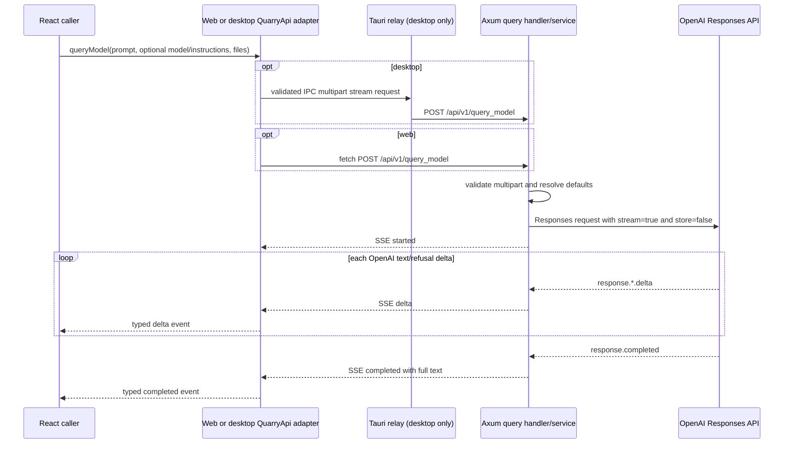

# Quarry send-query SSE plan

Status: proposed
Scope: shared API contract, browser and Tauri transports, Axum query endpoint/service, and the existing OpenAI Responses client
Baseline: current working tree inspected on 2026-08-31
Primary endpoint: `POST /api/v1/query_model`

## Outcome

Add a single-shot send-query operation that accepts a user-authored prompt, optional user-selected
model, optional user-authored system instructions, and zero or more user-selected files. Axum will
call the existing OpenAI Responses streaming function and relay every semantic OpenAI text delta
to the caller as a Quarry-owned SSE event, in order, without waiting for the full response.

The first release will:

- require the user prompt and never substitute the existing generic default prompt;
- use the server-side query-model default when `model` is omitted, while allowing the user to
  override it per request;
- use `DEFAULT_SYSTEM_INSTRUCTIONS` when `systemInstructions` is omitted, while allowing the user
  to override it per request;
- accept only bytes from user-selected multipart uploads—never a caller-selected server path,
  arbitrary URL, or provider file ID;
- map supported document uploads to OpenAI `input_file` content and supported image uploads to
  `input_image` content;
- translate each OpenAI `response.output_text.delta` or `response.refusal.delta` into exactly one
  downstream `delta` event;
- support the browser and Tauri desktop through the shared `QuarryApi` contract;
- cancel upstream work when the browser request or desktop subscription is cancelled;
- keep the OpenAI API key and every provider call in the Axum process;
- avoid database, Helix, conversation-history, and durable-job changes.

Official OpenAI documentation confirms that the Responses API accepts text, image, and file inputs,
supports a request-level `instructions` value and model selection, and streams when `stream: true`.
Implementation should re-check the current file-type guidance while coding because provider input
support can change: [Create a model response](https://developers.openai.com/api/reference/cli/resources/responses/methods/create).

## Decisions

### Public Quarry operation

Use a dedicated feature route instead of placing generic chat behavior under research,
summarization, or document jobs:

```text
POST /api/v1/query_model
Content-Type: multipart/form-data
Accept: text/event-stream

200 OK
Content-Type: text/event-stream
Cache-Control: no-cache, no-store
```

The router's existing `/api` compatibility mount will expose the same operation temporarily, but
all new web and desktop clients must call `/api/v1/query_model`.

This is one streaming HTTP exchange. Do not create a POST-to-job plus GET-to-events protocol: query
generation is not durable, there is no reconnect/resume requirement, and the OpenAI stream is
already available during the initiating request.

### Request fields

| Multipart field | Cardinality | Rule |
| --- | --- | --- |
| `prompt` | exactly one text field | Required, trimmed only for validation, non-blank, at most 100,000 characters; preserve the user's original content when sending it. |
| `model` | zero or one text field | Omission selects the configured server default; a supplied value must be trimmed, non-blank, at most 128 characters, and contain no control characters. |
| `systemInstructions` | zero or one text field | Omission selects `DEFAULT_SYSTEM_INSTRUCTIONS`; a supplied value must be non-blank and at most 50,000 characters; preserve the user's original content. |
| `files` | repeated file field | Optional; maximum 20 files, 50 MB per file and 50 MB in aggregate, using the existing upload-size posture. |

Reject duplicate scalar fields, unknown fields, empty files, invalid filenames, unsupported
extensions/MIME types, and limit violations with HTTP 400 before starting the SSE response. Raise
the route-specific Axum body limit to the 50 MB aggregate plus the existing 1 MB multipart overhead,
so the handler's documented checks are reachable rather than being pre-empted by Axum's 2 MB
default.

The initial upload allowlist should be derived from the current OpenAI input helpers and confirmed
against the current official provider documentation during implementation. Keep document and image
classification explicit: images use `ResponsesFileInput::ImageData` with `detail: "auto"`; all
other allowed files use `ResponsesFileInput::FileData`. Derive the MIME type server-side from a
normalized leaf filename, validate it against obvious content signatures where supported, and do
not trust the browser-provided MIME type by itself.

Do not expose `ResponsesFileInput::FilePath`, `FileUrl`, or `FileId` through this endpoint. Those
variants can remain available to trusted internal callers, but making them transport inputs would
introduce server-filesystem, URL-fetch, or cross-user provider-file trust problems.

### Defaults

- Keep `gpt-5.5` as the current query default rather than changing model policy as part of this
  feature.
- Add `OPENAI_QUERY_MODEL` to `OpenAiConfig`, defaulting to `gpt-5.5`, and inject it into the new
  query service from `bootstrap.rs`.
- Keep `DEFAULT_SYSTEM_INSTRUCTIONS` as `You are a helpful assistant.` and resolve it in the query
  service only when the field is absent.
- A present but blank `model` or `systemInstructions` is invalid; it does not silently select the
  default. This keeps omission and invalid user input distinct.
- The endpoint always supplies a validated prompt to the OpenAI client, so
  `DEFAULT_RESPONSES_PROMPT` is not used by this operation.
- Set `store: false` on this new streaming Responses call so user prompts and files are not stored
  by request for later response retrieval. Keep that choice server-owned rather than accepting it
  from the client.

### SSE contract

Expose Quarry-owned events instead of forwarding raw provider JSON. This keeps the product API
stable if OpenAI adds or changes non-text events.

| Event name | JSON data | Meaning |
| --- | --- | --- |
| `started` | `{ "type": "started", "model": "gpt-5.5" }` | The request passed Quarry validation and the resolved model is known. |
| `delta` | `{ "type": "delta", "delta": "text" }` | One semantic text/refusal delta from OpenAI. Preserve provider order and do not coalesce adjacent deltas. |
| `completed` | `{ "type": "completed", "response": "full text" }` | Exactly one successful terminal event. The full text is authoritative and also covers a provider completion that had no delta events. |
| `failed` | `{ "type": "failed", "error": "query generation failed" }` | Exactly one sanitized terminal event for failures after HTTP 200 has begun. |

Use Axum `Sse`, JSON serialization through `Event::json_data`, a 15-second keepalive, and explicit
`no-cache, no-store` response headers. Ignore OpenAI events that are not user-visible text, but
recognize `response.failed`, `response.incomplete`, top-level provider errors, malformed events,
and premature EOF as failures rather than reporting an empty successful response.

HTTP failures are possible only before the SSE response begins:

- 400: malformed multipart, missing/invalid prompt, invalid overrides, invalid files, or limits;
- 503: the optional OpenAI capability is not configured;
- 500: unexpected Quarry failure, using the existing sanitized `AppError` boundary.

After the 200 response begins, failures must use one terminal `failed` event because the status and
headers can no longer change. Log internal provider context on the server, but never send raw
provider bodies, API details, keys, prompts, system instructions, filenames, file contents, or
generated text in errors or tracing.

### Shared TypeScript contract

Extend `frontend/src/contracts/quarryApi.ts` with a transport-neutral API shaped like the existing
document-job subscription:

```ts
export type QueryModelInput = {
  files: File[];
  model?: string;
  prompt: string;
  systemInstructions?: string;
};

export type SendQueryEvent =
  | { model: string; type: "started" }
  | { delta: string; type: "delta" }
  | { response: string; type: "completed" }
  | { error: string; type: "failed" };

export type SendQueryEventHandlers = {
  onConnectionError?: (message: string) => void;
  onEvent: (event: SendQueryEvent) => void;
};

queryModel(input: QueryModelInput, handlers: SendQueryEventHandlers): () => void;
```

The returned function cancels the active upload/stream and releases listeners. `failed` is a
server terminal event; `onConnectionError` is reserved for failures that prevent or corrupt the
SSE exchange, including a non-2xx response, wrong content type, malformed frame, or EOF without a
terminal event. The adapter must deliver at most one terminal notification.

No React page or chat component is part of this plan. Product UI can consume this contract in a
follow-up without changing the transport protocol.

## Current-state findings

| Area | Current implementation | Consequence for this change |
| --- | --- | --- |
| OpenAI request builder | `backend/src/core/clients/openai.rs` already builds Responses payloads with prompt, instructions, model, `input_file`, and `input_image`. | Reuse it; do not add an SDK or second provider implementation. |
| OpenAI streaming | `gen_model_response_with_files_streaming` already sets `stream: true`, parses fragmented SSE, emits output/refusal deltas through a callback, and returns the full text. | Adapt its callback/cancellation/error contract for a bounded downstream channel and call it from the query service. |
| OpenAI defaults | The client currently defaults responses to `gpt-5.5`, `DEFAULT_SYSTEM_INSTRUCTIONS`, and a generic prompt. | Centralize the query model in `OpenAiConfig`; keep system default; make prompt required at the HTTP boundary. |
| Backend SSE | The document-job handler already uses Axum `Sse`, JSON events, stream unfolding, and 15-second keepalive. | Reuse the delivery pattern, but not the process-local job registry/watch protocol. |
| Browser SSE | Document jobs use `EventSource` for GET. | A POST with multipart requires `fetch`, `ReadableStream`, an incremental SSE parser, and `AbortController`. |
| Desktop transport | Tauri supports JSON/multipart POST and GET streaming separately; its HTTP client has a 120-second whole-request timeout. | Add a narrow multipart-stream command and ensure a long response is governed by connect/idle policy rather than a 120-second total timeout. |
| Desktop cancellation | Removing the current document-job listener does not cancel its upstream Rust request. | The new query stream must include explicit cancellation instead of repeating this known gap. |
| Upload boundary | Browser uploads are raw multipart; desktop files are base64 over IPC and reconstructed as multipart in Rust. | Preserve the 50 MB byte limits and account for desktop base64 memory amplification. |
| API contract | Web and desktop endpoint mappings are handwritten and tested separately. | Update both adapters and both test suites in the same change. |
| Logging | `summarizeFormData`/IPC logging can expose new scalar fields unless their names are treated as sensitive; SSE delta data would contain generated text. | Redact prompt/instructions and log only query event metadata/character counts, never content. |
| Authentication | Axum currently has no production authentication, authorization, tenancy, rate limiting, or quota enforcement. | The route can follow current development posture, but it must not be described or deployed as public-production safe. |

## Target flow



On desktop, Axum SSE frames are parsed in Rust and re-emitted with a per-subscription ID so
concurrent queries cannot cross-deliver events. The TypeScript adapter filters by that ID and maps
the same event union used by the browser.

## Implementation sequence

### Phase 1 — Lock the contract, defaults, and validation

1. Add the shared `QueryModelInput`, event union, handler type, and `QuarryApi.queryModel` signature.
2. Add backend-owned query input/event DTOs with camelCase serialization and named validation
   constants for scalar lengths, file count, and byte limits.
3. Add `OPENAI_QUERY_MODEL` to `OpenAiConfig`, its optional-capability detection list, config
   parser defaults/tests, and `backend/.env.example`. Preserve the current rule that any supplied
   OpenAI model setting requires `OPENAI_API_KEY`.
4. Keep the client default as a compatibility fallback for existing internal callers, but inject
   the resolved query default into the new service so runtime behavior does not depend on a hidden
   client constant.
5. Document the multipart field names, omission/default behavior, supported file classes, and
   event schema in tests before adding transport code.

Exit criteria:

- The default and override rules are unambiguous and tested.
- No client duplicates the model or system-instruction default.
- Prompt, system instructions, model, file count, filenames, types, and sizes have explicit bounds.

### Phase 2 — Harden the existing OpenAI streaming seam

1. Keep `gen_model_response_with_files_streaming` as the one provider entry point. Refactor its
   delta callback into an async or result-bearing sink so a bounded Tokio channel can apply
   backpressure and signal receiver cancellation; do not use an unbounded queue for arbitrary
   client slowness.
2. Make callback/channel closure stop reading the upstream body promptly, which drops the reqwest
   response and cancels provider work as far as the transport permits.
3. Set `stream: true` and `store: false` for the query streaming request without changing the
   retention behavior of unrelated non-streaming callers.
4. Preserve fragmented LF/CRLF event parsing and multi-line `data:` handling. Extend parsing to
   detect provider failure/incomplete/error events and premature EOF explicitly.
5. Keep the final accumulated text return value. If deltas were absent but
   `response.completed.response` contains output text, return that text so the service can emit a
   useful `completed` event.
6. Add a test-only loopback Responses URL seam or narrow fake gateway so route/service tests can
   exercise streaming without live OpenAI. Production construction must continue using the fixed
   official HTTPS endpoint and a server-held key.

Exit criteria:

- One provider delta produces one callback invocation in order.
- Slow/cancelled downstream consumers stop upstream processing without an unbounded buffer.
- Provider failure, malformed SSE, invalid UTF-8, and EOF-without-output are typed failures.
- No live OpenAI request is needed for automated tests.

### Phase 3 — Add the Axum query vertical slice

1. Create `backend/src/services/query_service.rs` with only an optional `Arc<OpenAiClient>`, the
   injected default model, and the default system-instruction value it needs. Add it to
   `services/mod.rs`.
2. Define an owned `QueryRequest` and `UploadedQueryFile` so the service-owned task never borrows
   Axum multipart fields. Convert bytes to base64 within the request task, then build borrowed
   `ResponsesFileInput` values over those owned buffers for the existing client call.
3. Have `QueryService::stream` validate use-case input, fail synchronously with
   `ServiceError::Unavailable` if OpenAI is disabled, create a bounded channel, emit `started`, and
   run the OpenAI stream. Map deltas to `delta`, success to exactly one `completed`, and logged
   provider failure to exactly one sanitized `failed` event.
4. Add `queries: Arc<QueryService>` to `AppState`, construct it in `bootstrap::assemble_state`, and
   update the test application assembler. Do not place the raw OpenAI client or configuration in
   `AppState`.
5. Create `backend/src/handlers/query_model.rs` to collect/validate multipart transport facts and adapt
   the service receiver to Axum `Sse`. Keep OpenAI orchestration out of the handler.
6. Create `backend/src/routes/query_model.rs`, merge it in `routes/mod.rs`, and attach a route-local body
   limit equal to the 50 MB aggregate plus multipart overhead.
7. Set the SSE cache/buffering headers intentionally and keep the existing 15-second keepalive.
   Verify that the global compression and timeout layers do not buffer or terminate a healthy
   stream; add a route-specific adjustment only if the runtime test proves one is needed.

Exit criteria:

- `POST /api/v1/query_model` streams before the full provider response is complete.
- Pre-stream validation/configuration failures use HTTP errors; post-start failures use `failed`.
- Services do not import `AppState`, read environment variables, or construct clients.
- No prompt, instructions, filename, file bytes, response text, or provider body is logged.

### Phase 4 — Add browser POST-SSE support

1. Implement `queryModel` in `frontend/src/api/httpQuarryApi.ts` using `FormData`, preserving absent
   optional fields rather than sending empty strings.
2. Use `fetch` with an `AbortController`; validate non-success responses with the existing
   `BackendApiError` behavior and require `text/event-stream` before reading the body.
3. Add a small incremental SSE parser under `frontend/src/api/` that handles arbitrary UTF-8 byte
   boundaries, LF and CRLF framing, comments/keepalives, repeated `data:` lines, multiple events in
   one network chunk, and a final partial buffer. Do not split directly on each `ReadableStream`
   chunk.
4. Validate event names and JSON against the discriminated union. Reject malformed events,
   duplicate terminals, events after terminal, and clean EOF without `completed`/`failed` through
   `onConnectionError`.
5. Make the returned cleanup abort the upload/response reader and suppress callbacks after
   cancellation.
6. Update query activity logging to store only route, model, file count/aggregate bytes, event
   names, delta character counts, duration, and terminal status. Extend redaction tests so
   `prompt` and `systemInstructions` can never enter the session activity log.

Exit criteria:

- The browser begins receiving typed deltas before completion.
- Fragmented Unicode and SSE frames reconstruct exactly once and in order.
- Cancellation closes the Fetch stream and prevents late callbacks.
- Browser logs contain no user or model-generated content.

### Phase 5 — Add the narrow Tauri streaming relay

1. Add a dedicated query-stream IPC request/payload model in
   `frontend/src-tauri/src/quarry_api/models.rs`. Reuse multipart file validation and byte limits,
   but fix the upstream path to `/api/v1/query_model` rather than accepting a generic stream path from
   the webview.
2. Add `QuarryHttpClient::post_multipart_stream`. Remove the client's global whole-request timeout
   only if necessary, preserving 120-second timeouts on ordinary JSON/PDF operations and using a
   connect timeout plus an explicit stream-idle policy for long-running SSE.
3. Add a service method that submits multipart, validates the `text/event-stream` response type,
   parses LF/CRLF SSE incrementally, and emits only allowed Quarry event names/data with the
   subscription ID.
4. Add `send_query_stream` and `cancel_query_stream` commands. Both must validate the main
   window/origin and subscription identifier. Store only cancellation handles keyed by
   subscription ID, remove them on every terminal/error/cancel path, and abort the upstream
   reqwest body when cancelled.
5. Register the commands in `frontend/src-tauri/src/lib.rs` and export them from the query API
   module. No new shell/filesystem capability or CSP relaxation is required.
6. Extend the TypeScript Tauri transport and `createTauriQuarryApi` so it base64-encodes only the
   user-selected files, starts the dedicated subscription, filters `quarry-query-event` by
   subscription ID, maps the shared event union, and invokes cancellation during cleanup.
7. Pass only a redacted request summary to activity logging; do not log the actual IPC fields,
   base64 data, SSE data, prompt, instructions, filenames, or output text.

Exit criteria:

- Desktop callers receive the same typed event order and terminal semantics as web callers.
- Concurrent streams remain isolated by subscription ID.
- Cleanup cancels the Rust upstream request rather than merely removing the JavaScript listener.
- The command remains a narrow capability with validated input and a fixed product API path.

### Phase 6 — Tests, documentation, and runtime verification

Backend coverage:

- request-body generation includes the required prompt, resolved instructions/model, supported
  files/images, `stream: true`, and `store: false`;
- OpenAI SSE parsing covers split boundaries, CRLF, multiple frames per chunk, Unicode, text and
  refusal deltas, completed fallback text, provider failure/incomplete/error, malformed JSON,
  invalid UTF-8, callback cancellation, and premature EOF;
- query service covers missing OpenAI, defaults, overrides, ordered deltas, one terminal event,
  sanitized failure, and cancellation/backpressure;
- route tests cover field cardinality, blank/oversized scalar fields, file count/type/name/size,
  bodies above Axum's default limit, `text/event-stream`, keepalive-safe ordered events, HTTP 503
  before streaming, and failure events after streaming begins;
- architecture tests continue to prove handler/service/client dependency direction.

Frontend coverage:

- HTTP adapter field mapping, omitted defaults, files, non-2xx errors, content-type validation,
  fragmented/multiple/CRLF SSE frames, malformed data, EOF rules, exact terminal behavior, Unicode,
  and AbortController cancellation;
- Tauri adapter multipart/base64 mapping, event parsing/filtering, concurrent subscription IDs,
  error paths, and explicit cancellation;
- activity-log tests prove prompt, system instructions, filenames/file contents, and generated
  text are absent or redacted while safe counts and byte sizes remain observable.

Tauri Rust coverage:

- fixed route and identifier validation;
- multipart field/file validation and 50 MB limits;
- response status/content-type checks;
- incremental SSE framing, keepalive comments, allowed event names, terminal cleanup, concurrent
  subscription isolation, and cancellation;
- ordinary JSON/PDF timeout behavior remains unchanged.

Update `docs/ARCHITECTURE.md` in the implementation change because this feature alters:

- the shared `QuarryApi` contract and web/desktop transport inventory;
- the `/api/v1` route table and multipart/SSE behavior;
- `AppState` and bootstrap service assembly;
- the OpenAI configuration group and request flow;
- query-stream cancellation, logging/redaction, and known production trust limitations;
- the external-integration and verification coverage narrative.

Also update `backend/.env.example` for `OPENAI_QUERY_MODEL`, while preserving the documented caveat
that model-only OpenAI configuration activates a capability that still requires the API key.

## Verification commands for implementation

Run focused checks first using the test filters/names actually added, then the repository gates.

From `backend/`:

```sh
cargo test openai
cargo test query_service
cargo test send_query
cargo fmt --all -- --check
cargo check --locked --all-targets
cargo clippy --locked --all-targets -- -D warnings
cargo test --locked --all-targets
```

From `frontend/`:

```sh
npm test -- src/api/httpQuarryApi.test.ts
npm test -- src/api/tauriQuarryApi.test.ts
npm test -- src/lib/activityLog.test.ts
npm run typecheck
npm run check:boundaries
npm test
npm run build:web
npm run check:web-bundle
npm run build:desktop-ui
```

From `frontend/src-tauri/`:

```sh
cargo fmt --all -- --check
cargo clippy --locked --all-targets -- -D warnings
cargo test --locked --all-targets
```

Use a loopback fake OpenAI server for an end-to-end runtime observation that deliberately delays
two deltas and verifies that web and desktop callers display the first delta before the second and
before completion. Also inspect cancellation, malformed upstream termination, browser console,
network timing, activity logs, and concurrent desktop streams. Do not use live OpenAI in the
routine test suite and do not use `cargo run` against valuable SQLite/Helix state as a build check.

Before handoff:

```sh
git diff --check
git status --short
```

Inspect the final diff for unrelated user work, generated `dist`/`target` output, secrets, prompt
or response fixtures copied from real users, and lockfile churn. A new dependency should not be
necessary: Axum SSE, reqwest byte streams, `futures-util`, and Tokio channels already exist.

## Security and operational notes

- The OpenAI key remains server-only. Never add it to `VITE_*`, IPC arguments, browser storage, or
  logs.
- User-selected model access can affect cost and availability. Provider rejection becomes a
  sanitized `failed` event; the server should not silently substitute another model.
- The 50 MB upload posture can create larger in-memory base64/JSON copies, especially through
  Tauri IPC. Keep all copies request-scoped and bounded. Moving large files through OpenAI's Files
  API would be a separate design.
- Do not log prompts, instructions, filenames, file contents, generated text, or raw OpenAI errors.
  Metrics may record counts, byte sizes, resolved model, latency, cancellation, and terminal class.
- The endpoint is not durable or resumable. A disconnect cancels the request, and the caller must
  explicitly submit again.
- The current server has no identity, tenancy, authorization, rate limit, quota, or abuse control.
  Before public production exposure, add those controls in Axum and bind file/query access to the
  authenticated principal. CORS and Tauri origin validation are not authorization.
- No SQLite schema, Helix graph, migration, ADR, or destructive rollout is required for this
  feature.

## Out of scope

- A chat page, composer, model picker, file-picker UI, or response rendering.
- Multi-turn conversation state, `previous_response_id`, conversation persistence, replay, or
  reconnect/resume.
- OpenAI tools, web search, file search/vector stores, structured output, or function calling.
- Arbitrary server paths, remote file URLs, or caller-supplied OpenAI file IDs.
- Query/result persistence, audit history, billing, quotas, or production identity enforcement.
- Changing defaults for existing deal extraction, embeddings, summaries, or image descriptions.

## Definition of done

- A shared client can submit the required prompt plus optional overrides and user-selected files to
  `POST /api/v1/query_model` from both web and desktop.
- Omitted model and system instructions resolve only on the server; supplied values are preserved
  and validated.
- Every OpenAI text/refusal delta is delivered once, in order, as a Quarry `delta` SSE event before
  the terminal event.
- Success and failure each have exactly one documented terminal path, including malformed stream,
  provider failure, cancellation, and premature EOF.
- Browser and desktop cleanup stops upstream work and prevents late callbacks.
- Uploads, memory, paths, MIME types, scalar fields, event parsing, timeouts, and logging are
  bounded and tested.
- No OpenAI key, raw provider error, or real user prompt/instructions/filename/file data/response
  text appears in client activity logs, backend logs, or error responses; automated tests use only
  synthetic content.
- Focused tests and all affected backend/frontend/Tauri gates pass without a live provider.
- `docs/ARCHITECTURE.md` and `backend/.env.example` reflect the implemented contract and runtime
  behavior.
- `git diff --check` is clean and the final status review distinguishes the user's pre-existing
  work from this feature.
